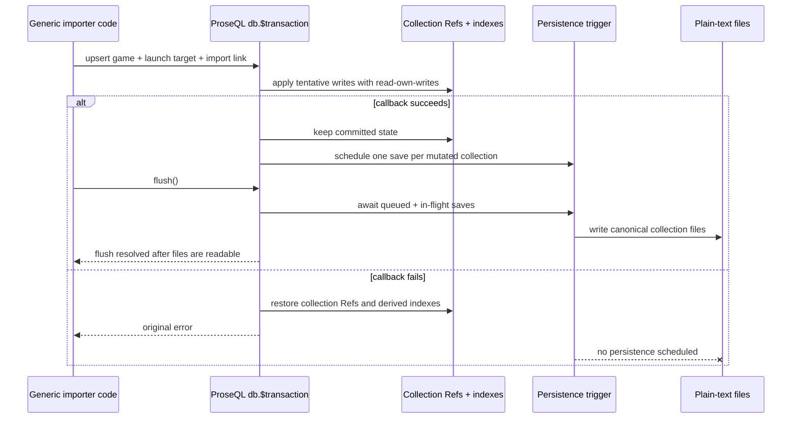

# feat: Harden ProseQL foundation for Korri

## Overview

Harden ProseQL so Korri can use `@proseql/node` as the canonical server-side plain-text persistence layer behind Korri's existing `LibrarySource` interface. The pass keeps ProseQL domain-neutral while proving the exact foundation Korri needs next: Effect v4 compatibility, Bun-ready file persistence, deterministic flush/reopen behavior, reliable cross-collection transactions, ergonomic idempotent imports, and a small game-library-shaped example.

## Problem Frame

Korri is about to depend on ProseQL rather than building local workarounds around weak persistence or import APIs. Korri runs on Bun with `effect@4.0.0-beta.60`, will use ProseQL server-side only, and will initially store `games`, `launchTargets`, and `importLinks`. ROCKNIX will become an importer that writes repeatably into ProseQL, so the database foundation must make idempotent multi-collection imports boring: write a game, launch target, and import link as one logical unit, flush, reopen, and read the same data back with no duplicates or partial writes.

## Requirements Trace

- R1. ProseQL installs, typechecks, and tests cleanly against `effect@4.0.0-beta.60` while preserving clean ESM exports.
- R2. `@proseql/node` and `createNodeDatabase` work under Bun for server-side file persistence.
- R3. `db.flush()` deterministically waits for all queued and in-flight writes to finish before resolving; `pendingCount()` accurately reports queued writes.
- R4. A write -> flush -> reopen/read cycle is covered by tests and docs.
- R5. Cross-collection transactions are reliable: committed mutations persist together, failed transactions roll back with no partial in-memory, index, search-index, or persisted state.
- R6. Compound uniqueness and upsert support idempotent imports for one import link per `(sourceKind, externalId)`.
- R7. Compound uniqueness and upsert support one active launch target per game without awkward application-side duplicate checks.
- R8. Add a canonical game-library example with `games`, `launchTargets`, and `importLinks` demonstrating first import, repeated import, flush/reopen, and failed transaction rollback.
- R9. Do not add Korri-specific domain APIs, a full ontology, ProseQL RPC work for Korri, or Korri importer code.

## Scope Boundaries

- ProseQL remains a generic library; example schemas may be game-library-shaped, but runtime APIs must not mention Korri, ROCKNIX, or game-specific helpers.
- The importer itself is out of scope; ProseQL only needs to expose safe generic primitives for an importer to use.
- No full media/source ontology design; the example should be intentionally small.
- No ProseQL RPC feature work for Korri.
- Browser storage is not part of Korri's server-side integration path; it can be updated or temporarily excluded from the Korri-ready gate if Effect v4 hardening would otherwise spend effort preserving unsupported surfaces.

### Deferred to Separate Tasks

- Korri `LibrarySource` adapter implementation: separate Korri work after this foundation pass lands.
- ROCKNIX importer integration: separate Korri/ROCKNIX work after ProseQL idempotent import primitives are verified.
- Any new RPC design for Effect v4: separate ProseQL RPC planning if `@proseql/rpc` cannot be trivially migrated while preserving package health.

## Context & Research

### Relevant Code and Patterns

- `packages/core/src/factories/database-effect.ts` builds the core and persistent database APIs, attaches `flush()` / `pendingCount()`, wires persistence triggers, and creates transaction-aware collection accessors.
- `packages/core/src/storage/persistence-effect.ts` contains `saveData`, `loadData`, and an Effect-scoped `createDebouncedWriter`; it already has tests around pending writes, flush, and coalescing in `packages/core/tests/debounced-writer.test.ts` and `packages/core/tests/persistence.test.ts`.
- `packages/node/src/convenience.ts` exposes `createNodeDatabase` and `makeNodePersistenceLayer`, which are the primary Korri-facing APIs.
- `packages/node/src/node-adapter-layer.ts` uses Node-compatible `node:fs`, `node:path`, and `node:crypto` APIs that Bun generally supports, but the persistence contract still needs Bun-specific coverage.
- `packages/core/src/transactions/transaction.ts` snapshots collection Refs and suppresses persistence scheduling until commit. Existing tests in `packages/core/tests/transactions.test.ts` verify mutation tracking and no persistence on rollback, but the plan must extend this to persisted multi-collection data and index/search-index rollback.
- `packages/core/src/operations/crud/unique-check.ts` already supports compound unique constraints and validates that upsert `where` clauses target `id` or declared unique fields.
- `packages/core/src/operations/crud/upsert.ts` already supports `upsert` / `upsertMany`, but type ergonomics and transactional/idempotent import coverage need to be tightened.
- `examples/12-file-persistence`, `examples/14-append-only-jsonl`, and `examples/16-advanced-features` provide patterns for persistence, flush, compound uniqueness, and transaction examples.
- Package metadata currently references Effect 3 ranges in `package.json`, `packages/core/package.json`, `packages/node/package.json`, `packages/rest/package.json`, `packages/cli/package.json`, and `packages/rpc/package.json`; `packages/browser/package.json` also needs an explicit compatibility decision because browser sources import `effect` even though Korri will not use browser storage.
- The local Effect checkout at `effect/packages/effect/src` confirms current source signatures for heavily used stable APIs such as `Effect.gen`, `Effect.runPromise`, `Schema.Struct`, `Schema.decodeUnknown`, `Schema.encode`, `Data.TaggedError`, `Context.GenericTag`, `Layer.succeed`, `Ref`, `PubSub`, `Stream`, `Fiber.interrupt`, and `Schedule` in the checked-out Effect 3 source. During implementation, these must be re-verified against the installed Effect v4 beta package, not assumed from the Effect 3 clone.

### Institutional Learnings

- No `docs/solutions/` entries were present for this repository, so there are no prior institutional learnings to carry forward.

### External References

- Effect v4 beta announcement: `https://effect.website/blog/releases/effect/40-beta` — v4 beta introduces a rewritten runtime, package version alignment, consolidated packages, and beta-level API churn.
- Effect v4 migration notes surfaced through Effect-TS/effect-smol: v4 aligns package versions with `effect@4.0.0-beta.x` and consolidates several previously separate packages into the core `effect` package, including areas relevant to RPC/platform users.
- NPM metadata/search results show current stable Effect 3 releases still exist alongside v4 beta; dependency ranges must be explicit enough that Korri installs the intended beta rather than accidentally resolving stable v3.

## Key Technical Decisions

- Target `effect@4.0.0-beta.60` explicitly and drop Effect 3/backward compatibility concerns. Korri is the forcing consumer, and preserving older dependency/API shapes should not complicate the v4 foundation.
- Treat `@proseql/core` and `@proseql/node` as the hard Korri-readiness gate. `@proseql/rest`, `@proseql/cli`, `@proseql/browser`, and `@proseql/rpc` may receive breaking dependency/API updates, be temporarily excluded from default checks, or be marked not Korri-ready rather than forcing compatibility work unrelated to Korri's server-side path.
- Make flush correctness stronger than debounce convenience. Writes may still be debounced during normal operation, but `flush()` must await queued writes, writes whose timers already fired, and append-only canonical rewrites, and it must surface write errors instead of swallowing them.
- Keep `pendingCount()` scoped to queued, not currently executing, writes, but add tests/docs that distinguish queued writes from in-flight writes. If implementation needs a separate in-flight counter to make assertions clear, add an internal counter rather than changing the public API unless necessary.
- Fix transaction integrity at every derived-state layer, not just collection Refs. Rollback must restore or rebuild indexes/search indexes as well as collection maps; commit must be the only point that schedules persistence and reactive notifications for transactional writes.
- Keep idempotent imports expressed through generic primitives: declared compound `uniqueFields`, `upsert`, and `$transaction`, not importer-specific helpers.
- Use a deterministic generic uniqueness-key pattern for "one active launch target per game" unless ProseQL already has a simple partial-unique path. The preferred first-pass model is an `activeSlot`-style field where active targets set a stable value such as `"active"` and inactive targets leave it null/undefined; this works with ProseQL's existing null-skipping unique checks and a compound constraint such as `["gameId", "activeSlot"]` without adding partial index semantics.

## Open Questions

### Resolved During Planning

- Should ProseQL add Korri-specific APIs? No. The request explicitly says ProseQL is owned by us but should remain generic; hardening should improve generic persistence, transaction, uniqueness, and upsert APIs.
- Should RPC be included in Korri's foundation? No for Korri behavior. It can be migrated or isolated only insofar as the monorepo install/typecheck/test gate requires it.
- Is external research warranted? Yes. Effect v4 beta is a moving external contract surface, and the repository currently targets Effect 3.

### Deferred to Implementation

- Exact Effect v4 API changes: determine by installing `effect@4.0.0-beta.60`, reading installed package types/source, and typechecking actual ProseQL code.
- Exact RPC compatibility path: decide after seeing the v4 beta RPC API surface and current `@proseql/rpc` compile failures.
- Whether Node adapter should add explicit fsync-level durability: decide after validating Bun support for file-handle sync and directory sync. The minimum required contract is flush/reopen determinism in the same filesystem environment; power-loss durability can be documented or exposed as a follow-up option if it broadens scope.
- Final example data fields and IDs: keep them small and deterministic, but let implementation adjust names to match established example style.

## Output Structure

    docs/plans/2026-05-06-001-feat-korri-foundation-hardening-plan.md
    examples/17-game-library-import/
      README.md
      index.ts
    packages/core/tests/korri-foundation.test.ts
    packages/node/tests/bun-persistence.test.ts

The tree shows expected new files only. Existing package files, docs, and tests listed in implementation units remain authoritative.

## High-Level Technical Design

> *This illustrates the intended approach and is directional guidance for review, not implementation specification. The implementing agent should treat it as context, not code to reproduce.*

### Import transaction and persistence flow



### Idempotent import primitives

| Library concern | Generic ProseQL primitive | Expected behavior |
|---|---|---|
| One imported game per source record | `games.upsert({ where: { id } ... })` or a declared unique external key if the importer stores one | Repeat import updates existing game instead of creating duplicates |
| One import link per `(sourceKind, externalId)` | `importLinks.uniqueFields: [["sourceKind", "externalId"]]` plus `upsert({ where: { sourceKind, externalId } ... })` | Same ROCKNIX record maps to the same link every run |
| One active launch target per game | Compound unique constraint over a generic active-slot representation | Re-import updates the active target instead of appending another active target |
| Multi-record logical unit | `db.$transaction` | Game, target, and link commit or roll back together |
| Durable handoff to Korri | `db.flush()` then reopen | Reopened database reads exactly the flushed state |

## Implementation Units

- [ ] **Unit 1: Move the foundation packages to Effect v4 beta**

**Goal:** Make the ProseQL packages Korri depends on install, typecheck, and test against `effect@4.0.0-beta.60` without ESM export regressions.

**Requirements:** R1, R2

**Dependencies:** None

**Files:**
- Modify: `package.json`
- Modify: `bun.lock`
- Modify: `packages/core/package.json`
- Modify: `packages/node/package.json`
- Modify: `packages/rest/package.json`
- Modify: `packages/cli/package.json`
- Modify: `packages/browser/package.json`
- Modify: `packages/rpc/package.json`
- Modify as needed: `packages/core/src/**/*.ts`
- Modify as needed: `packages/node/src/**/*.ts`
- Modify as needed: `packages/rest/src/**/*.ts`
- Modify as needed: `packages/cli/src/**/*.ts`
- Modify as needed: `packages/rpc/src/**/*.ts`
- Test: existing package tests under `packages/core/tests/`, `packages/node/tests/`, `packages/rest/tests/`, `packages/cli/tests/`, `packages/browser/tests/`, and `packages/rpc/tests/` as applicable to the final compatibility gate

**Approach:**
- Pin or range Effect dependencies and peers around `4.0.0-beta.60` intentionally; avoid ranges that can silently install Effect 3 in Korri.
- Re-run type discovery against the installed Effect v4 package and update imports/API usage only where actual compiler failures require it.
- Preserve current single-package imports from `"effect"` for stable Effect APIs unless v4 explicitly requires a new import path.
- Keep `type: "module"`, `exports`, `main`, and `types` fields ESM-clean for published packages.
- Resolve non-Korri packages deliberately: apply breaking v4-only updates where cheap, or remove them from the default Korri foundation gate and document them as not part of the Korri-ready package set. Do not preserve older Effect 3 behavior for compatibility's sake.

**Execution note:** Start with the dependency bump and typecheck failure list as characterization data before changing APIs.

**Patterns to follow:**
- Existing imports from `"effect"` throughout `packages/core/src` and `packages/node/src`.
- Existing package export maps in `packages/core/package.json` and `packages/node/package.json`.
- Effect source patterns verified in `effect/packages/effect/src/Effect.ts`, `Schema.ts`, `Data.ts`, `Context.ts`, and `Layer.ts`, then re-verified against the installed v4 package.

**Test scenarios:**
- Happy path: installing the workspace with `effect@4.0.0-beta.60` resolves one Effect major for `@proseql/core` and `@proseql/node`.
- Happy path: TypeScript builds `packages/core` and `packages/node` with no Effect API errors.
- Integration: importing `createNodeDatabase` from `@proseql/node` in an ESM script works without deep imports or CommonJS fallbacks.
- Error path: if `@proseql/rpc` or other non-Korri packages are incompatible with v4, the default Korri foundation checks fail clearly only when those packages are explicitly included, not during core/node validation.

**Verification:**
- The foundation package dependency graph is Effect v4 beta compatible.
- Public ESM exports still point at `dist` artifacts for publishable packages.

- [ ] **Unit 2: Make flush semantics deterministic and observable**

**Goal:** Ensure `db.flush()` waits for every queued and already-started persistence write, reports failures, and leaves `pendingCount()` accurate.

**Requirements:** R3, R4

**Dependencies:** Unit 1

**Files:**
- Modify: `packages/core/src/factories/database-effect.ts`
- Modify: `packages/core/src/storage/persistence-effect.ts`
- Modify: `packages/core/tests/debounced-writer.test.ts`
- Modify: `packages/core/tests/persistence.test.ts`
- Modify: `packages/core/tests/database-effect.test.ts`
- Add or modify: `packages/core/tests/korri-foundation.test.ts`
- Modify: `packages/core/README.md`
- Modify: `packages/node/README.md`

**Approach:**
- Replace the current timer-only persistence trigger with a writer state model that tracks queued timers separately from in-flight save promises/effects.
- Make timer-fired writes remain visible to `flush()` until their save effect resolves.
- Stop swallowing persistence errors in `executeSave`, `trigger.flush()`, append-only canonical flush, and scope finalizer paths where the caller explicitly invokes `flush()`.
- Keep scope-finalizer cleanup best-effort if needed, but explicit `db.flush()` must reject on write failure.
- Document `pendingCount()` as queued debounced writes, and ensure it returns to `0` after `flush()` resolves.

**Technical design:** *(directional guidance, not implementation specification)*

```text
Persistence trigger state:
- queued: Map<collectionName, timer>
- inFlight: Map<collectionName, Promise<void>> or Set<Promise<void>>

schedule(collection):
- clear queued timer for collection
- enqueue timer that moves collection from queued -> inFlight and records completion

flush():
- atomically take queued keys and cancel timers
- start saves for queued keys
- await queued saves plus any inFlight saves already present
- reject if any save rejects
- resolve only when queued and inFlight are empty

pendingCount():
- return queued.size
```

**Patterns to follow:**
- Existing `createDebouncedWriter` tests in `packages/core/tests/debounced-writer.test.ts`.
- Existing database persistence tests in `packages/core/tests/database-effect.test.ts`.
- `saveData` service-layer pattern in `packages/core/src/factories/database-effect.ts`.

**Test scenarios:**
- Happy path: create a record with a very long debounce, observe `pendingCount() === 1`, call `flush()`, then `pendingCount() === 0` and the file contains the record.
- Edge case: a timer fires and starts a slow write before `flush()` is called; `pendingCount()` may be `0`, but `flush()` still waits for the in-flight write before resolving.
- Edge case: multiple rapid writes to the same collection coalesce to one queued save and flush writes the latest state.
- Edge case: multiple persistent collections have queued writes; flush waits for all and persists all collection files.
- Error path: storage write failure during explicit `db.flush()` rejects instead of being swallowed.
- Integration: write -> flush -> create a new database instance -> read returns the flushed record.
- Integration: scope close still attempts to flush pending writes and clears timers.

**Verification:**
- No test relies on arbitrary sleeps to prove flush; assertions observe file contents only after `flush()` resolves.
- Docs state exactly what `flush()` and `pendingCount()` guarantee.

- [ ] **Unit 3: Verify Bun-ready `@proseql/node` file persistence**

**Goal:** Prove `createNodeDatabase` works under Bun with real filesystem persistence, flush, and reopen behavior.

**Requirements:** R2, R4

**Dependencies:** Units 1 and 2

**Files:**
- Modify: `packages/node/src/node-adapter-layer.ts`
- Modify: `packages/node/src/convenience.ts`
- Modify: `packages/node/tests/convenience.test.ts`
- Modify: `packages/node/tests/node-storage.test.ts`
- Create: `packages/node/tests/bun-persistence.test.ts`
- Modify as needed: `justfile`
- Modify as needed: `.github/workflows/`
- Modify: `packages/node/README.md`

**Approach:**
- Add Bun-specific tests using real temp directories and the public `createNodeDatabase` API rather than manually wired layers.
- Cover JSON at minimum, and keep YAML/TOML coverage through existing codec inference tests if already present.
- Validate that Node adapter atomic write behavior (`temp file -> rename`) behaves under Bun.
- If implementation discovers Bun-specific incompatibility in `fs.watch`, keep file watching best-effort and do not let watcher failure break basic persistence.
- Ensure the repository has an obvious Bun-facing verification path for the new node persistence test, whether through existing `just test-node` behavior or a small targeted test recipe.
- Consider adding fsync/directory sync only if it is portable across Node and Bun without undermining simplicity; otherwise document the flush/reopen contract precisely.

**Patterns to follow:**
- Temp directory style in `packages/node/tests/convenience.test.ts`.
- Node adapter configuration in `packages/node/src/node-adapter-layer.ts`.
- Example usage in `examples/11-persistence-setup/index.ts` and `examples/12-file-persistence/index.ts`.

**Test scenarios:**
- Happy path: under Bun, `createNodeDatabase` creates a JSON-backed database, writes a record, flushes, and the file exists with expected JSON content.
- Integration: under Bun, a second `createNodeDatabase` call pointed at the same file reads the flushed record.
- Edge case: nested temp directory does not exist before write; adapter creates parent directories.
- Error path: invalid or unwritable path causes `db.flush()` to reject with a storage error rather than silently losing data.
- Integration: codec inference still works through `makeNodePersistenceLayer` when running in Bun.

**Verification:**
- Bun test coverage exercises the public API Korri will call, not just storage adapter internals.
- `@proseql/node` remains server-side only and does not introduce browser/runtime conditionals.

- [ ] **Unit 4: Harden cross-collection transaction rollback and commit semantics**

**Goal:** Make transactions trustworthy for writing a game, launch target, and import link as one logical unit.

**Requirements:** R5

**Dependencies:** Units 1 and 2

**Files:**
- Modify: `packages/core/src/transactions/transaction.ts`
- Modify: `packages/core/src/factories/database-effect.ts`
- Modify as needed: `packages/core/src/indexes/index-manager.ts`
- Modify as needed: `packages/core/src/indexes/search-index.ts`
- Modify: `packages/core/tests/transactions.test.ts`
- Add or modify: `packages/core/tests/korri-foundation.test.ts`
- Modify: `packages/core/README.md`

**Approach:**
- Audit transaction rollback for all mutable derived state: collection Refs, normal indexes, search indexes, and reactive notifications.
- Snapshot or rebuild index/search-index state on rollback so rolled-back entities are not queryable through accelerated paths.
- Ensure transactional writes do not schedule persistence until commit and never schedule persistence after rollback.
- Confirm failed transaction paths re-raise the original error while restoring state.
- Confirm transaction API behavior is consistent between in-memory and persistent database factories.
- Document transaction boundaries and any non-transactional hook caveats clearly. If hooks can perform external side effects before rollback, either defer hook execution until commit or document that hooks are not rollback-safe; prefer deferring/suppressing after/onChange side effects in transaction contexts if bounded.

**Patterns to follow:**
- Existing transaction tests in `packages/core/tests/transactions.test.ts` for lock behavior, auto-rollback, and persistence scheduling.
- `makeBuildCollectionForTx` in `packages/core/src/factories/database-effect.ts` for transaction-aware mutation hooks.
- Index rebuild patterns in `packages/core/src/factories/database-effect.ts` startup initialization.

**Test scenarios:**
- Happy path: transaction creates a game, launch target, and import link; after commit and flush, all three collections contain exactly one related record.
- Error path: transaction creates a game and launch target, then fails before import link; after rollback, all three collections are unchanged.
- Error path: failed transaction followed by flush and reopen still shows no partial records on disk.
- Edge case: rolled-back entity was covered by a single-field or compound index; indexed query does not return the rolled-back entity.
- Edge case: rolled-back entity was covered by a search index; search query does not return the rolled-back entity.
- Edge case: a transaction mutates the same collection multiple times; commit schedules one persistence save for that collection.
- Error path: nested transactions remain rejected and leave the outer transaction state unchanged.
- Integration: reactive subscribers receive commit notifications only, never rollback/tentative notifications.

**Verification:**
- Rollback restores observable query results through both full-scan and indexed paths.
- Committed persistent transactions survive flush and reopen.

- [ ] **Unit 5: Improve compound uniqueness and upsert ergonomics for idempotent imports**

**Goal:** Make repeat imports straightforward with generic compound uniqueness and upsert APIs.

**Requirements:** R6, R7

**Dependencies:** Units 1 and 4

**Files:**
- Modify: `packages/core/src/types/crud-types.ts`
- Modify: `packages/core/src/types/types.ts`
- Modify: `packages/core/src/operations/crud/unique-check.ts`
- Modify: `packages/core/src/operations/crud/upsert.ts`
- Modify: `packages/core/tests/upsert-validation.test.ts`
- Modify: `packages/core/tests/unique-constraints.test.ts`
- Modify: `packages/core/tests/crud/upsert.test.ts`
- Add or modify: `packages/core/tests/korri-foundation.test.ts`
- Modify: `packages/core/README.md`

**Approach:**
- Preserve runtime validation that upsert `where` clauses target `id` or declared unique constraints.
- Improve TypeScript inference so `db.collection.upsert({ where: { sourceKind, externalId } })` is accepted when `uniqueFields: [["sourceKind", "externalId"]]` is declared in the collection config.
- Tighten `upsertMany` duplicate handling when multiple inputs target the same compound unique key in a single batch.
- Verify update-path uniqueness checks catch attempts to move an entity onto another entity's compound key.
- Add a generic documented pattern for conditional uniqueness-like needs such as one active launch target per game. Prefer a small, explicit field pattern over a new partial-index abstraction unless existing design makes partial unique constraints simple and low risk.

**Technical design:** *(directional guidance, not implementation specification)*

```text
Config-declared unique fields influence two layers:
1. Runtime validation: uniqueFields normalize to constraints and validate upsert where clauses.
2. Type ergonomics: generated collection type exposes where shapes derived from config uniqueFields:
   - "email" -> { email: T["email"] }
   - ["sourceKind", "externalId"] -> { sourceKind: T[...], externalId: T[...] }
   - id remains always valid.
```

**Patterns to follow:**
- `normalizeConstraints`, `validateUpsertWhere`, and compound tests in `packages/core/tests/upsert-validation.test.ts`.
- `uniqueFields: [["userId", "settingKey"]]` examples in `packages/core/tests/crud/upsert.test.ts` and `packages/core/README.md`.

**Test scenarios:**
- Happy path: `importLinks` with `uniqueFields: [["sourceKind", "externalId"]]` accepts upsert by `{ sourceKind: "rocknix", externalId: "doom" }` and creates one record.
- Happy path: repeating the same upsert updates the existing import link and returns `__action: "updated"`.
- Edge case: creating a duplicate import link directly fails with `UniqueConstraintError` naming both compound fields.
- Edge case: `upsertMany` with two inputs for the same `(sourceKind, externalId)` does not create duplicates; expected behavior is either deterministic update coalescing or a clear validation error, documented by the test.
- Edge case: update attempts to change an existing import link to another link's compound key fail.
- Happy path: one active launch target per game pattern creates or updates the active target on repeat import.
- Edge case: direct create of a second active launch target with the same `gameId` and `activeSlot: "active"` fails under the generic uniqueness-key pattern.
- Edge case: creating multiple inactive launch targets with `activeSlot` omitted or null remains allowed, matching existing null-skipping unique constraint behavior.
- Type scenario: add compile-time assertions or type tests showing compound `where` shapes are accepted for declared compound unique fields and rejected for non-unique field-only `where` clauses.

**Verification:**
- An implementer can write idempotent import code without pre-querying for existing records.
- Runtime and TypeScript behavior agree on valid upsert keys.

- [ ] **Unit 6: Add canonical game-library foundation tests**

**Goal:** Add focused tests that combine persistence, transaction, flush, reopen, uniqueness, and upsert in Korri's first expected shape.

**Requirements:** R2, R3, R4, R5, R6, R7

**Dependencies:** Units 2, 3, 4, and 5

**Files:**
- Create: `packages/core/tests/korri-foundation.test.ts`
- Modify: `packages/node/tests/convenience.test.ts`
- Modify or create: `packages/node/tests/bun-persistence.test.ts`

**Approach:**
- Define minimal generic game-library schemas inside tests: `games`, `launchTargets`, `importLinks`.
- Use deterministic IDs or deterministic unique keys so repeat imports are easy to assert.
- Test through `createPersistentEffectDatabase` in core with in-memory storage and through `createNodeDatabase` in node with real temp files.
- Keep tests generic and named around game-library persistence, not Korri internals.

**Patterns to follow:**
- Existing schema/test style in `packages/core/tests/database-effect.test.ts`.
- Temp filesystem style in `packages/node/tests/convenience.test.ts`.
- Existing `Effect.scoped` patterns for persistent database lifecycle.

**Test scenarios:**
- Happy path: first import transaction inserts one game, one active launch target, and one import link.
- Happy path: second identical import transaction updates import metadata and/or title without increasing collection counts.
- Integration: after second import, `flush()` resolves, a reopened database reads exactly one game, one launch target, and one import link.
- Error path: transaction fails after game creation but before link creation; all collection counts remain unchanged.
- Error path: failed transaction followed by `flush()` and reopen still shows no partial records.
- Edge case: duplicate direct create for `(sourceKind, externalId)` fails.
- Edge case: duplicate direct create for active launch target pattern fails.
- Integration: pending count increases after persistent mutation with a long debounce and returns to zero after flush.

**Verification:**
- Tests demonstrate the exact persistence shape Korri needs without adding Korri-specific APIs.

- [ ] **Unit 7: Add the canonical example and documentation updates**

**Goal:** Provide a small runnable example that proves the foundation behavior for future Korri work and documents the generic patterns.

**Requirements:** R4, R5, R6, R7, R8, R9

**Dependencies:** Units 2, 3, 4, 5, and 6

**Files:**
- Create: `examples/17-game-library-import/index.ts`
- Create: `examples/17-game-library-import/README.md`
- Modify: `README.md`
- Modify: `packages/core/README.md`
- Modify: `packages/node/README.md`
- Modify as needed: example data under `examples/data/`

**Approach:**
- Add a concise example with schemas for `games`, `launchTargets`, and `importLinks`.
- Demonstrate a generic `importGame` function that uses `$transaction` plus `upsert` for idempotency.
- Run two imports in one program and log counts/actions showing no duplicates.
- Call `db.flush()`, reopen the database, and print persisted counts/records.
- Include a failing transaction demo and prove counts remain unchanged.
- Keep data fields intentionally small: IDs/names/source identifiers/path-like target fields are enough.

**Patterns to follow:**
- Example organization in `examples/12-file-persistence` and `examples/16-advanced-features`.
- README style in `examples/14-append-only-jsonl/README.md`.

**Test scenarios:**
- Test expectation: none for README prose itself -- behavior is covered by Unit 6 tests.
- Happy path if examples are exercised by test tooling: running the example twice does not produce duplicate records.
- Integration if examples are exercised by test tooling: after example flush/reopen, persisted counts match logged counts.

**Verification:**
- A reader can copy the generic transaction/upsert/flush pattern into Korri importer work without inventing missing ProseQL behavior.

## System-Wide Impact

- **Interaction graph:** CRUD operations feed collection Refs, indexes/search indexes, reactive PubSub, lifecycle hooks, and persistence scheduling. Transaction hardening must keep these in sync across commit and rollback.
- **Error propagation:** Explicit `db.flush()` should surface storage/serialization/validation errors; transaction callback failures should re-raise the original error after rollback; nested transaction errors should remain typed `TransactionError`s.
- **State lifecycle risks:** Current timer-only persistence can miss in-flight saves during flush; current rollback may restore collection Refs without restoring derived indexes/search indexes. Both need direct coverage.
- **API surface parity:** `createPersistentEffectDatabase` and `createNodeDatabase` should expose the same persistence and transaction guarantees. Type ergonomics should apply to generated collection types, not just internal CRUD helpers.
- **Integration coverage:** Unit tests alone are insufficient for this pass; include cross-layer tests that create a persistent database, run transactions, flush, reopen, and query by unique/indexed fields.
- **Unchanged invariants:** ProseQL remains runtime-agnostic in `@proseql/core`; Node/Bun filesystem behavior stays in `@proseql/node`; APIs should be clean and Korri-ready, even when that means breaking old Effect 3-era compatibility.

## Dependencies / Prerequisites

- Bun must be able to install `effect@4.0.0-beta.60` for this workspace.
- If RPC compatibility is included, identify the matching Effect v4 RPC surface/package before editing `packages/rpc/src`.
- Implementation should keep the local Effect source exploration discipline: check installed Effect v4 source/types before changing Effect APIs.

## Risk Analysis & Mitigation

| Risk | Likelihood | Impact | Mitigation |
|------|-----------|--------|------------|
| Effect v4 beta API churn causes broad compile failures | High | High | Start with dependency/typecheck characterization, change only real failures, and pin the beta version Korri uses. |
| `@proseql/rpc` blocks the foundation despite being a Korri non-goal | Medium | Medium | Decide explicitly whether to migrate RPC or isolate it from core/node gates; document the chosen path. |
| Flush appears correct in tests but misses timer-fired in-flight writes | Medium | High | Track in-flight writes separately and add a slow-write test where pending queued count is zero before flush. |
| Persistence errors are swallowed and Korri believes data is persisted | Medium | High | Make explicit `flush()` reject on write/serialization failures and test with failing storage. |
| Transaction rollback restores data maps but leaves stale indexes/search indexes | Medium | High | Snapshot or rebuild derived indexes on rollback and test accelerated queries after rollback. |
| Lifecycle hooks perform non-rollback-safe side effects inside transactions | Medium | Medium | Defer/suppress transaction side-effect hooks where feasible or document the caveat prominently. |
| Partial uniqueness for active launch targets expands scope | Medium | Medium | Prefer the generic `activeSlot` uniqueness-key pattern using existing null-skipping unique constraints unless partial unique constraints already fit cleanly. |
| Bun filesystem behavior differs from Node around `fs.watch` or atomic rename | Medium | Medium | Treat watcher as best-effort; make core persistence tests rely on read/write/flush/reopen, not watcher events. |

## Alternative Approaches Considered

- **Ask Korri to pre-query before create:** Rejected. The request explicitly says to fix weak ProseQL APIs rather than forcing Korri workarounds.
- **Add Korri-specific import helpers to ProseQL:** Rejected. It would make ProseQL less generic and violates non-goals.
- **Disable debounced writes entirely:** Rejected. Debouncing is useful; the issue is that explicit flush must be deterministic.
- **Implement full partial unique indexes:** Deferred unless already simple. The active launch target need can be satisfied generically with deterministic uniqueness-key modeling for the first integration.

## Phased Delivery

### Phase 1: Compatibility baseline

- Land Effect v4 beta dependency/API updates for foundation packages, allowing breaking changes where they simplify the Korri-ready surface.
- Decide and document the RPC handling path.

### Phase 2: Persistence and transaction correctness

- Fix deterministic flush and Bun Node persistence tests.
- Harden transaction rollback/commit across derived state and persistence scheduling.

### Phase 3: Idempotent import ergonomics and proof

- Tighten compound uniqueness/upsert typing and runtime edge cases.
- Add game-library foundation tests and canonical example/docs.

## Documentation / Operational Notes

- Update docs to state that `db.flush()` is the handoff point before process shutdown, importer completion, or reopening from disk.
- Document `pendingCount()` as queued debounced writes; do not imply it is a durability counter.
- Document transaction rollback guarantees and any hook side-effect caveats.
- Document the generic compound uniqueness/upsert pattern for import links and active-target-like uniqueness.
- Mention Bun support in `packages/node/README.md` after tests prove the public API path.

## Success Metrics

- ProseQL foundation packages resolve `effect@4.0.0-beta.60` without Effect 3 leakage.
- Core/node typechecks and tests pass under Bun.
- `db.flush()` tests prove queued and in-flight writes are persisted before reopen.
- Transaction tests prove failed multi-collection writes leave no partial data in memory, indexes, or persisted files.
- Compound uniqueness/upsert tests prove repeat imports update existing rows without duplicates.
- `examples/17-game-library-import` demonstrates the exact generic shape Korri needs next.

## Sources & References

- Related code: `packages/core/src/factories/database-effect.ts`
- Related code: `packages/core/src/storage/persistence-effect.ts`
- Related code: `packages/core/src/transactions/transaction.ts`
- Related code: `packages/core/src/operations/crud/unique-check.ts`
- Related code: `packages/core/src/operations/crud/upsert.ts`
- Related code: `packages/node/src/convenience.ts`
- Related code: `packages/node/src/node-adapter-layer.ts`
- Related tests: `packages/core/tests/database-effect.test.ts`
- Related tests: `packages/core/tests/debounced-writer.test.ts`
- Related tests: `packages/core/tests/transactions.test.ts`
- Related tests: `packages/core/tests/upsert-validation.test.ts`
- Related tests: `packages/node/tests/convenience.test.ts`
- Related examples: `examples/12-file-persistence/index.ts`
- Related examples: `examples/16-advanced-features/index.ts`
- External docs: `https://effect.website/blog/releases/effect/40-beta`
