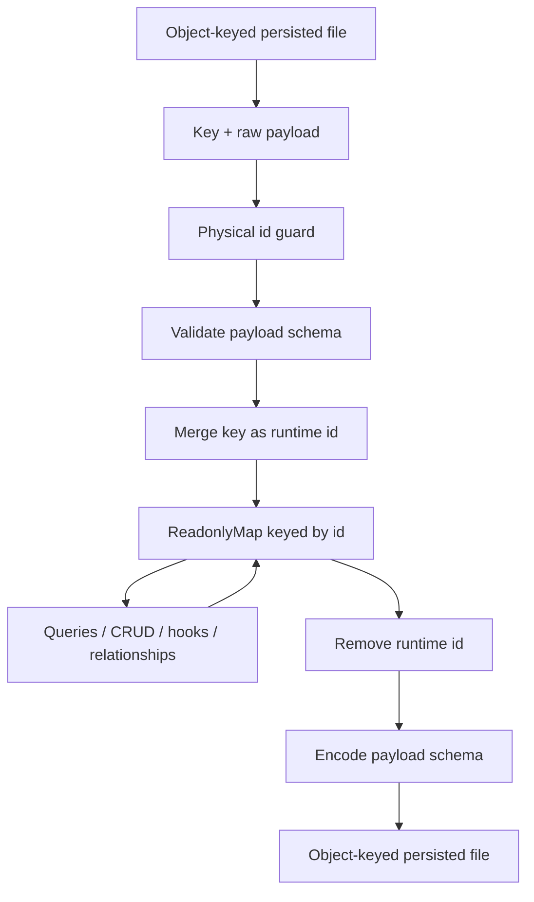
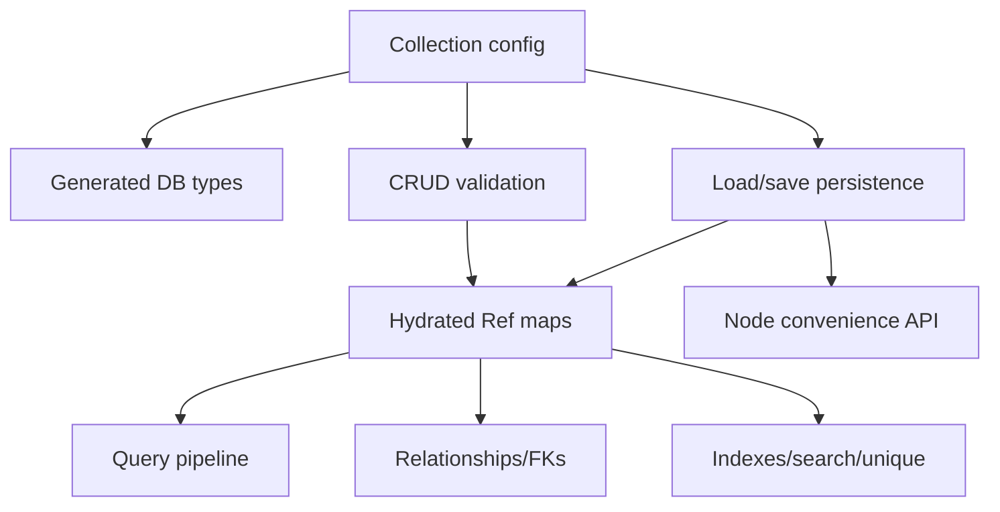

# feat: Add key-derived record identity

## Overview

ProseQL can feasibly support Korri's desired plain-text shape by making derived identity a collection-level persistence policy, not a new runtime identity model. The recommended design keeps all in-memory records hydrated with `id: string`, while selected persisted collections may omit the `id` field from each serialized payload and derive it from the surrounding object key on load.

This plan intentionally targets the smallest useful feature: primary record `id` comes from the storage key for object-keyed plain-text collection files. It does not generalize into arbitrary computed fields, alternate primary keys, or a new relationship model.

| Surface | Current behavior | Target behavior for derived-id collections |
|---|---|---|
| Runtime entity | Must physically contain `id` | Still contains `id` after hydration |
| Persisted keyed object | Key and payload both contain same `id` | Key contains identity; payload omits `id` |
| Schema in config | Describes full runtime entity | Describes persisted payload when `id.kind === "derivedFromKey"` |
| Legacy duplicated files | Required | Not supported in derived-id mode; any physical payload `id` is invalid |

## Feasibility Assessment

Feasible with moderate type and persistence-boundary work.

The current architecture already stores collection state as `ReadonlyMap<string, entity>`, which is a good fit for key-derived identity. The hard constraint is that CRUD, relationships, indexes, search, cursor pagination, hooks, and public query results expect hydrated entities with `.id`. The feature should therefore avoid changing internal state shape. Instead, it should add explicit hydrate/dehydrate transforms at the persistence and validation boundary:

- **Load:** keyed raw payload + key -> validated payload -> hydrated runtime entity with `id`.
- **Save:** hydrated runtime entity -> payload with `id` removed -> keyed object entry.
- **CRUD validation:** user input + generated/provided id -> validate non-id payload -> merge id into runtime entity.

The main implementation risk is type inference: `schema` will infer the payload type, while `GenerateDatabaseWithPersistence<Config>` must expose the hydrated runtime type. This is solvable with config-sensitive type helpers, but it touches public exported types and should be implemented test-first.

## Problem Frame

Korri wants ProseQL YAML files to be human-authored and human-reviewed without redundant identity fields. Today, YAML collections persist records as object entries keyed by id while also storing the same `id` inside the value:

```yaml
472c8ba3-c51c-45ed-8bab-fc560edd83ea:
  id: 472c8ba3-c51c-45ed-8bab-fc560edd83ea
  metadata:
    name: Default
```

The desired persisted form omits the redundant inner `id`, while the runtime API still returns full records:

```yaml
472c8ba3-c51c-45ed-8bab-fc560edd83ea:
  metadata:
    name: Default
```

Runtime result:

```ts
{ id: "472c8ba3-c51c-45ed-8bab-fc560edd83ea", metadata: { name: "Default" } }
```

## Requirements Trace

- R1. Support opt-in collection-level derived ids for object-keyed persisted collection files (`PROMPT_derived_ids_feasibility.md`).
- R2. Preserve runtime API shape: callers query and mutate records as objects containing `id: string`.
- R3. Allow collection schemas to describe the persisted payload without an `id` field when derived id mode is enabled.
- R4. On write, omit the derived `id` field from serialized payloads.
- R5. On read, inject the storage key as `id` into runtime records.
- R6. Do not support backward compatibility for legacy duplicated id payloads in derived-id mode.
- R7. Reject or skip any persisted payload that physically contains the derived `id` field, even when it matches the storage key.
- R8. Preserve `GenerateDatabaseWithPersistence<Config>` inference for derived-id collections.
- R9. Keep relationships, unique constraints, indexes, queries, cursors, and hooks operating on hydrated runtime records.
- R10. Avoid expanding scope into arbitrary computed fields or a generalized identity system.

## Scope Boundaries

- No Korri-specific ProseQL APIs.
- No generalized computed-field persistence framework.
- No alternate primary-key field support in the first implementation; the derived runtime field is `id`.
- No change to runtime collection state: it remains keyed `ReadonlyMap<string, hydratedEntity>`.
- No behavior change for collections that omit the derived id config.
- No support in the first pass for append-only JSONL/NDJSON collections, because array/line formats do not have a stable enclosing object key.
- No support in the first pass for Prose array output, for the same reason.

### Deferred to Separate Tasks

- Directory-per-collection payload id omission: the same transform can apply because filenames already supply keys, but Korri's immediate use case is keyed YAML files.
- Path mode where `path` resolves to arrays: derived id should remain unsupported until there is a key source.
- Any one-off rewrite of existing duplicated-id files is user-managed outside ProseQL before enabling derived-id mode.

## Context & Research

### Relevant Code and Patterns

- `packages/core/src/factories/database-effect.ts` creates `Ref<ReadonlyMap<string, HasId>>` state from initial or loaded data and builds CRUD/query APIs around hydrated entities.
- `packages/core/src/storage/persistence-effect.ts` owns file loading/saving and already separates object-keyed formats from array formats (`jsonl`, `ndjson`, `prose`). This is the right place for raw persisted payload hydration/dehydration.
- `packages/core/src/types/database-config-types.ts` defines `CollectionConfig`; the derived-id config belongs here as an opt-in collection property.
- `packages/core/src/types/types.ts` currently infers entity types directly from `schema`. It needs config-sensitive runtime entity helpers for derived-id collections.
- `packages/core/src/types/crud-types.ts` assumes runtime entities have `id`, and `CreateInput<T>` already makes `id` optional. This supports the target caller experience once runtime entity inference includes `id`.
- `packages/core/src/operations/crud/create.ts`, `update.ts`, `upsert.ts`, and relationship variants validate through the collection schema. Derived-id collections need these validation paths to validate persisted payload shape while returning hydrated runtime entities.
- `packages/core/src/operations/relationships/populate-stream.ts`, `filter.ts`, `unique-check.ts`, indexes, search indexes, and cursor pagination already operate on hydrated records, so they should not need raw persisted payload awareness.
- `packages/node/src/convenience.ts` delegates to core persistence and should inherit behavior after core config/types are updated.

### Current Behavior Summary

- Entity keys are established from `entity.id` during CRUD creation and when building initial `ReadonlyMap` state in `createEffectDatabase` / `createPersistentEffectDatabase`.
- File loading for object formats currently uses the outer key as the map key but decodes the value as the full schema; if the schema requires `id`, the payload must physically contain it.
- File saving encodes the full entity and stores it under the map key, so the key and payload both contain `id`.
- `findById` and `exists` use the map key directly.
- Most other APIs rely on `record.id` from hydrated records: relationship population, foreign-key validation, unique checks, hooks, indexes, search indexes, cursor sorting by `id`, delete constraint checks, transactions, and CRUD return values.

### Institutional Learnings

- `docs/solutions/build-errors/effect-v4-foundation-migration-2026-05-06.md` documents that the project is now on Effect v4 and schema code should use `Schema.Codec`, `Schema.decodeUnknownEffect`, and `Schema.encodeEffect`. This plan should preserve those conventions.
- The same learning emphasizes foundation-first validation for `@proseql/core` and `@proseql/node`; derived-id work should prioritize those packages and avoid widening into RPC or unrelated legacy suites.

### External References

- Not used. This feature is primarily about ProseQL's internal persistence/type model, and local code provides the relevant constraints.

## Key Technical Decisions

| Decision | Rationale |
|---|---|
| Use `id: { kind: "derivedFromKey", field: "id" }` instead of `deriveIdFromKey: true` | Self-describing, leaves room for explicit validation options later, and matches the requested acceptance shape without over-generalizing. |
| Treat `schema` as persisted payload schema in derived-id mode | Lets callers define `GamePayload` without `id`, which is the core Korri requirement. |
| Keep runtime/in-memory records hydrated with `id` | Minimizes blast radius across CRUD, queries, relationships, indexes, hooks, and transactions. |
| Hydrate/dehydrate at boundaries instead of changing serializers | Identity derivation is collection-aware, not format-aware; serializers should continue handling plain data structures. |
| Reject physical `id` before payload validation | Payload schemas should not need to accept `id`, and derived-id mode must not silently accept legacy duplicated files. |
| Default physical-id handling: absent `id` only | Any persisted payload containing `id` is invalid in derived-id mode, even if it matches the key. |
| Exclude append-only and array-backed formats initially | They do not provide an enclosing object key to derive from. |
| Validate unsupported derived-id combinations at startup | A clear config-time `ValidationError` is safer than silently falling back to duplicated ids or failing later during serialization. |

## Open Questions

### Resolved During Planning

- **Can ProseQL support this without changing runtime record shape?** Yes. Keep `ReadonlyMap<string, hydratedEntity>` and introduce collection-aware hydration/dehydration at persistence and CRUD validation boundaries.
- **Should the origin prompt's temporary legacy tolerance be implemented?** No. The follow-up direction explicitly rejects backwards compatibility, so derived-id mode must fail/skip any persisted payload that physically contains `id`, even when it matches the key.
- **Should persisted schema differ from public row schema?** Yes in derived-id mode. The configured schema should describe the persisted payload, while exported database types should expose `Payload & { readonly id: string }`.
- **Do relationships and uniqueness still work?** Yes, if all internal state and operation pipelines see hydrated records before indexes, foreign-key validation, hooks, unique checks, and query filters run.

### Deferred to Implementation

- **Exact helper names and placement:** Implementation should pick concise names while keeping the transform logic centralized.
- **Whether to include directory-mode support in the first patch:** The design supports it, but the first implementation may defer it if keyed file support satisfies the acceptance criteria cleanly.
- **Exact TypeScript constraints needed for Effect Schema v4:** The implementation should verify against the real `effect@4.0.0-beta.60` type signatures before finalizing helper generics.

## High-Level Technical Design

> *This illustrates the intended approach and is directional guidance for review, not implementation specification. The implementing agent should treat it as context, not code to reproduce.*



## Implementation Units

- [x] **Unit 1: Add derived-id config and type inference**

**Goal:** Introduce the public opt-in config shape and update generated database types so derived-id collections expose hydrated runtime entities while schemas can describe id-less payloads.

**Requirements:** R1, R2, R3, R8, R10

**Dependencies:** None

**Files:**
- Modify: `packages/core/src/types/database-config-types.ts`
- Modify: `packages/core/src/types/types.ts`
- Modify: `packages/core/src/factories/database-effect.ts`
- Test: `packages/core/tests/crud/type-safety.test.ts`

**Approach:**
- Add a narrow `DerivedIdConfig` shape to collection config with `kind: "derivedFromKey"` and `field: "id"`.
- Do not allow arbitrary field names in the first pass; many internal APIs currently assume `.id` as the primary identity field.
- Introduce a config-sensitive runtime entity type helper used by `GenerateDatabase`, `GenerateDatabaseWithPersistence`, `DatasetFor`, and factory return types.
- For non-derived collections, preserve existing inference exactly.
- For derived collections, infer payload from `schema` and expose runtime entity as payload plus `readonly id: string`.
- Add runtime config validation for unsupported first-pass combinations such as `appendOnly: true`, JSONL/NDJSON/Prose array formats without a key source, and `path` targets that resolve to arrays.

**Execution note:** Implement type coverage first because this is a public API surface and inference regressions are easy to miss at runtime.

**Patterns to follow:**
- Existing type inference helpers in `packages/core/src/types/types.ts`.
- Existing `@ts-expect-error` style type tests in `packages/core/tests/crud/type-safety.test.ts` and `packages/core/tests/nested-type-safety.test.ts`.

**Test scenarios:**
- Happy path: a config using `schema: GamePayload` and `id: { kind: "derivedFromKey", field: "id" }` infers query results with `id: string` plus payload fields.
- Happy path: `create()` accepts payload fields and optional `id`, even though the configured schema does not contain `id`.
- Edge case: `update()` does not allow changing `id`, matching existing runtime identity rules.
- Edge case: a normal collection without derived id keeps current full-schema inference.
- Error path: unsupported `field` values other than `"id"` are rejected at compile time where possible.
- Error path: unsupported derived-id persistence combinations fail at database startup with a clear `ValidationError` instead of writing ambiguous data.

**Verification:**
- Derived-id collection types are ergonomic for the acceptance example.
- Existing collection config and generated database types for non-derived collections remain unchanged.

- [x] **Unit 2: Centralize hydrate/dehydrate transforms for derived-id collections**

**Goal:** Add shared runtime helpers that convert between keyed persisted payloads and hydrated runtime entities, explicitly rejecting duplicated physical id payloads.

**Requirements:** R4, R5, R6, R7

**Dependencies:** Unit 1

**Files:**
- Create: `packages/core/src/storage/derived-id.ts`
- Modify: `packages/core/src/storage/persistence-effect.ts`
- Test: `packages/core/tests/derived-id-persistence.test.ts`

**Approach:**
- Create small helpers for:
  - detecting whether a collection uses derived id mode;
  - detecting and rejecting any physical payload `id` before payload validation;
  - treating a matching physical `id` as invalid rather than as a compatibility case;
  - hydrating validated payloads with the outer key as `id`;
  - dehydrating runtime entities by omitting `id` before encode/write.
- Keep helpers collection-aware and serializer-agnostic.
- Preserve strict vs lenient behavior: strict mode fails on a physical `id` or validation error; lenient mode skips invalid entities with warnings where the current loader already supports skipping.
- Do not mutate raw parsed objects in place; return shallow copies so serializer/plugin behavior remains predictable.

**Technical design:** Directional transform contract:

```text
hydrate(key, rawPayload, schema, derivedIdConfig)
  if rawPayload.id is absent: validate rawPayload, then add id = key
  if rawPayload.id exists: reject as unsupported duplicated identity

dehydrate(entity, schema, derivedIdConfig)
  remove entity.id
  encode payload schema
  store encoded payload under entity.id key
```

**Patterns to follow:**
- `stripComputedFromInput` helpers in CRUD operations for derived, non-persisted fields.
- `ValidationError` mapping patterns in `packages/core/src/storage/persistence-effect.ts` and `packages/core/src/validators/schema-validator.ts`.

**Test scenarios:**
- Happy path: keyed YAML/JSON object with payload missing `id` loads into map entry whose runtime entity has matching `id`.
- Happy path: saving a hydrated runtime entity writes a keyed object value with no `id` field.
- Error path: keyed object with payload `id` equal to key fails in strict validation with a clear field path.
- Error path: keyed object with payload `id` different from key fails in strict validation with a clear field path.
- Error path: lenient validation skips any entity containing a physical `id` and loads valid siblings.
- Edge case: non-object payload under a key still fails with the existing serialization/validation style.

**Verification:**
- Hydration and dehydration behavior is covered independently before being wired through database factories.

- [x] **Unit 3: Wire derived-id transforms into file persistence and database creation**

**Goal:** Make persistent databases load, save, flush, watch, and migrate derived-id collections through the new boundary transforms.

**Requirements:** R1, R4, R5, R6, R7, R9

**Dependencies:** Units 1 and 2

**Files:**
- Modify: `packages/core/src/storage/persistence-effect.ts`
- Modify: `packages/core/src/factories/database-effect.ts`
- Modify: `packages/core/src/storage/read-document.ts`
- Test: `packages/core/tests/derived-id-persistence.test.ts`
- Test: `packages/core/tests/file-watcher.test.ts`

**Approach:**
- Extend persistence option objects to carry the collection's derived-id config into `loadData` and `saveData`.
- During file load, reject any physical payload `id` and validate payloads before placing hydrated entities into `ReadonlyMap`.
- During file save/flush, encode payloads with `id` omitted and store them under the runtime entity id.
- Pass derived-id options from `createPersistentEffectDatabase` into initial file load, debounced save, flush, and file watcher reloads.
- Preserve migrations carefully: migrations should continue to receive raw entity maps in the persisted shape for that collection. If a derived-id collection has migrations, the implementation must define whether migrations run on payload-only records or hydrated records before changing behavior. Prefer payload-only migration input for consistency with configured schema, and document that choice in tests.
- Keep non-derived collections on the existing load/save path.

**Patterns to follow:**
- Existing `format`, `path`, `version`, `migrations`, and `validation` option threading in `createPersistentEffectDatabase`.
- Existing file watcher reload path in `createFileWatcher`.

**Test scenarios:**
- Happy path: `createPersistentEffectDatabase` loads id-less YAML payloads and `query().runPromise` returns hydrated records.
- Happy path: creating a new record with an explicit `id`, flushing, and reading the YAML shows the outer key but no inner `id`.
- Happy path: creating a new record without `id` still generates an id, returns it at runtime, and persists it only as the outer key.
- Error path: a file with duplicated matching `id` fails startup in strict mode; users must rewrite files before enabling derived-id mode.
- Error path: a file with a mismatched physical `id` also fails startup in strict mode.
- Edge case: file watcher reload of an externally edited id-less payload updates the hydrated entity and publishes the normal reload event.
- Edge case: non-derived collections in the same test still write duplicated/full payloads exactly as before.

**Verification:**
- The acceptance YAML shape round-trips through the persistent database API.
- Existing persistence tests continue to pass for normal collections.

- [x] **Unit 4: Adapt CRUD validation for payload-schema derived-id collections**

**Goal:** Ensure create/update/upsert and relationship-aware CRUD validate payload schemas while still storing and returning hydrated runtime entities with `id`.

**Requirements:** R2, R3, R8, R9

**Dependencies:** Units 1 and 2

**Files:**
- Modify: `packages/core/src/operations/crud/create.ts`
- Modify: `packages/core/src/operations/crud/update.ts`
- Modify: `packages/core/src/operations/crud/upsert.ts`
- Modify: `packages/core/src/operations/crud/create-with-relationships.ts`
- Modify: `packages/core/src/operations/crud/update-with-relationships.ts`
- Modify: `packages/core/src/factories/database-effect.ts`
- Test: `packages/core/tests/derived-id-crud.test.ts`
- Test: `packages/core/tests/crud/type-safety.test.ts`

**Approach:**
- Pass derived-id config into CRUD operation factories, or pass a validation strategy object that abstracts over full-entity vs payload-schema validation.
- For derived-id collections, validate the payload portion of create/update/upsert inputs with the configured schema, then merge/retain `id`, `createdAt`, and `updatedAt` according to existing CRUD semantics.
- Preserve hook behavior on hydrated runtime entities, not raw payloads. Hooks should continue to see `id`.
- Preserve unique, index, search, and foreign-key validation on hydrated entities.
- Prevent update operators from changing `id`, matching current immutable id behavior.

**Patterns to follow:**
- Existing computed-field stripping in CRUD operations, which already separates derived fields from stored validation/update payloads.
- Existing unique and foreign-key validation order in `create.ts`, `update.ts`, and `upsert.ts`.

**Test scenarios:**
- Happy path: `create({ id: "game-1", metadata: { name: "Default" } })` returns `{ id: "game-1", metadata: ... }` for a payload schema without `id`.
- Happy path: `create({ metadata: ... })` generates an id and returns a hydrated record.
- Happy path: `update("game-1", { metadata: { name: "Changed" } })` validates payload changes and preserves `id`.
- Happy path: `upsert({ where: { id: "game-1" }, create: ..., update: ... })` works with payload-schema create/update values.
- Integration: `createWithRelationships` creates hydrated parent/child records and relationship foreign keys still reference runtime ids.
- Error path: invalid payload fields fail validation with a useful `ValidationError` even though `id` is not part of the payload schema.
- Error path: attempts to set or update `id` through updates remain disallowed or ignored according to existing update semantics.

**Verification:**
- Derived-id collections behave like normal collections from the runtime CRUD user's perspective.
- Payload schemas without `id` are valid for all normal mutation paths.

- [x] **Unit 5: Prove cross-surface behavior and Node convenience API**

**Goal:** Cover the full Korri-facing usage path through `@proseql/node` and verify derived ids remain compatible with relationships, uniqueness, indexes, selection, cursors, and queries.

**Requirements:** R1, R2, R4, R5, R8, R9

**Dependencies:** Units 1-4

**Files:**
- Modify: `packages/node/src/convenience.ts` only if type forwarding requires it
- Test: `packages/node/tests/derived-id-convenience.test.ts`
- Test: `packages/core/tests/derived-id-query-integration.test.ts`
- Test: `packages/core/tests/derived-id-persistence.test.ts`

**Approach:**
- Add an end-to-end `createNodeDatabase` test matching the prompt's acceptance criteria.
- Add core integration coverage proving derived-id records participate normally in query filters, selects, cursor pagination using `id`, relationships, and uniqueness checks.
- Ensure `@proseql/node` exports the relevant types through existing core re-exports if needed.
- Keep docs examples focused on the minimal API and Korri-like YAML shape without naming Korri as a ProseQL concept.

**Patterns to follow:**
- `packages/node/tests/convenience.test.ts` for temporary-directory file round trips.
- `packages/core/tests/database-effect.test.ts` for persistent database integration patterns.
- `packages/core/tests/select.test.ts`, `cursor-pagination.test.ts`, and relationship tests for query-surface expectations.

**Test scenarios:**
- Happy path: `createNodeDatabase` with `GamePayload` and `id: { kind: "derivedFromKey", field: "id" }` persists YAML without inner `id` and returns hydrated runtime records.
- Happy path: `findById("game-1")`, `exists("game-1")`, and `query({ where: { id: "game-1" } })` all work.
- Happy path: `select: { id: true, metadata: true }` can include the derived id.
- Happy path: cursor pagination with `cursor.key = "id"` works because runtime records are hydrated before query stages.
- Integration: a `ref` relationship targeting a derived-id collection resolves by hydrated `id`.
- Integration: unique constraints inspect hydrated entities and still catch duplicate payload fields.
- Edge case: non-derived and derived collections can coexist in the same database config.

**Verification:**
- The exact acceptance example is possible through `@proseql/node`.
- No new package such as `@proseql/bun` is required.

- [x] **Unit 6: Document API constraints and no-compatibility stance**

**Goal:** Explain the public feature, no-compatibility stance, and unsupported surfaces so downstream users can adopt it safely.

**Requirements:** R1, R6, R7, R10

**Dependencies:** Units 1-5

**Files:**
- Modify: `README.md`
- Modify: `packages/core/README.md` if present/relevant
- Modify: `packages/node/README.md` if present/relevant
- Modify: `docs/solutions/build-errors/effect-v4-foundation-migration-2026-05-06.md` only if implementation uncovers Effect v4-specific schema lessons worth preserving

**Approach:**
- Add a concise example showing a payload schema without `id`, the derived-id config, persisted YAML, and runtime query result.
- Document that derived-id mode has no legacy compatibility: any inner `id` in persisted payloads is invalid and must be removed before enabling the feature.
- Document first-pass limitations: object-keyed file formats only; append-only/JSONL/prose array formats unsupported for derived ids.
- Avoid Korri-specific names in public docs.

**Patterns to follow:**
- Existing README persistence examples.
- Existing solution-doc style only if new migration/build learning is discovered during execution.

**Test scenarios:**
- Test expectation: none -- documentation-only unit; behavior is covered by earlier implementation units.

**Verification:**
- A user can copy the documented pattern and understand the runtime/persisted schema distinction.

## System-Wide Impact



- **Interaction graph:** Config drives both type inference and runtime persistence transforms. CRUD and persistence must converge on the same hydrated state shape before query, relationship, hook, index, search, and uniqueness code runs.
- **Error propagation:** Strict load physical-id violations should surface as `ValidationError` with collection/key context. Lenient load should skip bad entities and log warnings consistently with existing lenient validation behavior.
- **State lifecycle risks:** Partial hydration or mixed raw/hydrated state would break relationships and indexes. State refs must only contain hydrated entities.
- **API surface parity:** Core and Node APIs should expose the same config shape and inferred entity behavior. REST/RPC work is outside Korri scope and should not be widened unless type exports force it.
- **Integration coverage:** Persistence round trips alone are insufficient; derived id must be proven through create/update/upsert, query, select, cursor, relationship, uniqueness, and Node convenience paths.
- **Unchanged invariants:** Runtime identity remains `id: string`; `findById` and `exists` remain map-key lookups; non-derived collections continue to persist full encoded entities.

## Risks & Dependencies

| Risk | Mitigation |
|------|------------|
| Type inference exposes payload type instead of hydrated runtime type | Add config-sensitive entity helpers and compile-time tests before runtime wiring. |
| Payload-schema validation breaks CRUD paths that currently validate full entities | Introduce a derived-id validation strategy and test create/update/upsert plus relationship variants. |
| Existing duplicated-id files fail after derived-id mode is enabled | This is intentional: no backwards compatibility. Document that users must remove inner `id` fields before enabling derived-id mode. |
| Physical payload `id` silently corrupts identity | Fail in strict mode and skip in lenient mode with warnings before schema validation. |
| Array-backed formats cannot derive ids | Explicitly reject unsupported format/config combinations for derived-id collections during startup/config validation. |
| Migrations become ambiguous between payload-only and hydrated records | Decide and document one model; prefer payload-only migrations for derived-id collections because schema describes persisted payload, and add migration tests before advertising migration support. |
| Hooks or indexes receive raw payloads without `id` | Ensure all state mutation paths hydrate before hooks, indexes, search, unique checks, and relationship validation. |
| Existing non-derived persistence regresses | Keep non-derived code paths behaviorally unchanged and run existing persistence foundation tests. |

## Documentation / Operational Notes

- This should be a minor feature release because it adds a public config option and type behavior.
- Migration path is opt-in per collection. Existing files and schemas continue unchanged unless the collection adds the derived-id config.
- No backwards compatibility is provided for duplicated id files after derived-id mode is enabled. Users must remove inner `id` fields before startup; ProseQL should not normalize legacy payloads automatically.
- The docs should emphasize that `schema` means persisted payload schema in derived-id mode, while runtime results are hydrated.

## Sources & References

- Origin document: [PROMPT_derived_ids_feasibility.md](PROMPT_derived_ids_feasibility.md)
- Config types: `packages/core/src/types/database-config-types.ts`
- Generated DB types: `packages/core/src/types/types.ts`
- Persistent database factory: `packages/core/src/factories/database-effect.ts`
- Persistence boundary: `packages/core/src/storage/persistence-effect.ts`
- CRUD validation: `packages/core/src/operations/crud/create.ts`, `packages/core/src/operations/crud/update.ts`, `packages/core/src/operations/crud/upsert.ts`
- Relationship population: `packages/core/src/operations/relationships/populate-stream.ts`
- Node convenience path: `packages/node/src/convenience.ts`
- Effect v4 migration learning: `docs/solutions/build-errors/effect-v4-foundation-migration-2026-05-06.md`
