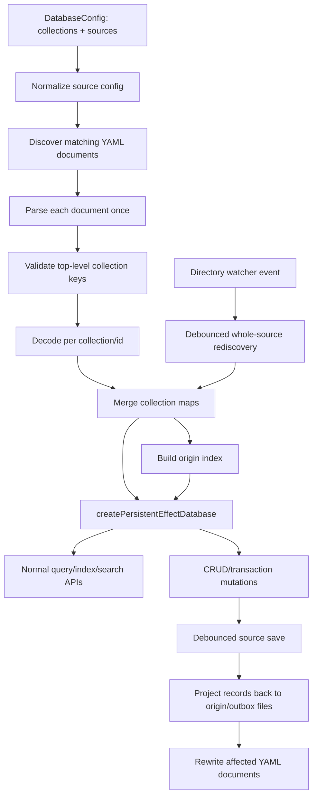

# Add Multi-Collection Document Sources

## Summary

Add a breaking, database-level persistence source model where one logical ProseQL database can load multiple collections from a directory of object-keyed YAML documents. The plan reshapes `DatabaseConfig` into explicit `collections` plus tagged `sources`, tracks each loaded record's origin file for update/delete routing, and writes new records to an explicit outbox file.

---

## Problem Frame

ProseQL currently treats persistence as a per-collection concern: a collection points at one file, or at a directory where each entity is its own file. Korri's config cascade needs a different user contract: filenames carry no logical meaning, and any YAML file in a config directory can contribute records to any declared top-level collection.

This is a public persistence-surface change. The user explicitly confirmed that backwards compatibility is not required, so the plan can replace the existing optional-field persistence shape with a cleaner source model instead of layering another special case on `CollectionConfig`.

---

## Requirements

- R1. A database-level document source loads a directory/glob of YAML files where each file is a top-level object keyed by declared collection names.
- R2. Each collection section is object-keyed by record id; runtime entities are hydrated from the object key using the existing derived-id semantics, and physical `id` fields in persisted payloads remain invalid.
- R3. Matching files merge into one logical in-memory map per collection, while duplicate `(collection, id)` records across files or sources fail loudly by default.
- R4. Unknown top-level collection keys fail loudly by default, with an explicit opt-in preservation policy available for consumers that need non-ProseQL top-level data to survive rewrites.
- R5. Validation, serialization, migration, duplicate, and unknown-key failures include the offending file path, and where applicable the collection and record id.
- R6. Loaded records retain origin-file attribution so updates write back to the source file and deletes remove the record from the source file.
- R7. Newly-created records with no origin write to a configured outbox file, with optional per-collection overrides if the source config needs them.
- R8. Empty source files and existing empty matched directories are valid; missing source roots fail by default unless explicitly marked optional, missing outbox parents are created on first write, and outbox paths must be rediscoverable by their owning source.
- R9. File watching/reload support works for document sources: add/change/remove events eventually rebuild collection state and origin attribution, then publish existing reactive reload events.
- R10. Node convenience APIs infer/register the right codecs for document sources and operate against the real filesystem.
- R11. CLI commands that read or mutate persistent databases resolve document source paths, report document-source locations clearly, and fail explicitly for unsupported conversion flows.
- R12. The implementation may break existing `file`/`directory`/`path` persistence config APIs and tests if doing so produces a simpler public contract.
- R13. Each persisted `(collection, id)` has exactly one source/origin; overlapping source patterns and duplicate physical files are rejected or canonicalized deterministically.
- R14. Mutating CLI flows and explicit `flush()` calls surface persistence failures instead of exiting after only an in-memory mutation.

---

## Scope Boundaries

- Korri cascade resolver implementation, Korri dependency bump, and Korri plan revision are out of scope for this ProseQL plan.
- Legacy Korri data migration and backwards compatibility for old Korri library files are out of scope.
- Mixed file formats within one document source are out of scope for the first version; a source uses one object document format, with YAML as the primary supported/tested path.
- Korri layer-specific write routing is out of scope for this ProseQL release. The generic contract is configured outbox routing; if Korri later needs caller-selected cascade destinations, that should be planned as a separate API extension.
- Preserving YAML comments, exact ordering, and original formatting is out of scope; writes preserve data and sibling collection sections, not presentation trivia.
- Lenient duplicate resolution is out of scope for the default behavior. If a policy hook exists, strict failure remains the default.
- Optimized per-file watcher reload is out of scope for the first pass; correctness via debounced whole-source rediscovery is preferred.
- Crash-level all-or-nothing writes across multiple files are out of scope unless a journal/recovery protocol is deliberately added. This plan requires all validation/serialization before first write and atomic replace per file, not a promise that a process crash cannot leave some files updated.

### Deferred to Follow-Up Work

- Capture a `docs/solutions/` learning after the feature ships so future ProseQL and Korri work can reuse the document-source pattern.
- Add cross-format document-source examples beyond YAML only if downstream users need them.
- Add comment-preserving YAML editing only if ProseQL adopts a parser/serializer that can round-trip comments as a first-class contract.

---

## Context & Research

### Relevant Code and Patterns

- `packages/core/src/types/database-config-types.ts` — current `CollectionConfig` persistence fields (`file`, `directory`, `path`, `appendOnly`, `format`, `validation`, `id`) and the exported `DatabaseConfig` shape.
- `packages/core/src/storage/derived-id.ts` — existing object-key hydration, physical-id rejection, and save-time stripping helpers that document sources must reuse rather than reimplement.
- `packages/core/src/storage/transforms.ts` — existing collection/file grouping assumptions that likely need removal or replacement under source-level persistence.
- `packages/core/src/storage/persistence-effect.ts` — existing helpers for single-file collection persistence, multi-collection single-file persistence, entity-per-file directory persistence, debounced writers, and file/directory watchers.
- `packages/core/src/factories/database-effect.ts` — `createPersistentEffectDatabase` currently validates per-collection persistence, loads per collection, schedules debounced saves by collection name, and starts file/directory watchers.
- `packages/core/src/storage/storage-service.ts` — storage adapter boundary; currently supports direct file operations plus direct-child `listDirectory`/`watchDir`, but no recursive discovery or glob matching.
- `packages/core/src/storage/in-memory-adapter-layer.ts` and `packages/node/src/node-adapter-layer.ts` — real adapter implementations that need deterministic discovery/watch behavior for tests and filesystem use.
- `packages/core/src/transactions/transaction.ts` — transaction persistence scheduling currently keys off mutated collection names and must learn source-level persistence keys.
- `packages/core/src/serializers/infer-codecs.ts` and `packages/node/src/convenience.ts` — codec inference and Node convenience wiring that currently inspect collection-level file/format settings.
- `packages/core/tests/persistence-effect.test.ts`, `packages/core/tests/database-effect.test.ts`, `packages/core/tests/file-watcher.test.ts`, `packages/core/tests/schema-migrations.test.ts`, `packages/core/tests/derived-id.test.ts` — foundation tests to mirror for load/save/watch/migration/derived-id behavior.
- `packages/cli/src/config/loader.ts` and `packages/cli/src/commands/{query,create,update,delete,collections,stats,migrate,convert}.ts` — CLI config and command paths currently assume top-level collection configs and/or collection-level files.
- `packages/core/src/index.ts`, `packages/node/src/index.ts`, `packages/browser/src/index.ts`, and `packages/ai/src/introspect.ts` — public package entrypoints and config introspection surfaces affected by the breaking `DatabaseConfig` type change.
- `packages/node/tests/convenience.test.ts`, `packages/node/tests/node-storage.test.ts`, and `packages/cli/tests/commands/*.test.ts` — Node and CLI integration coverage to extend once core semantics are stable.

### Institutional Learnings

- `docs/solutions/build-errors/effect-v4-foundation-migration-2026-05-06.md` — storage, serializer, schema, watcher, and node adapter work must follow Effect v4 service, schema, stream, and scoped-fiber patterns. Watcher callbacks need explicit runtime context and scoped ownership; detached debounce writes should not accidentally require caller scope.

### External References

- None. Local code patterns and the checked-in Effect reference clone are sufficient for planning this feature. Implementation should still inspect `effect/packages/effect/src/` before touching Effect APIs, per project guidance.

---

## Key Technical Decisions

- **Use database-level `sources`, not collection-level persistence fields.** Collections continue to define schemas, relationships, indexes, migrations, and identity policy; sources define where documents are discovered, how unknowns/duplicates behave, and where new records are written. This matches a file contributing to multiple collections and avoids hidden coordination among per-collection configs.
- **Reshape `DatabaseConfig` to explicit `collections` plus `sources`.** A top-level `sources` key cannot be safely added to today's `Record<string, CollectionConfig>` without colliding with a valid collection name and confusing generated database typing. The breaking shape should make `sources` metadata, not a runtime collection.
- **Replace the optional-field persistence cluster with tagged source variants.** Because backwards compatibility is not required, the plan should retire `file`/`directory`/`path`/`appendOnly` as competing top-level `CollectionConfig` fields instead of adding more optional combinations. To preserve ProseQL's existing persistence capabilities under the new config shape, this release should ship tagged variants for single-collection file, entity directory, append-only log, and multi-collection documents.
- **Make source ownership unique.** A persisted `(collection, id)` must resolve to exactly one source and one origin file. Duplicate records across any sources fail, overlapping include patterns are canonicalized or rejected deterministically, and write-capable collections cannot be ambiguously backed by multiple sources.
- **Make outbox rediscovery an invariant.** An outbox file must belong to exactly one document source and be discoverable by that source after flush, either by matching the include pattern or by explicit source membership. Otherwise records created successfully could disappear on reload.
- **Make strictness the default.** Duplicate `(collection, id)` pairs, unknown top-level collection keys, duplicate YAML mapping keys, physical `id` fields in derived-id object payloads, and invalid schemas fail the load by default. Leniency must be explicit and narrowly scoped; any non-error unknown-key policy should preserve unknown sections on rewrite unless it explicitly says data may be dropped.
- **Keep matching policy in core, traversal in adapters.** Storage adapters should enumerate normalized files beneath roots and provide watcher wakeups. Core document-source code owns include/exclude matching, format filtering, duplicate physical-path handling, and source semantics.
- **Prepare every migration/write projection before first write, but do not overpromise crash atomicity.** Multi-file source saves should parse, migrate, validate, encode, and stage all target documents before writing any file, then use atomic replace per file where the adapter supports it. If a non-crash write failure occurs after some files were replaced, surface a partial-persistence error that names committed and failed paths and requires reload/reconciliation before further writes. Without a journal/recovery protocol, crash-level all-or-nothing across multiple files is not guaranteed and must be documented.
- **Represent origin and projection state as first-class persistence state.** The document-source module owns origin indexes, last-loaded content hashes, preserved sibling sections, `_version` metadata, and save projections. The factory should schedule and coordinate source saves, not know how to rewrite YAML documents.
- **Schedule persistence by source, not by collection, for document sources.** Any mutation to a sourced collection schedules the owning source save. Transaction commit needs a collection-to-persistence-key mapping so one transaction mutating two collections in the same document source schedules one source save.
- **Serialize source save and reload through one concurrency boundary.** Local saves, watcher reloads, origin updates, index/search rebuilds, and migration write-backs must share a source-level lock/state machine so a reload cannot race a debounced local save.
- **Prefer whole-source watcher reload for correctness.** Adapter watcher events can be lossy, especially on Node rename/remove. A debounced rediscovery/reload keeps collection maps, origin state, indexes, and search state coherent; optimization can follow after correctness is proven.
- **Define path normalization at composition roots.** Core receives normalized adapter paths. Node convenience documents process-relative behavior; CLI resolves paths relative to the config file through one helper before calling core. Physical-file uniqueness is lexical/canonical-path based for this release; symlink-safe identity can be a follow-up unless implementation adds a storage capability for it.
- **Do not promise YAML comment preservation.** Existing serializers rewrite documents semantically. Document that manual YAML remains supported at the data level, not at the original formatting/comment level.

---

## Open Questions

### Resolved During Planning

- **Should the public API be database-level or collection-level?** Database-level `sources` was chosen with the user because one physical document source contributes to multiple logical collections and needs shared duplicate detection, origin tracking, and write routing. The breaking config shape should be explicit `collections` plus `sources`, not `Record<string, CollectionConfig>` plus a reserved key.
- **Is backwards compatibility required?** No. The user explicitly stated that no backwards compatibility is needed.
- **Should strict or lenient collision behavior be default?** Strict default. Silent precedence would create hidden data loss in a plain-text config workflow.
- **Should watcher support be included?** Yes. Existing persistent databases already have best-effort watcher support, and document sources should participate in the same reactive reload contract.

### Deferred to Implementation

- **Exact TypeScript names for the source union and error classes:** Choose names that fit nearby code once the implementing agent has the types open.
- **Exact discovery matcher implementation:** Decide whether adapter-level recursive listing plus core filtering is enough, or whether a small glob dependency is justified. Matching semantics stay in core either way.
- **Exact migration path for legacy config examples/tests:** The plan chooses tagged source variants for existing persistence capabilities, but the implementer may temporarily bridge internals to keep the diff reviewable.
- **Whether to add crash-recovery journaling:** The base plan requires preflight validation and per-file atomic replace, but not a multi-file recovery journal. Add one only if implementation or release review decides crash-level atomicity is part of the contract.

---

## Output Structure

    packages/core/src/storage/
      source-config.ts
      document-source.ts
      origin-index.ts
    packages/core/src/errors/
      source-errors.ts
    packages/core/tests/
      document-source.test.ts
    # Post-implementation follow-up, not part of these implementation units:
    docs/solutions/
      [learning captured after shipment]

---

## High-Level Technical Design

> *This illustrates the intended approach and is directional guidance for review, not implementation specification. The implementing agent should treat it as context, not code to reproduce.*



Directional config sketch:

```text
DatabaseConfig
  collections: record of CollectionConfig without storage paths
  sources:
    - id: stable unique source id
      kind: "documents"
      root plus include pattern(s)
      format: "yaml"
      collections: declared collection names or "all"
      unknownCollections: "error" by default, optional preserve policy
      duplicates: "error" by default across all sources
      outbox: required rediscoverable file, optionally overridden per collection
```

---

## Implementation Units

### U1. Define the source-oriented configuration contract

**Goal:** Replace collection-level persistence paths with a database-level tagged source contract that can represent multi-collection document sources cleanly.

**Requirements:** R1, R2, R4, R7, R12, R13

**Dependencies:** None

**Files:**
- Modify: `packages/core/src/types/database-config-types.ts`
- Modify: `packages/core/src/types/types.ts`
- Create: `packages/core/src/storage/source-config.ts`
- Modify: `packages/core/src/serializers/infer-codecs.ts`
- Modify: `packages/core/src/storage/transforms.ts`
- Modify: `packages/core/src/index.ts`
- Modify: `packages/browser/src/index.ts`
- Modify: `packages/ai/src/introspect.ts`
- Modify: `packages/ai/src/types.ts`
- Modify: `packages/cli/src/config/loader.ts`
- Test: `packages/core/tests/infer-codecs.test.ts`
- Test: `packages/core/tests/database-effect.test.ts`
- Test: `packages/ai/tests/ai-tools.test.ts`
- Test: `packages/cli/tests/config-discovery.test.ts`

**Approach:**
- Introduce an explicit `collections` plus `sources` database config shape while keeping collection schemas and derived-id policy on each collection.
- Ensure `sources` is metadata and cannot appear as a runtime collection in generated database types or CLI config validation.
- Model persistence variants as tagged source cases for single-collection file, entity directory, append-only log, and multi-collection documents. The old optional fields are removed from `CollectionConfig`; their behavior survives through source variants.
- Add shared configured-collection helper types/functions so generated database types, factory loops, plugin validation, migration validation, relationship helpers, REST/RPC/AI surfaces, and CLI collection listing all iterate `config.collections` rather than top-level config keys.
- Normalize source config early so the factory and CLI consume one shape for source id, participating collections, format, discovery root/patterns, strictness policy, canonical physical paths, and outbox routing.
- Update codec inference to inspect source formats and outbox paths, not just `CollectionConfig.file` and `format`.
- Preserve the project terminology `DatabaseConfig`, `CollectionConfig`, and `StorageAdapter`; avoid inventing a parallel vocabulary for records/entities.

**Execution note:** Start with type/config and codec-inference tests so the public shape is fixed before persistence internals move.

**Patterns to follow:**
- `packages/core/src/types/database-config-types.ts` for current config documentation style.
- `packages/core/src/serializers/infer-codecs.ts` for extension/format-driven codec inference.
- `packages/core/tests/persistence-format-override.test.ts` and `packages/core/tests/infer-codecs.test.ts` for format behavior.

**Test scenarios:**
- Happy path: a config with document source format `yaml` causes YAML codec inference even when collections no longer specify `file`.
- Happy path: a document source can target all configured collections or an explicit subset.
- Happy path: `sources` is accepted as metadata and is not exposed as a runtime collection.
- Edge case: a document source referencing an undeclared collection fails config validation with the source id and collection name.
- Edge case: duplicate source ids fail during config normalization.
- Edge case: overlapping include patterns that discover the same physical file are canonicalized once or rejected deterministically, according to the chosen invariant.
- Edge case: outbox paths that do not belong to exactly one owning source fail config validation.
- Edge case: a collection with derived-id policy is accepted for document sources but still rejects array-backed or entity-directory-only shapes where object keys are unavailable.
- Error path: incompatible old-style persistence fields and new `sources` configuration fail clearly during the breaking transition, rather than being silently combined.
- Error path: old top-level collection-only CLI config is rejected or bridged deliberately; it is not accidentally parsed as the new shape.
- Integration: `GenerateDatabase` and related public types expose collection names from `config.collections`, not `collections` or `sources` metadata keys.

**Verification:**
- Public exports expose the new source types and remove/supersede old persistence field assumptions.
- Codec inference no longer depends on collection-level `file` paths.

---

### U2. Extend storage discovery and watcher adapter capabilities

**Goal:** Give core persistence deterministic file discovery for directory/pattern sources while keeping Node filesystem details at the adapter edge.

**Requirements:** R1, R8, R9, R10

**Dependencies:** U1

**Files:**
- Modify: `packages/core/src/storage/storage-service.ts`
- Modify: `packages/core/src/storage/in-memory-adapter-layer.ts`
- Modify: `packages/node/src/node-adapter-layer.ts`
- Modify: `packages/browser/src/adapters/web-storage-adapter.ts`
- Modify: `packages/browser/src/adapters/indexeddb-adapter.ts`
- Modify: `packages/browser/src/adapters/local-storage-adapter.ts`
- Modify: `packages/browser/src/adapters/session-storage-adapter.ts`
- Modify: `packages/core/src/utils/path.ts`
- Test: `packages/core/tests/storage-services.test.ts`
- Test: `packages/core/tests/in-memory-storage.test.ts`
- Test: `packages/node/tests/node-storage.test.ts`

**Approach:**
- Extend the `StorageAdapter` contract with deterministic recursive file enumeration beneath a root. Do not put include/glob matching semantics into individual adapters.
- Keep discovery deterministic by sorting normalized matched paths before load/merge, so duplicate error attribution and tests are stable.
- Preserve core's runtime-agnostic boundary: core owns pattern/format matching and duplicate physical-path handling; Node-specific traversal stays in `packages/node/src/node-adapter-layer.ts`.
- Update in-memory storage with the same enumeration semantics so core tests use a real configurable implementation rather than a mock.
- Require watcher coverage for the same file set that source discovery supports, including nested add/change/remove for recursive document sources. Implement this by recursive watch wakeups or by watching discovered directories and refreshing the watch set after rediscovery.
- Plan for safe writes at the adapter seam where practical: Node already writes via temp file and rename; document-source saves should use per-file atomic replace and last-loaded content hashes for conflict detection.

**Patterns to follow:**
- Existing direct-child `listDirectory` and `watchDir` implementations in `packages/core/src/storage/in-memory-adapter-layer.ts` and `packages/node/src/node-adapter-layer.ts`.
- `docs/solutions/build-errors/effect-v4-foundation-migration-2026-05-06.md` for Effect v4 watcher ownership and callback context.

**Test scenarios:**
- Happy path: recursive enumeration under a root returns nested files; core matching then filters to `.yaml` document-source files.
- Happy path: discovery returns sorted normalized paths for deterministic merge order.
- Edge case: missing root fails by default for required document sources; an explicit optional/bootstrap flag can opt into empty-source behavior.
- Edge case: in-memory discovery matches the same normalized paths as Node discovery for equivalent fixture paths.
- Edge case: browser adapters either implement the new capability meaningfully or fail with explicit unsupported errors without breaking type compatibility.
- Edge case: duplicate path aliases or symlink/case-normalization collisions are rejected or canonicalized according to the source invariant.
- Error path: filesystem traversal errors surface as `StorageError` with operation/path context.
- Error path: write/replace failure does not leave the final target file truncated in Node integration coverage.
- Integration: Node adapter discovers real temp-dir files across nested directories.
- Integration: nested add/change/remove watcher wakeups are covered for the chosen recursive-watch strategy.

**Verification:**
- Core tests can seed a `Map<string, string>` and discover nested document files without Node imports.
- Node tests prove the real filesystem adapter can enumerate the document source shape Korri needs.

---

### U3. Build document-source load, merge, validation, and origin indexing

**Goal:** Add the core deep module that parses many YAML documents once, validates collection sections, decodes records, detects collisions, and returns collection maps plus origin metadata.

**Requirements:** R1, R2, R3, R4, R5, R8, R13

**Dependencies:** U1, U2

**Files:**
- Create: `packages/core/src/storage/document-source.ts`
- Create: `packages/core/src/storage/origin-index.ts`
- Create: `packages/core/src/errors/source-errors.ts`
- Modify: `packages/core/src/storage/persistence-effect.ts`
- Modify: `packages/core/src/storage/derived-id.ts`
- Modify: `packages/core/src/errors/index.ts`
- Modify: `packages/core/src/index.ts`
- Test: `packages/core/tests/document-source.test.ts`
- Test: `packages/core/tests/derived-id.test.ts`
- Test: `packages/core/tests/schema-migrations.test.ts`

**Approach:**
- Treat document-source loading as a source-level operation, not a collection loop. Each matching file is parsed once and each declared top-level collection section is decoded with that collection's schema and migration settings.
- Reuse or extract existing object-keyed decode/migration/derived-id logic from `loadData`; do not create a parallel implementation that bypasses `packages/core/src/storage/derived-id.ts`.
- Create source-level errors for unknown top-level collections, duplicate records across files/sources, duplicate physical file discovery, invalid collection section shapes, and missing origin attribution. Include structured file path, collection, id, source id, and conflicting path fields where applicable.
- Reject duplicate YAML mapping keys for YAML document sources. If the existing YAML codec cannot expose duplicate keys safely, add a document-source-specific parse path or reject that codec for document-source use until duplicate-key detection exists.
- Run per-collection migrations in memory for every matched file. Only after the whole source succeeds should migrated documents be eligible for write-back, and duplicate detection should run on canonical ids after migration/derived-id hydration.
- Return merged collection maps, an origin index, and document projection state. The origin/projection data is not part of the public query API; it is persistence state owned by the document-source module.

**Execution note:** Implement document-source behavior test-first with in-memory storage fixtures containing two or more YAML files.

**Patterns to follow:**
- `loadCollectionsFromFile` in `packages/core/src/storage/persistence-effect.ts` for top-level collection sections and per-collection migration.
- `loadData` and `packages/core/src/storage/derived-id.ts` for object-keyed derived-id hydration and validation.
- `packages/core/tests/persistence-effect.test.ts` for serializer-layer test setup.

**Test scenarios:**
- Happy path: two YAML files each contribute `games` and `systems`; the result has one merged map per collection and origin paths for every `(collection, id)`.
- Happy path: a file omitting a declared collection contributes no records for that collection and does not fail.
- Happy path: derived-id records hydrate runtime `id` from YAML object keys and strip physical ids on later save.
- Edge case: an empty matched file or empty top-level object loads no records.
- Edge case: `_version` inside a collection section is treated as collection metadata, not a record id.
- Error path: duplicate `games.super-mario-world` across two files fails with collection, id, first file, and duplicate file.
- Error path: duplicate `games.super-mario-world` across two source configs fails with both source ids and paths.
- Error path: duplicate mapping keys in YAML are rejected at top-level collection, collection record-id, and record-field levels.
- Error path: unknown top-level `emulators` key fails by default with the offending file path and key.
- Error path: preserved unknown top-level data survives a later source save when the opt-in preservation policy is used.
- Error path: invalid collection sections such as `games: null`, `games: []`, scalar sections, and record ids mapped to `null` fail with file/collection/id context.
- Error path: malformed YAML reports the file path that failed to deserialize.
- Error path: schema validation failure reports file path, collection, and id.
- Error path: physical `id` field in a derived-id payload is rejected with file path and record key.
- Error path: migration or id normalization producing a duplicate canonical id fails with both origins.
- Integration: a per-collection migration runs across all files and does not write any migrated document if another file in the same source fails.

**Verification:**
- The new module is deep enough that factory code can ask it to load a source without knowing parse/merge/duplicate/origin details.
- Error assertions can rely on structured tags/fields rather than brittle message-only checks where practical.

---

### U4. Integrate document sources into persistent database load/save/transactions

**Goal:** Wire document sources into `createPersistentEffectDatabase` so normal query, CRUD, transaction, index, search, and flush behavior works from merged multi-file data.

**Requirements:** R3, R6, R7, R8, R12, R13, R14

**Dependencies:** U1, U3

**Files:**
- Modify: `packages/core/src/factories/database-effect.ts`
- Modify: `packages/core/src/storage/persistence-effect.ts`
- Modify: `packages/core/src/transactions/transaction.ts`
- Modify: `packages/core/src/types/types.ts`
- Test: `packages/core/tests/database-effect.test.ts`
- Test: `packages/core/tests/transactions.test.ts`
- Test: `packages/core/tests/indexing.test.ts`
- Test: `packages/core/tests/full-text-search.test.ts`

**Approach:**
- Load document sources before building collection refs, then merge source-loaded records with explicit `initialData` using the existing `initialData` precedence rule.
- Define `initialData` origin semantics explicitly. Same-id overrides of loaded records are in-memory overlays and should not rewrite origin files until that record is mutated; new `initialData` records remain memory-only unless an explicit persistence option or CRUD mutation marks them for persistence.
- Maintain source-owned origin refs alongside collection state refs. Existing persisted records route to their origin file; records created through CRUD without an origin route to the configured outbox.
- Validate persistence-routing preconditions at config/load time where possible. Missing outbox should be invalid before create paths can mutate in memory and only fail later during debounced save.
- Change persistence scheduling for document-source collections so mutations schedule the source id, not only the collection name. Transaction commit needs a collection-to-persistence-key mapping or scheduler callback.
- Refactor explicit `flush()` behavior so persistence errors are observable. Background debounced saves may remain best-effort/logging-oriented, but CLI and callers using `flush()` need failures instead of swallowed errors.
- Implement source save as a reconciliation step owned by the document-source module: snapshot current collection/origin refs, build all target file projections, encode/validate every target document, compare current file content against the last-loaded hash for best-effort lost-update detection, stage writes, atomically replace each file, and only then update origin state.
- Preserve sibling collection sections, `_version` metadata, and preserved unknown top-level sections according to source policy.
- If a later file write fails after earlier files were replaced, return a partial-persistence error that names committed and failed paths, keeps origin refs conservative, and requires reload/reconciliation before further writes.
- Ensure transaction rollback leaves collection refs, origin refs, equality indexes, and search indexes unchanged; transaction commit schedules each affected source once.

**Execution note:** Add integration tests before refactoring transaction/persistence scheduling so behavior stays visible during the factory rewrite.

**Patterns to follow:**
- Existing `createPersistentEffectDatabase` load/merge/index construction in `packages/core/src/factories/database-effect.ts`.
- Existing debounced source of truth in `createPersistenceTrigger` and finalizer `flush` behavior.
- Existing transaction lock and commit scheduling in `packages/core/src/transactions/transaction.ts`.

**Test scenarios:**
- Happy path: `createPersistentEffectDatabase` queries merged records from two YAML files through normal collection query APIs.
- Happy path: indexes and full-text search are built from the merged document-source data.
- Happy path: updating an existing record rewrites only the record's origin document and preserves sibling collections in that file.
- Happy path: deleting an existing record removes it from the origin document and leaves the empty file on disk.
- Happy path: creating a new record writes it under the configured outbox collection section and assigns future origin to that file after flush.
- Happy path: `initialData` overriding a loaded record changes query results in memory but does not rewrite the origin file until that record is mutated or explicit initial-data persistence is enabled.
- Happy path: new `initialData` records remain memory-only unless explicitly persisted; CRUD-created records route to outbox.
- Edge case: an existing empty source directory creates an empty database and later writes creates to the outbox.
- Edge case: `updateMany` across records from two origin files rewrites both affected files coherently.
- Edge case: updating two collections in the same physical file writes one coherent file projection.
- Error path: create/upsert-create into a document source without an outbox fails before mutating durable state.
- Error path: an existing record whose origin cannot be determined fails update/delete persistence instead of guessing a file.
- Error path: serialization failure in one target file prevents all source writes.
- Error path: write failure on the second affected file does not update origin refs and surfaces a partial-persistence error with committed/failed paths.
- Error path: external edit between load and flush causes a conflict instead of silently overwriting when content-hash comparison detects drift.
- Error path: `flush()` returns persistence failures instead of swallowing them.
- Error path: failed transaction restores equality indexes and search indexes, not only collection refs.
- Integration: a transaction that mutates several sourced collections commits in memory and schedules one coherent source save.
- Integration: a transaction mutating collections in different sources schedules each affected source once.
- Integration: a failed transaction leaves collection data and origin attribution unchanged.

**Verification:**
- Existing public database operations work without callers knowing whether a collection came from one file or many document-source files.
- No source save can silently move an existing record to the outbox unless it truly had no origin.
- `flush()` is the documented durability boundary for debounced persistence, and persistence failures are observable there.

---

### U5. Add document-source watcher reload behavior

**Goal:** Keep reactive file-change support coherent for multi-file document sources by rediscovering and reloading the full source after relevant filesystem events.

**Requirements:** R5, R6, R9

**Dependencies:** U2, U3, U4

**Files:**
- Modify: `packages/core/src/storage/persistence-effect.ts`
- Modify: `packages/core/src/factories/database-effect.ts`
- Test: `packages/core/tests/file-watcher.test.ts`
- Test: `packages/core/tests/reactive-queries.test.ts`

**Approach:**
- Add a document-source watcher variant that listens according to the adapter's recursive-watch strategy, debounces adapter events, rediscovers matching files, reloads through the document-source loader, and swaps all affected collection refs plus origin refs together.
- Rebuild collection indexes, search indexes, and any unique-field state that depends on collection refs as part of a successful reload; do not leave secondary state stale.
- Coordinate watcher reload and local source save through the same source-level lock/state machine. Local writes may trigger watcher events; define whether they are ignored, coalesced, or followed by a verification reload.
- Publish one reload event per affected collection through the existing `changePubSub` so `watch()` and `watchById()` consumers observe the same reactive contract as current file/directory modes.
- Treat invalid external changes as a defined terminal state: keep the previous good collection refs, origin refs, indexes, and search refs intact while surfacing/logging the error according to current watcher posture.
- Define behavior when external edits arrive while local unflushed changes exist; safest default is conflict rather than implicit merge.
- Follow Effect v4 scoped watcher patterns from the existing file/directory watchers and institutional learning.

**Patterns to follow:**
- `createFileWatcher` and `createDirectoryWatcher` in `packages/core/src/storage/persistence-effect.ts`.
- `packages/core/tests/file-watcher.test.ts` for scope-managed lifecycle assertions.
- `docs/solutions/build-errors/effect-v4-foundation-migration-2026-05-06.md` for callback-driven Effect execution.

**Test scenarios:**
- Happy path: changing a matched YAML file updates the relevant collection ref and publishes a reload event.
- Happy path: adding a new matched YAML file adds its records to the merged database and origin index after debounce.
- Happy path: removing a matched YAML file removes only records whose origin was that file.
- Edge case: watcher cleanup on scope close prevents later filesystem changes from mutating refs.
- Error path: introducing a duplicate record by editing a file does not partially apply the bad reload.
- Error path: introducing an unknown top-level key follows the configured unknown-key policy and reports the file path.
- Error path: watcher event during a pending debounced save does not lose local mutation.
- Error path: local flush triggering a watcher event does not double-apply or publish inconsistent state.
- Error path: failed reload leaves collection refs, origin refs, indexes, and search refs unchanged.
- Integration: `watchById()` subscribers for a record in a changed file receive the reload/update signal.
- Integration: indexed queries and full-text search see externally reloaded records after a successful reload.

**Verification:**
- Document-source watchers maintain collection refs, origin refs, indexes, and search refs as an atomic set from the caller's perspective.
- Watcher behavior is correctness-first even when adapter events are imprecise.

---

### U6. Update Node convenience, package exports, and real filesystem integration

**Goal:** Ensure `@proseql/node` can create document-source databases without manual layer wiring and that real filesystem behavior matches core expectations.

**Requirements:** R1, R7, R8, R10

**Dependencies:** U1, U2, U4

**Files:**
- Modify: `packages/node/src/convenience.ts`
- Modify: `packages/node/src/index.ts`
- Modify: `packages/node/src/node-adapter-layer.ts`
- Modify: `packages/core/src/index.ts`
- Modify: `packages/browser/src/index.ts`
- Modify: `packages/rest/src/index.ts`
- Modify: `packages/rpc/src/index.ts`
- Test: `packages/node/tests/convenience.test.ts`
- Test: `packages/node/tests/node-storage.test.ts`
- Test: `packages/node/tests/derived-id-convenience.test.ts`

**Approach:**
- Update `makeNodePersistenceLayer` to infer codecs from database-level sources and outbox paths.
- Keep Node storage as the filesystem adapter only; source semantics stay in core.
- Verify browser/rest/rpc package type exports still compile against the breaking `DatabaseConfig` shape, even if they do not add runtime source behavior.
- Add temp-directory integration tests that load multiple real YAML files, mutate records, flush, and inspect actual file contents.
- Verify path creation and relative-path handling works for outbox files nested under missing directories.

**Patterns to follow:**
- Existing `createNodeDatabase` and `makeNodePersistenceLayer` convenience wrappers.
- Existing temp directory patterns in `packages/node/tests/convenience.test.ts` and `packages/node/tests/node-storage.test.ts`.

**Test scenarios:**
- Happy path: `createNodeDatabase` loads a document source from real nested YAML files without manually passing codecs.
- Happy path: create writes a new record to a real outbox YAML file and creates missing parent directories.
- Happy path: update/delete flushes changes to the original real YAML file.
- Edge case: relative source/outbox paths resolve consistently from the caller's working directory or documented base.
- Error path: malformed YAML in one real file rejects database creation with the path of that file.
- Integration: derived-id convenience behavior matches core document-source behavior when using `@proseql/node` exports.

**Verification:**
- Node users can adopt document sources through the convenience API, not only through manually assembled layers.
- Core package and node package export surfaces are aligned.

---

### U7. Make CLI commands source-aware

**Goal:** Update the CLI so users can query and mutate document-source databases and receive accurate path/error reporting.

**Requirements:** R5, R7, R11, R14

**Dependencies:** U1, U4, U6

**Files:**
- Modify: `packages/cli/src/commands/query.ts`
- Modify: `packages/cli/src/commands/create.ts`
- Modify: `packages/cli/src/commands/update.ts`
- Modify: `packages/cli/src/commands/delete.ts`
- Modify: `packages/cli/src/commands/collections.ts`
- Modify: `packages/cli/src/commands/stats.ts`
- Modify: `packages/cli/src/commands/migrate.ts`
- Modify: `packages/cli/src/commands/convert.ts`
- Modify: `packages/cli/src/commands/describe.ts`
- Modify: `packages/cli/src/commands/init.ts`
- Modify: `packages/cli/src/config/loader.ts`
- Modify: `packages/cli/src/config/discovery.ts`
- Test: `packages/cli/tests/config-discovery.test.ts`
- Test: `packages/cli/tests/commands/query.test.ts`
- Test: `packages/cli/tests/commands/crud.test.ts`
- Test: `packages/cli/tests/commands/inspect.test.ts`
- Test: `packages/cli/tests/commands/init.test.ts`
- Test: `packages/cli/tests/commands/migrate.test.ts`
- Test: `packages/cli/tests/commands/convert.test.ts`

**Approach:**
- Centralize config/source path resolution so source roots, include patterns, and outbox paths are resolved once instead of each command only looking for `collectionConfig.file`.
- Ensure query/create/update/delete run through the same database factory path as library users; do not add CLI-only parsing for document sources.
- Mutating commands must flush before exit and return failure if durable persistence fails, because the CLI contract is a completed filesystem mutation, not only an in-memory commit.
- Update collections/stats/inspect output to describe a collection's source as document-source-backed rather than pretending there is one file per collection.
- Support migrate/status flows only to the extent core exposes source-level migration state. If migration write-back affects multiple files, provide dry-run/status before write-back and surface partial-write limitations clearly. If conversion between source shapes is not designed, make `convert` reject document sources with a clear message.
- Update `init` to generate a valid `collections` plus `sources` starter config instead of the old top-level collection map with `file` fields.

**Patterns to follow:**
- Existing command test style under `packages/cli/tests/commands/`.
- Current config discovery tests in `packages/cli/tests/config-discovery.test.ts`.

**Test scenarios:**
- Happy path: `query` reads records merged from multiple YAML files.
- Happy path: `create` writes to the configured outbox and `query` can read the created record on a subsequent run.
- Happy path: `update` and `delete` mutate the record's origin file, not the outbox.
- Happy path: `collections` and `stats` display document-source-backed collections without requiring a single collection file path.
- Happy path: `init` generates a config that typechecks against the new `DatabaseConfig` shape and uses tagged source variants.
- Edge case: relative source/outbox paths in the CLI config resolve relative to the config file location according to the documented rule.
- Error path: duplicate records across files produce a CLI-visible error that includes both paths.
- Error path: `create`/`update`/`delete` exits with failure when flush/write-back fails.
- Error path: CLI errors include path/collection/id context without dumping full record payloads.
- Error path: migration failure in one file prevents all planned migration write-backs.
- Error path: `convert` rejects document-source configs until conversion semantics are deliberately designed.
- Integration: migrate/status command behavior remains correct for versioned collection sections inside document-source files.

**Verification:**
- CLI commands no longer duplicate collection-file path assumptions.
- Unsupported CLI flows fail explicitly rather than operating on only part of the logical database.

---

### U8. Update documentation, examples, and release notes

**Goal:** Document the new source model, strictness/default outbox semantics, formatting limits, and migration path for downstream consumers.

**Requirements:** R1, R2, R4, R7, R11, R12

**Dependencies:** U1, U4, U6, U7

**Files:**
- Modify: `README.md`
- Modify: `packages/core/README.md`
- Modify: `packages/node/README.md`
- Modify: `packages/cli/README.md`
- Modify: `examples/11-persistence-setup/README.md`
- Create or modify: `examples/16-advanced-features/` document-source example files
- Test: `packages/core/tests/codecs.test.ts`

**Approach:**
- Show a minimal YAML example where one file contributes `games` and `systems`, and another contributes more `games`.
- Explain strict duplicate and unknown-key defaults, derived-id object-key expectations, outbox behavior for creates, and the fact that comments/formatting are not preserved.
- Call out the breaking API posture clearly so downstream consumers know old `file`/`directory` examples have changed.
- Keep examples focused on ProseQL; do not document Korri-specific cascade behavior here.

**Patterns to follow:**
- Existing README persistence examples and examples directory style.
- Project style guide: concise docs, established domain terms, no unintroduced synonyms for collections/entities/sources.

**Test scenarios:**
- Happy path: documentation examples use config shapes that typecheck in existing example/test harnesses if they are executable.
- Error path: docs explicitly describe what users see for duplicate ids and unknown top-level keys.
- Test expectation: no separate behavior-only test is required for prose documentation beyond example/typecheck coverage; behavior is covered by U3-U7.

**Verification:**
- A downstream user can read the docs and understand how to map many YAML files into one logical database, where new records go, and what breaks from older persistence config.

---

## System-Wide Impact

- **Interaction graph:** `DatabaseConfig` types feed codec inference, Node convenience layer creation, persistent database factory loading, transaction commit scheduling, debounced save scheduling, watcher startup, CLI config resolution, browser/rest/rpc type exports, and README examples. Changing persistence to database-level sources requires coordinated updates across all of those surfaces.
- **Error propagation:** Source-level errors should remain Effect tagged errors and flow through the same `createPersistentEffectDatabase`, Node convenience, and CLI error paths as existing storage/validation/migration failures. Errors should include path/collection/id context without serializing full record payloads.
- **State lifecycle risks:** Origin maps must stay aligned with collection refs, indexes, search refs, and source projection state across load, flush, transaction commit/rollback, external reload, and failed writes. Treat origin as source-owned state, not derived ad hoc during each write.
- **Durability boundary:** In-memory mutation and durable filesystem persistence are separate until `flush()` succeeds. CLI mutating commands should call `flush()` and propagate failures before exit.
- **Cross-file atomicity:** Multi-file source saves cannot be truly crash-atomic without journaling. This plan requires preflight validation/encoding and per-file atomic replace; any stronger recovery guarantee must be explicitly added.
- **Concurrent writer model:** ProseQL should document a single-writer assumption for document sources. Content-hash compare-before-replace should prevent common lost updates in Node/CLI flows, but it is not a multi-process locking protocol.
- **Save/reload concurrency:** Source save, watcher reload, migration write-back, origin updates, and secondary index rebuilds need one source-level coordination boundary.
- **Unknown data preservation:** If a non-error unknown-key policy exists, projection must preserve unknown top-level sections unless the policy explicitly permits dropping them.
- **API surface parity:** Core, Node, browser, REST, RPC, and CLI compile against the same `DatabaseConfig` shape. Only Core/Node/CLI need runtime document-source behavior in this plan.
- **Integration coverage:** Unit tests alone will not prove filesystem semantics. Node temp-dir tests and CLI command tests must verify real read/write/delete behavior and flush failure propagation.
- **Unchanged invariants:** Query semantics, relationships, indexes, search indexes, hooks, migrations, transactions, and reactive query APIs should continue to operate on logical collection maps regardless of how records were loaded from files.

---

## Alternative Approaches Considered

- **Add a third collection-level source variant:** Rejected after user discussion. It would look closer to today's API but would require hidden grouping to parse files once, detect cross-collection duplicates, and share origin state.
- **Reuse entity-directory mode:** Rejected because current `directory` means one entity per file and explicitly rejects derived ids. Overloading it would confuse established semantics.
- **First-wins duplicate policy:** Rejected as default because it can silently hide user edits and create data loss in plain-text configuration.
- **Incremental watcher reload:** Deferred. It is faster but brittle with glob membership changes, deletes, and Node watcher event ambiguity.

---

## Phased Delivery

### Phase 1 — Source contract and read path

- Land the explicit `collections` plus `sources` config shape, tagged source variants for existing persistence capabilities, storage discovery, document-source parsing, strict duplicate/unknown validation, derived-id hydration, and Node real-filesystem load tests.
- This phase proves the Korri-critical read/merge contract: many YAML files contribute to one logical database.

### Phase 2 — Durable write path and transactions

- Add origin/outbox reconciliation, explicit `flush()` error propagation, partial-persistence error semantics, transaction/index/search state coherence, and Node write/update/delete integration tests.
- This phase proves ProseQL can safely mutate document sources under its documented single-writer assumptions.

### Phase 3 — Watchers, CLI parity, and docs

- Add recursive-source watcher reload, CLI query/mutation/migration behavior, package export parity, examples, and release documentation.
- If implementation pressure is high, conversion tooling and broader CLI migrate/convert parity can be split out, but query/create/update/delete and docs should land before the package is advertised for Korri use.

---

## Risks & Dependencies

| Risk | Mitigation |
|------|------------|
| Public API churn is large because persistence moves from collections to database sources. | Use the breaking-release posture explicitly; define the source contract first and update docs/examples in the same plan. |
| `sources` collides with today's top-level collection map shape. | Break to explicit `collections` plus `sources`; verify generated database types do not expose `sources` as a collection. |
| Origin index and collection refs drift after failed writes or transaction rollback. | Treat origin as source-owned state and update it only after successful source reconciliation; add transaction rollback tests. |
| Cross-file writes partially apply if one write fails or the process crashes mid-save. | Preflight all projections before writing, use temp-file + rename per file, update origin only after success, and document that crash-level all-or-nothing requires future journaling. |
| External edits or another process writes between load and flush, causing lost updates. | Track last-loaded content hashes; fail with conflict rather than overwriting changed files; document single-writer assumptions. |
| YAML duplicate mapping keys silently overwrite data during parse. | Require duplicate-key rejection for YAML document sources and test top-level, collection-level, and record-field duplicate keys. |
| Duplicate ids appear only after migration or id normalization. | Run duplicate detection on canonical ids after migration/derived-id hydration and report all conflicting origins. |
| Watcher reload races with local debounced save. | Use a source-level lock/state machine shared by save and reload; coalesce or verify self-triggered watcher events. |
| Watcher reload updates collection refs but leaves indexes/search stale. | Rebuild secondary state atomically with successful reload and test indexed/search queries after external changes. |
| Lenient unknown-key handling drops non-ProseQL data on rewrite. | Make `preserve` semantics explicit and retain unknown top-level sections in file projections. |
| Outbox file is outside rediscovery, causing created records to disappear after reload. | Validate that outbox files belong to exactly one source and are rediscoverable after successful flush. |
| CLI accidentally operates on only one physical file or exits before persistence failure. | Centralize path/source resolution; mutating commands flush before exit and add command tests for merged reads, origin-routed writes, and flush failures. |
| YAML users expect comments and ordering to survive writes. | Document that ProseQL preserves data, not formatting/comments, matching existing serializer behavior. |
| Effect v4 API drift causes type/runtime errors. | Implementation must inspect `effect/packages/effect/src/` before Effect changes and follow the documented v4 foundation learning. |

---

## Documentation / Operational Notes

- This is a breaking public API change and should be released with clear package release notes.
- Document source examples should use YAML because that is the first downstream consumer's format and the easiest way to explain top-level collection keys.
- If this lands for Korri, the Korri plan can revise its ProseQL library-db unit to use a document source instead of fixed one-file-per-collection YAML files.
- After implementation, use `/se-compound` to capture a reusable learning about source-level persistence, origin attribution, and strict multi-file merge behavior.

---

## Sources & References

- Related code: `packages/core/src/types/database-config-types.ts`
- Related code: `packages/core/src/storage/persistence-effect.ts`
- Related code: `packages/core/src/factories/database-effect.ts`
- Related code: `packages/core/src/storage/storage-service.ts`
- Related code: `packages/node/src/convenience.ts`
- Related code: `packages/cli/src/commands/query.ts`
- Institutional learning: `docs/solutions/build-errors/effect-v4-foundation-migration-2026-05-06.md`
- External context: user-provided handoff describing Korri's files-don't-matter config cascade requirement
