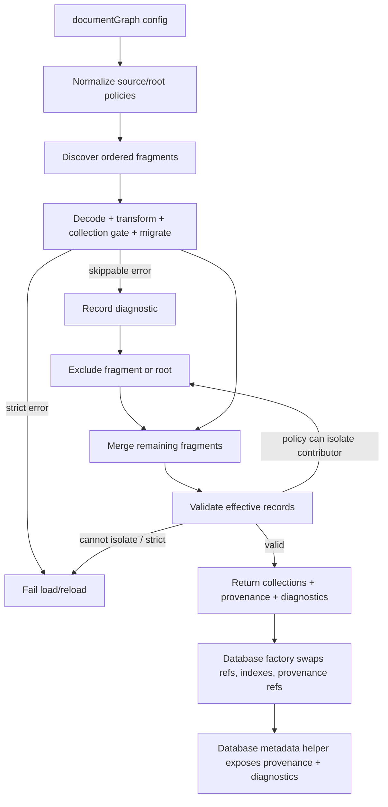

# feat: Extend documentGraph containment, root policy, and provenance

## Summary

Extend the existing read-only `documentGraph` source with three additive capabilities: configurable containment for bad fragments/roots, per-root collection allowlists, and a database-level provenance/diagnostics surface that tells callers which graph roots and fragments produced each effective record.

---

## Problem Frame

Korri now consumes ProseQL's `documentGraph` as its config graph, including removable-media roots that may be untrusted or transient. Today one bad matched fragment fails the whole graph rebuild, collection trust policy has to be implemented in a downstream transform, and record provenance is retained only as internal path strings for validation messages. That leaves Korri unable to tolerate a bad removable-media file, enforce root-specific trust without bespoke stripping, or route future authoring decisions from the effective graph back to contributing roots.

---

## Requirements

- R1. Add an explicit `documentGraph` fragment error policy with default behavior preserving today's fail-whole-graph semantics.
- R2. Support `skip-fragment` behavior so fragment-local failures can be excluded while valid fragments still load and valid reloads still replace the active graph.
- R3. Support `skip-root` behavior so any failure in a root excludes that root's contributions atomically for that rebuild.
- R4. Add per-root collection restrictions so a root can contribute only a subset of the graph source's owned collections.
- R5. Expose structured record provenance for graph-owned records, including source id, root id, and contributing fragment path(s), without changing runtime record shapes.
- R6. Preserve documentGraph read-only behavior, merge ordering, migration-before-merge, validation-after-merge, last-known-good reloads, and existing query/index/search behavior.
- R7. Surface skipped-fragment/root diagnostics in a structured, inspectable way so containment is observable rather than silent.

---

## Scope Boundaries

- No writable documentGraph/outbox/copy-on-write behavior; graph-owned collections remain read-only.
- No delete/tombstone semantics for overlays.
- No Korri-repo integration work.
- No symlink-containment option, per-root metadata passthrough, or writable-root bridge design in this plan.
- No full graph lifecycle event API; diagnostics/provenance should be queryable from the database object, but richer `config.changed` / `config.invalid` event payloads remain downstream/future work.
- No CLI behavior changes.

### Deferred to Follow-Up Work

- Symlink-containment flag for documentGraph roots: separate source-security API design.
- Per-root `meta` passthrough: separate config contract once a downstream needs root labels/capabilities beyond provenance.
- Writable-root bridge / authoring semantics: separate plan because it changes mutation and persistence routing.
- Graph lifecycle event API with generation/attempt counters: separate plan if ProseQL should own more of Korri's reload lifecycle.

---

## Context & Research

### Relevant Code and Patterns

- `packages/core/src/storage/source-config.ts` normalizes `DocumentGraphSourceConfig` and `DocumentGraphRootConfig`, validates unique source ownership, requires effective include patterns, and currently carries graph-level `collections` only.
- `packages/core/src/storage/document-graph-source.ts` owns documentGraph discovery, decode, transform, unknown-collection checks, per-fragment migration, deep merge, effective validation, and internal `contributingPaths` tracking.
- `packages/core/src/factories/database-effect.ts` loads documentGraph data into collection refs, marks graph-owned collections read-only, rebuilds indexes/search indexes on graph reload, and keeps last-known-good by catching reload failures before swapping refs.
- `packages/core/src/storage/origin-index.ts` provides the existing document-source record-origin helper shape, but documentGraph provenance is currently path-only and not retained in the factory.
- `packages/core/tests/document-graph-config.test.ts`, `packages/core/tests/document-graph-source.test.ts`, `packages/core/tests/database-document-graph.test.ts`, and `packages/node/tests/document-graph.test.ts` are the primary test surfaces.
- `packages/core/README.md` documents current documentGraph v1 limits, explicitly saying provenance is internal and lifecycle events are deferred.

### Institutional Learnings

- `docs/plans/2026-05-21-001-feat-multi-collection-document-source-plan.md` established key source-system rules: keep matching policy in core, traversal/watching in adapters; represent origin/projection state as first-class source state; prefer whole-source rediscovery for watcher correctness; default to strict behavior and require explicit leniency.
- `docs/handoffs/korri-config-graph-document-source-handoff.md` established documentGraph product semantics: roots are ordered, fragment formats are syntax only, partial overlays validate after merge, root order is the overlay boundary, and read fragments must not become write targets.
- The shipped documentGraph plan at `work/items/active/01KTSB42V2YV0DFYXP9NGC1A7J-documentgraph-overlay-source/plan.md` intentionally deferred public provenance and lifecycle APIs; this plan reopens only the provenance slice plus containment/root-policy extensions.

### External References

- External research skipped: this is an internal ProseQL source-contract extension with strong local patterns and no security/payment/third-party API dependency.

---

## Key Technical Decisions

- Add explicit leniency rather than changing defaults: existing consumers keep strict fail-whole-graph semantics unless they opt into fragment/root skipping.
- Treat containment as part of source loading, not database factory logic: `document-graph-source.ts` should return a successful graph plus diagnostics when policy permits skipping; the factory should only swap refs after the loader reports a valid effective graph.
- Keep known-but-disallowed root collections separate from unknown collections: a root allowlist should ignore known collections outside that root's allowed set, while truly unknown top-level keys remain errors under the selected containment policy.
- Model provenance as graph-specific contribution metadata, not as a single document-source origin: overlay records can be composed from multiple fragments, so the public API must support multiple contributors and identify the effective/latest contributor without mutating records.
- Keep diagnostics structured and inspectable: skipped fragments/roots should return source id, root id, path when known, collection/record when known, and the original `DocumentGraphSourceError` or wrapped storage/serialization error.
- Preserve whole-graph reload correctness: on a watched change, rebuilding with skips is a successful rebuild if the remaining effective graph validates; rebuilding failure still keeps last-known-good exactly as today.

---

## Open Questions

### Resolved During Planning

- Should this be one plan or separate plans? One plan: the features share the same loader outcome model, and provenance/diagnostics should be updated during the same load/reload path.
- Should root collection restrictions fail or ignore disallowed known sections? Ignore them, because the motivating downstream currently strips those sections to prevent untrusted roots from overriding privileged config. Unknown collection names remain errors unless the selected containment policy skips the fragment/root.
- Should provenance change record shape? No. Records stay schema-owned values; provenance belongs to database/source metadata.
- Should this include graph lifecycle events? No. The minimal public surface is provenance plus diagnostics; event generation/attempt counters are deferred.

### Deferred to Implementation

- Exact public property/function names for the database-level graph metadata helper: choose names that fit `GenerateDatabase`, `EffectDatabase`, and existing `$transaction` / `$dryRunMigrations` naming conventions once editing types.
- Exact skip-policy property name: the contract is explicit cases for `error`, `skip-fragment`, and `skip-root`; final config field naming can be chosen during implementation.
- Exact algorithm for isolating post-merge validation failures: implementation may use a rebuild-with-exclusions loop or a more direct contribution analysis, but must preserve validation-after-merge semantics and test the chosen behavior.

---

## High-Level Technical Design

> *This illustrates the intended approach and is directional guidance for review, not implementation specification. The implementing agent should treat it as context, not code to reproduce.*

---

## Implementation Units

### U1. Normalize documentGraph containment and root collection policy

**Goal:** Extend source configuration types and normalization so documentGraph sources can declare an error-containment policy and roots can declare collection allowlists.

**Requirements:** R1, R3, R4, R6

**Dependencies:** None

**Files:**
- Modify: `packages/core/src/storage/source-config.ts`
- Modify: `packages/core/src/index.ts`
- Test: `packages/core/tests/document-graph-config.test.ts`

**Approach:**
- Add a normalized documentGraph error policy whose default preserves today's strict behavior.
- Add root-level collection selection that narrows the graph source's selected collections; validate that every root-selected collection is also declared by the graph source and by `config.collections`.
- Preserve existing include/exclude normalization and root order.
- Export any new public config/result types from `packages/core/src/index.ts`.

**Patterns to follow:**
- Existing `SourceCollectionSelection` and graph-level `collections` normalization in `packages/core/src/storage/source-config.ts`.
- Existing `SourceConfigError` usage for invalid source/root configuration.

**Test scenarios:**
- Happy path: graph-level `collections: "all"` plus a root-level allowlist normalizes to all graph-owned collections for source ownership and a narrower root contribution set.
- Happy path: graph-level subset plus root-level subset normalizes when the root subset is contained by the graph subset.
- Edge case: missing policy normalizes to strict current behavior.
- Error path: root-level collection not declared in `config.collections` fails normalization with `SourceConfigError` naming source/root/collection.
- Error path: root-level collection outside the graph source's selected collections fails normalization.
- Error path: invalid policy value fails type-level or runtime config validation where this module already validates config shape.

**Verification:**
- Config normalization remains deterministic.
- Existing documentGraph config tests still pass without changing current configs.
- New exported types are visible from `@proseql/core`.

---

### U2. Add loader diagnostics and strict-compatible skip policies

**Goal:** Teach `loadDocumentGraphSources` to return structured diagnostics and to apply strict, skip-fragment, or skip-root behavior without changing default strict behavior.

**Requirements:** R1, R2, R3, R6, R7

**Dependencies:** U1

**Files:**
- Modify: `packages/core/src/storage/document-graph-source.ts`
- Modify: `packages/core/src/errors/source-errors.ts`
- Modify: `packages/core/src/index.ts`
- Test: `packages/core/tests/document-graph-source.test.ts`

**Approach:**
- Convert the current per-fragment fail-fast path into a load-outcome path that can either fail immediately or record a diagnostic and exclude the fragment/root from this rebuild.
- Keep `DocumentGraphSourceError` as the typed error for strict failures and as the diagnostic cause for skipped failures.
- Apply `skip-fragment` to fragment-local failures such as unsupported extension, deserialization, transform failure/defect, top-level non-object, unknown collection, invalid collection section, and migration errors.
- Apply `skip-root` by excluding all fragments discovered under the failing root for the current rebuild when any root fragment fails.
- Preserve strict behavior for non-optional missing roots and any failure that cannot be attributed to a fragment/root.
- For post-merge effective validation failures, preserve validation-after-merge and attempt contributor-based containment only when the loader can attribute a failing record to one or more contributing fragments; otherwise fail as today.

**Patterns to follow:**
- Existing `DocumentGraphSourceError` structured fields (`sourceId`, `path`, `kind`, `collection`, `recordId`, `contributingPaths`).
- Existing `Effect.result` test style in `packages/core/tests/document-graph-source.test.ts`.
- Existing last-known-good database reload tests should remain unchanged until U5 wires diagnostics into factory refs.

**Test scenarios:**
- Happy path: strict policy is the default and existing unsupported-extension / transform-failure / validation tests still fail with `DocumentGraphSourceError`.
- Happy path: `skip-fragment` excludes a malformed matched YAML/JSON fragment and loads valid records from other fragments.
- Happy path: `skip-root` excludes valid and invalid fragments from the same root after one fragment in that root fails, while other roots still contribute.
- Edge case: empty files and optional missing roots continue to be empty contributions, not skip diagnostics.
- Error path: non-optional missing root still fails regardless of fragment skip policy.
- Error path: if all fragments are skipped and the remaining graph is empty, load succeeds only if the effective graph is valid under existing empty-baseline rules.
- Integration: diagnostics include source id, root id, path where known, policy action (`skipped-fragment` or `skipped-root`), and the underlying typed error.

**Verification:**
- Existing strict-mode documentGraph behavior is unchanged.
- Skipped fragments/roots never contribute to `collections` or provenance.
- Diagnostics are deterministic in root/file discovery order.

---

### U3. Enforce per-root collection restrictions before merge

**Goal:** Move root trust/collection policy into ProseQL by allowing each documentGraph root to contribute only its allowed collections before merge/projection.

**Requirements:** R4, R6, R7

**Dependencies:** U1, U2

**Files:**
- Modify: `packages/core/src/storage/document-graph-source.ts`
- Test: `packages/core/tests/document-graph-source.test.ts`
- Test: `packages/core/tests/database-document-graph.test.ts`

**Approach:**
- During fragment processing, distinguish three categories of top-level keys: graph-owned and root-allowed, graph-owned but root-disallowed, and unknown to the graph source.
- Omit graph-owned/root-disallowed sections from the fragment contribution before migration and merge; optionally record a low-severity diagnostic so operators can understand why a section had no effect.
- Keep unknown collection handling as an error under strict policy and as a skippable fragment/root error under skip policies.
- Ensure root collection restrictions apply after transform, because transforms are the format-independent seam that may normalize document shape.

**Patterns to follow:**
- Existing unknown top-level collection check in `packages/core/src/storage/document-graph-source.ts`.
- Existing Korri transform motivation in `docs/handoffs/korri-config-graph-document-source-handoff.md`: downstream should not need to strip trusted sections itself.

**Test scenarios:**
- Happy path: a root allowed only `library` contributes `library` records but its known `host` section is ignored, while an earlier trusted root's `host` data remains effective.
- Happy path: a later root allowed only one collection can still overlay that collection while leaving other graph collections untouched.
- Edge case: a root with an empty collection allowlist contributes no records but does not fail if matched fragments contain only graph-owned/root-disallowed sections.
- Error path: a truly unknown top-level key still fails in strict mode even if root collection restrictions are configured.
- Error path: under `skip-fragment`, a fragment with a truly unknown top-level key is skipped and its root-allowed known sections do not partially contribute.
- Integration: database-level reload rebuilds using the root restriction and publishes normal reactive reloads for graph-owned collections when effective data changes.

**Verification:**
- Disallowed known sections are never present in merged effective records or provenance.
- Root restriction behavior is independent of file format.
- Downstream transforms are no longer required to implement collection trust stripping.

---

### U4. Promote documentGraph provenance from path strings to structured metadata

**Goal:** Replace internal path-only contribution tracking with structured graph provenance that records source id, root id, fragment path, collection, and record id for every effective graph record.

**Requirements:** R5, R6, R7

**Dependencies:** U2, U3

**Files:**
- Modify: `packages/core/src/storage/document-graph-source.ts`
- Modify: `packages/core/src/storage/origin-index.ts` (only if shared helper types reduce duplication)
- Modify: `packages/core/src/errors/source-errors.ts`
- Modify: `packages/core/src/index.ts`
- Test: `packages/core/tests/document-graph-source.test.ts`

**Approach:**
- Introduce graph-specific provenance types rather than overloading single-origin `RecordOrigin`, because one overlay record can have multiple contributors.
- Track contributors in discovery/merge order and derive the effective/latest contributor from the final contributing fragment for the record.
- Preserve path-rich validation errors by deriving `contributingPaths` from structured provenance rather than maintaining two independent structures.
- Ensure skipped fragments and root-disallowed sections do not appear in provenance.

**Patterns to follow:**
- Existing `provenanceKey(collection, id)` map key pattern in `document-graph-source.ts`.
- Existing `origin-index.ts` helper shape for source-owned record metadata.

**Test scenarios:**
- Happy path: a record built from two roots returns contributors in configured root/file order and identifies the latest/effective contributor.
- Happy path: a record from one fragment has one contributor with source id, root id, path, collection, and id.
- Edge case: a partial overlay that supplies only nested fields still appears as a contributor for that record.
- Edge case: a root-disallowed known section does not create provenance for that record/collection.
- Error path: validation errors still include contributing paths after internal provenance type changes.
- Integration: loading multiple documentGraph sources keeps provenance separated by source id and collection/id.

**Verification:**
- No runtime record values gain provenance fields.
- Existing validation error messages retain or improve path context.
- New provenance types are exported from `@proseql/core`.

---

### U5. Expose provenance and diagnostics through the database API and keep them fresh on reload

**Goal:** Add a public, database-level metadata surface for documentGraph provenance and skip diagnostics, backed by refs that update atomically with successful graph reloads.

**Requirements:** R5, R6, R7

**Dependencies:** U2, U4

**Files:**
- Modify: `packages/core/src/factories/database-effect.ts`
- Modify: `packages/core/src/types/types.ts`
- Modify: `packages/core/src/index.ts`
- Test: `packages/core/tests/database-document-graph.test.ts`

**Approach:**
- Store graph provenance and diagnostics in refs alongside graph-owned collection refs.
- On initial load, initialize those refs from `loadDocumentGraphSources`.
- On successful watched reload, swap collection refs, indexes/search indexes, provenance refs, and diagnostics refs together; on failed reload, keep all last-known-good metadata untouched.
- Add a database-level helper namespace or method family for reading provenance/diagnostics. Keep it graph/source metadata scoped rather than collection CRUD scoped.
- Prefer a consistent helper surface on database objects that support source-oriented configs, returning empty/undefined results when no documentGraph source owns the requested record, rather than a complex conditional type that appears only for some configs. Avoid collisions with collection names by using the existing `$` helper naming convention.

**Patterns to follow:**
- `$transaction` and `$dryRunMigrations` as database-level helper precedent in `packages/core/src/factories/database-effect.ts` and `packages/core/src/types/types.ts`.
- Existing reload code in `reloadDocumentGraph` that rebuilds collection refs, indexes, search indexes, and publishes `reloadEvent` only after a successful load.

**Test scenarios:**
- Happy path: after database creation, the public helper returns provenance for an existing graph-owned record and `undefined` / empty result for a missing record.
- Happy path: diagnostics helper returns skipped fragment/root diagnostics when skip policy is configured and bad fragments are present.
- Edge case: strict mode with no skipped fragments returns an empty diagnostics collection.
- Integration: a valid watched reload updates provenance when a record moves from one fragment/root contribution set to another.
- Integration: an invalid watched reload that fails strict mode keeps previous data and previous provenance/diagnostics.
- Integration: a watched reload under skip policy updates diagnostics and effective data without failing the reload.
- Type/API: generated database types include the metadata helper consistently for source-oriented database objects and continue to expose normal collection accessors and `$transaction`.

**Verification:**
- Public provenance stays in sync with query results after reload.
- Last-known-good semantics apply to provenance as well as data.
- The new helper does not expose `sources` metadata as a runtime collection and does not collide with user collection names.

---

### U6. Document and verify the public contract through core and node surfaces

**Goal:** Update docs and end-to-end node tests so consumers understand strict defaults, skip policies, per-root collection restrictions, and the provenance/diagnostics API.

**Requirements:** R1, R2, R3, R4, R5, R6, R7

**Dependencies:** U1, U2, U3, U4, U5

**Files:**
- Modify: `packages/core/README.md`
- Test: `packages/node/tests/document-graph.test.ts`
- Modify: `packages/node/README.md` (only if it currently mirrors documentGraph behavior rather than deferring to core docs)

**Approach:**
- Replace the current documentGraph v1 limitation that says provenance is internal with a short explanation of the new public helper.
- Document that strict is the default, skip policies are explicit, and skipped entries are observable through diagnostics.
- Document root collection restrictions as a root contribution allowlist, not as schema validation or write authorization.
- Add real-filesystem node coverage for one skip-policy scenario and one provenance/root restriction scenario to prove the core contract survives through `createNodeDatabase` and inferred codecs.

**Patterns to follow:**
- Existing `packages/core/README.md` "Read-only document graphs" section.
- Existing `packages/node/tests/document-graph.test.ts` real temp-dir tests.

**Test scenarios:**
- Integration: `createNodeDatabase` loads a graph from real files with one skipped bad fragment and valid data from another fragment.
- Integration: `createNodeDatabase` exposes provenance containing real filesystem paths and root ids for an effective record.
- Integration: a root-level collection allowlist prevents a later real file from overriding a disallowed collection while allowing another collection from the same file/root.
- Documentation expectation: README examples describe defaults and skip behavior without implying graph writes are supported.

**Verification:**
- Core and node docs describe the same public contract.
- Node re-export surface works without additional package-specific exports because `packages/node/src/index.ts` re-exports core.

---

## System-Wide Impact

- **Interaction graph:** `normalizeSourceConfig` feeds `loadDocumentGraphSources`, which feeds `createPersistentEffectDatabase`; watcher reloads re-run the same loader and publish existing collection reload events after successful swaps.
- **Error propagation:** Strict mode preserves existing `DocumentGraphSourceError` failures. Skip modes convert skippable failures into diagnostics; non-attributable or non-optional-root failures still fail the load/reload.
- **State lifecycle risks:** Data refs, indexes/search indexes, provenance refs, and diagnostics refs must swap together on successful reload. Failed strict reloads must keep all last-known-good state untouched.
- **API surface parity:** `@proseql/core` owns the API and types; `@proseql/node` gets the same surface through its existing core re-export and needs real filesystem coverage.
- **Integration coverage:** Unit tests should cover loader semantics; database tests should cover generated API, last-known-good metadata, and reactive reload effects; node tests should prove real paths/root ids survive adapter traversal.
- **Unchanged invariants:** documentGraph remains read-only, source ownership remains unique per collection, fragments merge in existing deterministic order, migrations still run per fragment before merge, and records are still validated only after merge.

---

## Risks & Dependencies

| Risk | Mitigation |
|------|------------|
| Skip policies accidentally hide important config errors | Keep strict as default; record structured diagnostics for every skipped fragment/root; document that leniency is opt-in. |
| Post-merge validation cannot always identify one bad fragment safely | Preserve strict failure when attribution is ambiguous; test the chosen contributor-isolation behavior explicitly. |
| Root collection restrictions silently drop privileged sections without operator visibility | Treat root-disallowed known sections as ignored contributions and expose them through diagnostics or documented debug metadata. |
| Provenance metadata gets stale after reload | Store provenance/diagnostics in refs and update them only in the same successful reload path that swaps collection data and indexes. |
| Public API name becomes awkward or conflicts with collection names | Use the established `$` helper namespace convention and update generated database types in the same unit as runtime implementation. |

---

## Documentation / Operational Notes

- Update `packages/core/README.md` to explain strict default vs skip policies, root collection allowlists, provenance, and diagnostics.
- Keep README examples focused on read-only graph operation; do not imply authoring/writes are available.
- Mention that skip diagnostics are intended for operator visibility and downstream event/reporting layers, but ProseQL does not yet emit a full graph lifecycle event stream.

---

## Sources & References

- Input handoff: [HANDOFF.md](HANDOFF.md)
- Original Korri documentGraph handoff: [docs/handoffs/korri-config-graph-document-source-handoff.md](docs/handoffs/korri-config-graph-document-source-handoff.md)
- Shipped documentGraph plan: [work/items/active/01KTSB42V2YV0DFYXP9NGC1A7J-documentgraph-overlay-source/plan.md](work/items/active/01KTSB42V2YV0DFYXP9NGC1A7J-documentgraph-overlay-source/plan.md)
- Prior document source architecture plan: [docs/plans/2026-05-21-001-feat-multi-collection-document-source-plan.md](docs/plans/2026-05-21-001-feat-multi-collection-document-source-plan.md)
- Related code: `packages/core/src/storage/source-config.ts`
- Related code: `packages/core/src/storage/document-graph-source.ts`
- Related code: `packages/core/src/factories/database-effect.ts`
- Related code: `packages/core/src/types/types.ts`
- Related code: `packages/core/src/storage/origin-index.ts`
- Related docs: `packages/core/README.md`
