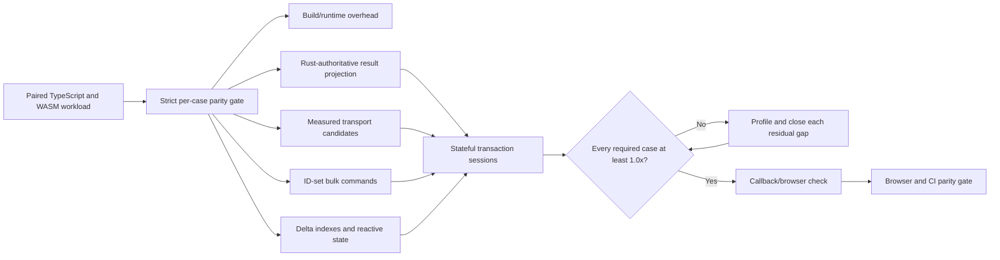
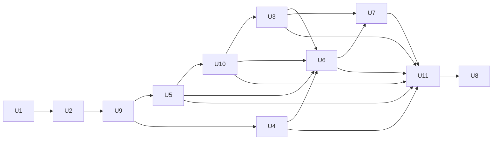

# refactor: Optimize the browser WASM engine

## Summary

Make the Rust/WASM implementation proseQL's single browser engine without a performance penalty: every fixed required benchmark must individually match or exceed the paired TypeScript engine while boundary work, mutation bookkeeping, transactions, public behavior, and browser delivery remain explicitly gated.

---

## Problem Frame

The Rust/WASM engine is functionally ready for browser use, but the first paired benchmark run found a geometric-mean throughput of 7.6% of the TypeScript engine across 51 engine-facing cases: roughly 13.2× slower overall. Ordinary indexed and unindexed reads were commonly 5–29× slower, single writes 27–46× slower, function-predicate bulk mutations 546–1,087× slower, and the three-operation transaction 326× slower. One complex nested query reached parity, showing that Rust computation itself is not uniformly the limiting factor.

The current binding sends JSON strings through WASM and recursively transforms every value to preserve `undefined`. Mutations also rebuild indexes and clone reactive state, while the JavaScript transaction facade copies the full database across the boundary multiple times. The existing benchmark harness only selects the TypeScript factory directly, mutates fixtures across samples, and retains database instances for the lifetime of a full run; the initial Rust comparison therefore required an ad hoc factory substitution and suite isolation. Optimization needs a durable, apples-to-apples measurement surface before changing these high-risk paths.

U1 and U2 established that surface and improved delivery without closing runtime parity: the browser artifact became 13.1% smaller, startup became 3.6% faster, and five of eight normal interactions fell below 50 ms, but bulk declarative update, function-predicate update, and transaction remained near 202 ms, 604 ms, and 205 ms p95. The latest complete paired run remains the authority for TypeScript-relative throughput. The revised target is therefore not an aggregate aspiration: every required case must independently reach or exceed `1.0×`, including fixed-overhead scaling cases at 100 and 1,000 records.

---

## Requirements

- R1. Every fixed required read/query benchmark, including scaling cases at 100, 1,000, and 10,000 records, must individually deliver at least 100% of the paired TypeScript engine throughput (`throughputRatio >= 1.0`). A faster aggregate score cannot offset a slower required case.
- R2. Every fixed required write, persistence, and transaction benchmark must individually deliver at least 100% of the paired TypeScript engine throughput (`throughputRatio >= 1.0`). A faster aggregate score cannot offset a slower required case.
- R3. The p95 wall-clock latency of normal browser interactions must stay below 50 ms: single-ID read, paginated query returning at most 100 records, single create/update/delete, declarative bulk mutation of approximately 100 records, function-predicate bulk mutation of approximately 100 records, and a three-operation transaction.
- R4. The 100,000-record workload remains throughput-non-blocking but safety-blocking: in a fresh process its peak WASM memory may not exceed 110% of the U1 pre-optimization 100,000-record baseline, and repeating the bounded workload after the first high-water mark may grow WASM memory by no more than 5%; crashes, missing results, and retained database handles fail the gate.
- R5. The public Promise-first, Effect, and browser APIs and their TypeScript inference must remain unchanged.
- R6. Observable semantics must remain unchanged, including insertion and sort order, `undefined`/`null`/missing distinctions, exact tagged error payloads, validation, hooks, callback order, transaction rollback, immediate transaction hook timing, transaction change-event coercion, partial relationship side effects, persistence, and reactive cleanup.
- R7. Performance results must be reproducible and machine-readable, separating TypeScript execution, WASM boundary encoding/transfer/decoding, Rust engine execution, callback overhead, initialization, actual p50/p95/p99 values computed from raw samples, JavaScript heap, WASM linear-memory high-water marks, bundle size, and browser startup. A blocking case requires at least 30 measured samples per engine.
- R8. The optimized production build must not materially regress browser delivery: compressed WASM size may not increase by more than 5%, cold startup p95 may not increase by more than 10%, fresh-process WASM linear-memory peak may not increase by more than 5%, and post-GC retained JavaScript heap may not increase by more than 5% where the browser exposes a reliable measurement. Warm-state throughput and cold startup are reported and gated separately.
- R9. The existing parity gate, Rust conformance suites, Node/Bun package checks, and real-browser persistence/reactivity smoke tests must remain green throughout the optimization.
- R10. The browser continues to ship one supported runtime engine: Rust/WASM. No TypeScript fallback, JavaScript query engine, or engine-selection API is introduced for consumers.
- R11. The performance contract may not be weakened to reach parity: required cases, fixture sizes, sample floors, checksums, direct-core TypeScript baseline, and per-case thresholds remain fixed unless a separately reviewed product-contract change supersedes this plan.

The blocking workload manifest is fixed by this plan; U1 encodes it without weakening or reclassifying cases:

| Category | Required benchmark cases | Fixed size(s) | Gate |
|---|---|---:|---|
| CRUD writes | `create (single)`, `createMany (batch of 100)`, `update (single)`, `updateMany (batch ~100)` in both declarative and function-predicate forms, `delete (single)`, `deleteMany (batch ~100)` in both forms, `upsert (create path)`, `upsert (update path)` | 10,000 | R2; the named normal interactions also satisfy R3 |
| Filters | equality, range, and compound `$and` queries | 10,000 | R1; paginated/≤100-result variants satisfy R3 |
| Sorts | single-field ascending/descending and multi-field two-/three-key sorts | 10,000 | R1 |
| Population | single ref, inverse, nested two-level, multiple refs, and nested three-level | 10,000 per collection | R1 |
| Selection | one field, two fields, three fields, most fields, no projection, and selection with a filter | 10,000 | R1 |
| Pagination | beginning, middle, end, 100-row page, sorted page, and filtered page | 10,000 | R1; ≤100-result cases satisfy R3 |
| Combined queries | filter/sort/select/page; filter/sort/populate/select/page; nested populate/sort/page; complex filter/multi-populate/sort/select/page | 10,000 per collection | R1 |
| Scaling reads | `findById`, unindexed filter, and indexed filter | 100; 1,000; 10,000 | R1; 10,000-record `findById` satisfies R3 |
| Transactions | direct create/update/delete and the equivalent three-operation `$transaction` | 10,000 | R2; transaction satisfies R3 |
| Persistence | debounced coalescing of 100 mutations and one explicit flush | 10,000 | R2 |
| Callback characterization | computed field, custom predicate/operator, locale collator, and one before/after hook workload | 10,000 | Non-regression characterization; U7 becomes blocking only if required to meet R1–R3 |
| Stress | scaling reads plus one single write and one three-operation transaction | 100,000 | R4 only |

---

## Scope Boundaries

- No new database features or public query/callback DSL.
- No weakening of validation, uniqueness, foreign-key, transaction, hook, persistence, or reactive guarantees for benchmark gains.
- No permanent second browser engine and no consumer-visible transport selector.
- No napi-rs addon; this work targets the browser WASM path. Node/Bun benefit only where they share the same binding.
- No worker, `SharedArrayBuffer`, or cross-origin-isolation requirement. The engine must continue working on ordinary browser origins.
- No storage-format migration. Boundary sentinels are an internal wire concern; persisted records remain engine-independent.
- Every case already classified as required remains parity-blocking at its fixed size, including the 100- and 1,000-record scaling cases. The 100,000-record stress workload remains safety- and memory-blocking rather than throughput-blocking.

### Deferred to Follow-Up Work

- Native Rust/Android benchmarking and korrid-specific optimization: separate work in the korri integration track.
- A public columnar result format, an expression DSL for replacing JavaScript callbacks, and worker-thread execution remain excluded. Internal opaque row handles and materialization descriptors may be used only behind the unchanged public API and only while Rust remains authoritative for filtering, sorting, relationship resolution, constraints, and mutation.
- General reentrancy redesign for hooks that synchronously call the same database: preserve the existing supported contract here and capture broader callback reentrancy as separate correctness work if characterization exposes a reachable panic.

---

## Context & Research

### Relevant Code and Patterns

- `packages/engine/src/database.ts` owns the Promise-first facade, JSON dispatch, temporary transaction runtime, persistence snapshots, and callback registration. `EngineRuntime.invoke` currently adds a microtask around an otherwise synchronous WASM dispatch.
- `packages/engine/src/boundary-values.ts` recursively encodes and decodes `undefined` plus reserved-key collisions on every command and result.
- `crates/proseql-wasm/src/bridge.rs`, `crates/proseql-wasm/src/runtime.rs`, and `crates/proseql-wasm/src/command.rs` define the internal string-based command/response ABI and panic-to-defect boundary.
- `crates/proseql-engine/src/collection.rs` rebuilds all declared indexes after successful mutations; batch operations already amortize this to one rebuild per batch.
- `crates/proseql-engine/src/relationships/mod.rs` uses whole-collection snapshots on several mutation paths to preserve foreign-key rollback semantics.
- `crates/proseql-engine/src/reactive/mod.rs` clones snapshots of every collection after writes, including when only one collection changed.
- `crates/proseql-engine/src/transactions/mod.rs` snapshots all collections at transaction start and again before each mutation to discover changed collections.
- `packages/effect/src/database.ts` emulates function-predicate `updateMany` and `deleteMany` by querying, filtering in JavaScript, and issuing one WASM mutation per matching row; the relationship variant already demonstrates the safer query/filter/ID-set/bulk-command pattern.
- `bench/` provides deterministic tinybench fixtures, JSON reports, scaling sizes, and transaction-overhead reporting, but currently binds directly to `@proseql/core` and lacks resource teardown and paired-engine ratio gates.
- `packages/browser/tests/browser-smoke.mjs` and its Vite/plain-module fixtures are the existing real-browser execution pattern.

### Institutional Learnings

- TypeScript types remain the contract and Rust implements the semantics; an optimization that changes visible behavior is a correctness regression.
- Update paths must retain schema decoding rather than replacing it with validation-only shortcuts because transforms and TypeScript parity depend on repeated decode behavior.
- Bulk operations already rebuild indexes once per batch; optimize incremental maintenance without decomposing a batch into single operations.
- Hook and callback order, transaction hook timing, transaction-wide `Update` notifications, and documented partial relationship artifacts are authoritative even when they are counterintuitive.
- The phase-two corpus currently executes 79 applicable files with 2,353 passing assertions; the 18 skipped files are internal primitives or compile-time-only suites covered elsewhere.

### External References

- wasm-bindgen arbitrary-data guidance recommends measuring JSON strings against `serde-wasm-bindgen`; either can be faster depending on payload and browser: https://wasm-bindgen.github.io/wasm-bindgen/reference/arbitrary-data-with-serde.html
- `serde-wasm-bindgen` supports native JavaScript values and a JSON-compatible serializer, but its `undefined`/`null` mappings require explicit parity tests: https://docs.rs/serde-wasm-bindgen/latest/serde_wasm_bindgen/
- wasm-bindgen string parameters incur UTF-8 encoding, copying, allocation, and return decoding: https://wasm-bindgen.github.io/wasm-bindgen/reference/types/string.html
- Reference types remove the old JavaScript heap-table indirection for `JsValue` but do not remove string encoding/copying: https://wasm-bindgen.github.io/wasm-bindgen/reference/reference-types.html
- Zero-copy typed-array views into WASM memory become invalid when backing memory grows, so dispatch-scoped views require immediate consumption: https://docs.rs/js-sys/latest/js_sys/struct.Uint8Array.html
- The Rust/WASM handle pattern keeps authoritative computation in WASM and returns small copyable descriptors rather than whole state: https://rustwasm.github.io/docs/book/game-of-life/implementing.html
- Cargo release-profile controls and the Rust/WASM size guide establish LTO, codegen-unit, panic, and profiling-build trade-offs: https://doc.rust-lang.org/cargo/reference/profiles.html and https://rustwasm.github.io/docs/book/reference/code-size.html
- Binaryen optimization must run on the post-bindgen `*_bg.wasm` artifact and be measured for speed as well as size: https://rustwasm.github.io/docs/wasm-bindgen/reference/optimize-size.html
- Browser wall-clock and memory measurements use `performance.now()`, DevTools/Memory Inspector, and best-effort memory APIs without requiring cross-origin isolation: https://developer.mozilla.org/en-US/docs/Web/API/Performance/now and https://developer.chrome.com/docs/devtools/memory-inspector

---

## Key Technical Decisions

- **The comparison baseline remains the direct `@proseql/core` Effect API; it is not wrapped by `@proseql/effect`.** The Rust path intentionally includes its supported `@proseql/effect` adapter. Matching TypeScript therefore includes compensating for adapter and boundary overhead rather than redefining the comparator. U1 re-established every starting ratio with this permanent harness; the ad hoc 546–1,087× predicate figures remain problem evidence, not post-U1 acceptance baselines.
- **Thresholds apply per required case at every fixed required size.** Each median paired throughput ratio must be at least `1.0`; a ratio below parity fails even when it is within measurement noise. Geometric means remain summaries only and cannot hide any slower required case.
- **Measurement precedes each structural optimization.** Every implementation unit records encode, WASM call, decode, engine, callback, memory, and artifact deltas so the next change attacks the measured dominant cost.
- **The internal WASM ABI may change; public APIs may not.** One internal boundary-value codec owns command inputs, responses, watch delivery, registered callbacks, `undefined`/collision handling, and tagged errors. Candidate transports are exercised behind a benchmark-only selector beneath that codec, and production ends with one transport.
- **Transport selection is bounded, payload-aware, and subordinate to end-to-end parity.** Compare optimized sentinel-aware JSON, direct native JavaScript values, numeric/specialized command exports, and a reusable byte-buffer response only for the payload classes each can plausibly improve. Official wasm-bindgen guidance does not establish one universal winner, so production promotion requires browser evidence and a confirmation run. Typed-array views are consumed before any subsequent allocating WASM call and never escape dispatch. Production ends with one deterministic internal strategy per payload class and no consumer selector.
- **Large results use a Rust-authoritative materialization projection rather than repeatedly serializing full collections.** JavaScript may retain a synchronized object/slot projection solely to materialize the ordered handles and result descriptors returned by Rust. Rust remains authoritative for query planning, filtering, sorting, pagination, selection intent, population graph resolution, validation, indexes, transactions, and mutations; the projection is not a fallback engine and cannot answer a query without a Rust result descriptor. Mutation deltas, reload/migration replacement, transaction commit, watch delivery, error recovery, and object-identity behavior are parity-gated. The projection must satisfy the existing JavaScript-heap budget rather than buying speed with unbounded duplicate state.
- **Function predicates stay public and scalar.** Internally, the Effect adapter resolves them once in JavaScript and sends one ID-set bulk mutation rather than issuing one WASM write per matching entity. User callback order and thrown errors remain unchanged.
- **Mutation bookkeeping uses one shared change-set seam.** Every low-level entity insertion, replacement, patch, and removal—including trusted relationship cascade helpers—records collection, before/after image, insertion position, and index/reactive deltas. Ordinary mutations use the change set for rollback and synchronization; U6 extends the same seam into a transaction journal. Repeated schema decode and constraint checks remain intact.
- **Transactions become stateful internal sessions.** The JS callback may still await arbitrary Effects between operations. WASM retains a single-writer transaction session and an undo journal, each operation observes prior transaction writes, hooks run at their current time, commit emits the current collection-level `Update` behavior, and rollback replays deltas without copying the database through JavaScript.
- **Persistence and reload work is serialized behind an active transaction.** Background reload, debounce flush, and close coordinate with the session rather than committing stale state or dropping a live transaction.
- **Callback batching is internal and conditional.** Public callback signatures do not change. Computed/predicate callback contexts may be delivered to a JavaScript wrapper in batches only if callback profiling remains a target blocker after the core transport work.
- **Compiler flags are not treated as the solution.** A measured WASM-specific release profile and post-bindgen Binaryen pass land early, but architectural work continues until the runtime targets pass.
- **CI uses paired medians with adequate samples.** Three interleaved TypeScript/WASM trials on the same runner reduce shared-host noise, and each blocking case auto-scales its measurement window to at least 30 samples per engine. R1/R2 measure warmed steady state; a separate fresh-Chromium gate enforces cold startup, the 50 ms interaction budget, and separate JS-heap/WASM-memory budgets.
- **Parity checksums operate on decoded application values.** Canonical hashing sorts object keys while representing explicit `undefined`, missing keys, `null`, array holes, and reserved sentinel-shaped objects as distinct values; wire bytes are never used as the semantic checksum.

---

## Open Questions

### Resolved During Planning

- **What is optimized enough?** Every fixed required case at 100, 1,000, or 10,000 records individually matches or beats paired TypeScript throughput; named normal browser interactions also remain below 50 ms p95.
- **What is the comparison engine?** The existing TypeScript runtime exposed by `@proseql/core`.
- **Should the TypeScript browser engine remain as a fallback?** No; the browser supports one Rust/WASM engine.
- **Are hooks excluded from correctness?** No. Hook behavior remains parity-gated. Hook-free interactions define the primary 50 ms UI budget, while representative hook/computed/collator workloads are separately characterized and must not regress.
- **Does transaction optimization permit collecting all operations before execution?** No. Existing callbacks may await and branch on earlier transaction results, so the implementation uses a stateful session rather than an upfront operation batch.
- **Can transaction event types become more precise?** No. Preserve the existing collection-level `Update` event artifact for compatibility.
- **Can schema validation be skipped on hot update paths?** No. Repeated decode behavior is part of parity.

### Deferred to Implementation

- **Which production transport wins for each internal payload class?** Select from optimized JSON, direct native values, specialized scalar exports, or a dispatch-scoped reusable buffer using U3 measurements after the U10 result-projection seam exists; generic wasm-bindgen guidance is insufficient.
- **Does callback batching need to ship?** Implement U7 when callback-heavy browser measurements miss R3 or when a callback-bearing case is promoted into the fixed required manifest by a separately reviewed contract change.
- **Which release profile minimizes total user cost?** Compare speed- and size-oriented profiles plus Binaryen levels; select from runtime, compressed size, and startup evidence rather than a fixed compiler folklore setting.

---

## High-Level Technical Design

> *This illustrates the intended approach and is directional guidance for review, not implementation specification. The implementing agent should treat it as context, not code to reproduce.*

Implementation dependencies:

Unit IDs remain stable because U1 and U2 are already committed; execute the dependency graph rather than the numeric/document order. The remaining critical path is U9 → U5 → U10 → U3 → U6 → U7 → U11 → U8, with U4 starting after U9 and joining at U6.

---

## Implementation Units

### U1. Establish the paired performance contract

**Goal:** Replace the ad hoc comparison with deterministic TypeScript-versus-Rust/WASM measurements that identify where time and memory are spent and establish the fixed paired workload later promoted to strict parity by U9.

**Requirements:** R1, R2, R3, R4, R7, R8

**Dependencies:** None

**Files:**
- Modify: `bench/utils.ts`
- Modify: `bench/runner.ts`
- Modify: `bench/crud.bench.ts`
- Modify: `bench/query-pipeline.bench.ts`
- Modify: `bench/scaling.bench.ts`
- Modify: `bench/transactions.bench.ts`
- Create: `bench/engines.ts`
- Create: `bench/comparison.ts`
- Create: `bench/performance-contract.ts`
- Create: `bench/browser-runner.ts`
- Create: `bench/baselines/browser-wasm.json`
- Test: `bench/runner.test.ts`
- Test: `bench/performance-contract.test.ts`
- Test: `packages/browser/tests/browser-performance.test.ts`

**Approach:**
- Define one engine-neutral workload contract and two factories: TypeScript via `@proseql/core` and Rust/WASM via `@proseql/effect`.
- Use tinybench's untimed per-sample cleanup to reverse creates/createMany batches and restore the exact 10,000-record cardinality before the next sample; validate the reset checksum before timing resumes.
- Extend benchmark modules with an explicit asynchronous teardown contract. The runner invokes teardown in a `finally` path, closes every captured database, and runs high-memory scaling sizes in isolated processes.
- Split declarative filters from function-predicate compatibility cases; both remain required, but their costs are attributed separately. Re-measure all starting ratios with the permanent direct-core versus Rust/Effect pairing.
- Compute percentiles from sorted raw latency samples rather than interpolating p75/p99. Auto-scale each engine/case measurement window until it has at least 30 measured samples, with a bounded timeout that reports an insufficient-samples failure.
- Record paired per-case throughput and p50/p95/p99 latency, initialization, encoded payload/result sizes, boundary stage timing, callback counts, WASM linear-memory high-water mark, retained JS heap where available, compressed artifact size, and browser cold start.
- Compare behavior using the canonical decoded-value checksum defined in Key Technical Decisions, not JSON wire bytes.
- Use the manifest's fixed sizes: 10,000 records for CRUD/query/transaction/persistence cases and 100, 1,000, and 10,000 records for scaling reads. Run 100,000 records separately as stress-only evidence and capture its fresh-process peak plus repeated-workload high-water growth.
- Store the current pre-optimization WASM results as a comparison baseline and encode the fixed workload manifest plus final TypeScript ratios as the release contract.

**Execution note:** Characterize the current engines and make the benchmark tests fail on the agreed targets before changing runtime code.

**Patterns to follow:**
- Existing deterministic generators and JSON result formatting in `bench/generators.ts`, `bench/utils.ts`, and `bench/runner.ts`.
- Existing Chromium/Vite harness in `packages/browser/tests/browser-smoke.mjs`.

**Test scenarios:**
- Happy path: identical seed, schema, initial data, and operation sequence produce paired results for both engines with matching result checksums.
- Happy path: every required case is classified as read/query or write/transaction, measured at its fixed size, and represented in the report so U9 can enforce exact TypeScript parity.
- Edge case: mutable create/delete suites keep collection cardinality within a fixed bound across warmup and measured iterations.
- Edge case: 100,000-record stress cases execute in isolated processes and do not affect blocking ratios.
- Error path: a task error, fewer than 30 samples, missing percentile data, missing engine result, or decoded-value checksum mismatch fails the run rather than being omitted from JSON output.
- Integration: module teardown runs after success and failure, releases database handles between suites, and does not reproduce the multi-gigabyte retained-handle growth seen by the first all-suite WASM run.
- Integration: real Chromium reports p95 wall-clock latency for the named normal interactions, not only Bun timing.

**Verification:**
- A clean checkout can produce one machine-readable paired report without source rewriting.
- The report pinpoints boundary, engine, callback, initialization, and memory costs and supplies reproducible negative evidence for the strict U9 contract.

---

### U2. Optimize the WASM build and synchronous dispatch wrapper

**Goal:** Remove low-risk compiler, artifact, and Promise-wrapper overhead while preserving the Promise-first rejection contract.

**Requirements:** R3, R5, R8, R9

**Dependencies:** U1

**Files:**
- Modify: `crates/Cargo.toml`
- Modify: `flake.nix`
- Modify: `packages/engine/scripts/build-wasm.mjs`
- Modify: `packages/engine/src/database.ts`
- Modify: `packages/engine/src/loader.ts`
- Modify: `scripts/verify-package-artifacts.ts`
- Test: `packages/engine/tests/engine-u8.test.ts`
- Test: `packages/engine/tests/package-conformance.test.ts`
- Test: `packages/browser/tests/browser-entry.test.ts`

**Approach:**
- Add a WASM-specific production profile rather than changing native release behavior. Compare speed- and size-oriented optimization settings, LTO, codegen units, and abort behavior using U1 evidence.
- Pin the wasm32 Rust target, linker, matching wasm-bindgen CLI, Binaryen, and Chromium/Playwright inputs in the repository environment; remove ad hoc installer/version drift from clean-checkout gates.
- Run Binaryen only on post-bindgen browser and Node artifacts; retain a named profiling artifact separately from stripped production output.
- Replace the extra scheduled microtask around synchronous dispatch with immediate execution wrapped into an already-settled Promise, converting synchronous throws into Promise rejection so callers never observe a synchronous exception.
- Record final raw/compressed WASM size, compile/instantiate time, and runtime deltas; select the profile that satisfies runtime targets without crossing the size/startup budgets.

**Test scenarios:**
- Happy path: successful collection calls still return Promises and preserve asynchronous consumption semantics.
- Error path: malformed input and tagged engine errors reject the returned Promise and never throw before a Promise is returned.
- Edge case: a callback-triggered defect remains a distinct `WasmEngineDefectError` after wrapper changes.
- Integration: browser and Node artifacts are post-processed, load through their published subpaths, and match the pinned wasm-bindgen version.
- Integration: production artifacts omit profiling-only names while profiling builds remain readable in browser tooling.

**Verification:**
- U1 attributes the gain to build or wrapper changes, package artifact checks pass, and size/startup stay within R8.

---

### U9. Promote the paired contract to strict TypeScript parity

**Goal:** Make the stronger target executable before further optimization so the harness rejects every required case that is slower than TypeScript.

**Requirements:** R1, R2, R7, R11

**Dependencies:** U1, U2

**Files:**
- Modify: `bench/performance-contract.ts`
- Modify: `bench/performance-contract.test.ts`
- Modify: `bench/workloads.ts`
- Modify: `bench/baseline.ts`
- Modify: `bench/baseline.test.ts`
- Create: `bench/reports/README.md`

**Approach:**
- Replace the read and write acceptance ratios with one exact per-case floor of `1.0`. Do not add a tolerance band, round ratios before comparison, or let a geometric mean compensate for an individual failure.
- Keep every existing `required` case required, including scaling reads at 100, 1,000, and 10,000 records. Keep only the already-designated 100,000-record workloads and callback characterization outside the throughput gate.
- Validate workload identity, fixture size, operation count, sample floor, engine pairing, and decoded-value checksum before evaluating throughput so a faster but non-equivalent report cannot pass.
- Preserve the direct `@proseql/core` TypeScript comparator and the supported Rust `@proseql/effect` path.
- Check the U2 report as a negative fixture: it must fail for the known slower cases while synthetic equal/faster reports pass. This makes the contract implementation green even though the product has not yet met it.
- Emit the complete ordered list of sub-parity cases and their ratios for use by U10, U3–U7, and U11; never stop reporting after the first failure.

**Execution note:** This is the first post-U2 unit. It changes the acceptance contract, not runtime behavior. Commit only when contract tests are green and the checked-in U2 evidence is correctly rejected.

**Test scenarios:**
- Happy path: a report with every required WASM case equal to or faster than its paired TypeScript case passes.
- Edge case: ratios of exactly `1.0` pass; any finite ratio below `1.0`, including `0.999999`, fails without rounding.
- Edge case: required 100- and 1,000-record scaling cases are gated exactly like 10,000-record cases; 100,000-record stress remains governed by R4.
- Error path: a missing/reclassified required case, changed fixture identity, fewer than 30 samples, checksum mismatch, or non-finite ratio fails before performance acceptance.
- Regression: the U2 evidence produces deterministic failures for every currently sub-parity required case, proving the stronger gate is active.

**Verification:**
- Contract unit tests pass, U2 evidence fails only for genuine contract deficits, and no benchmark workload or comparator has been weakened.

---

### U10. Add a Rust-authoritative materialized-result projection

**Goal:** Remove the structural disadvantage of serializing complete JavaScript-shaped results on every read while keeping Rust/WASM as the sole query and mutation engine.

**Requirements:** R1, R3, R5, R6, R7, R8, R9, R10, R11

**Dependencies:** U5

**Files:**
- Modify: `crates/proseql-wasm/src/bridge.rs`
- Modify: `crates/proseql-wasm/src/command.rs`
- Modify: `crates/proseql-wasm/src/runtime.rs`
- Modify: `crates/proseql-wasm/src/types.rs`
- Modify: `packages/engine/src/loader.ts`
- Modify: `packages/engine/src/browser-wasm.d.ts`
- Modify: `packages/engine/src/boundary-values.ts`
- Modify: `packages/engine/src/database.ts`
- Test: `crates/proseql-wasm/src/lib.rs`
- Test: `packages/engine/tests/boundary-values.test.ts`
- Test: `packages/engine/tests/engine-u8.test.ts`
- Test: `packages/engine/tests/browser-persistence-concurrency.test.ts`
- Test: `packages/browser/tests/browser-performance.test.ts`

**Approach:**
- Characterize the existing TypeScript contract for returned array/object identity, caller mutation of returned values, missing fields, transformed/defaulted values, and repeat reads before choosing a cache representation. Preserve that behavior rather than assuming records are immutable.
- Give Rust-owned records stable opaque row handles with generation/revision metadata. Query commands still execute in Rust and return ordered result descriptors: handles for unchanged source records plus only the projection, population, aggregate, computed, or boundary-value overlays needed to reconstruct the exact public result.
- Maintain a private JavaScript materialization projection keyed by collection/row handle. It may perform only mechanical descriptor materialization; it may not filter, sort, paginate, resolve relationships, enforce constraints, or independently answer a query. Every public read still requires an authoritative Rust result descriptor.
- Initialize the projection from canonical post-load values, not blindly from caller inputs. Normal successful mutations expose U5 created/updated/deleted deltas. Reload, migration, and the legacy snapshot transaction path atomically replace affected collection projections; U6 later replaces transaction replacement with accumulated commit deltas before external watch delivery.
- Define failure synchronization explicitly. Responses for documented partial side effects carry committed deltas when safe; defects or indeterminate failures invalidate affected projections and force a canonical Rust resynchronization before the next read. A stale projection must never be served.
- Use one sparse slot table of canonical row objects plus the minimum ID/handle index required for lookup; do not keep a second full-row map or per-query result cache. The projection's owned rows replace loader-retained initialization copies, and `initialCollections` plus bootstrap payloads are released after successful initialization. Measure retained heap and WASM memory with source fixtures released; U10 may not relax R8.
- Keep aggregate/scalar or novel computed values on the ordinary response path when a handle does not apply. The projection is a payload optimization, not a second public result format.
- Instrument descriptor bytes, materialization time, cache hits/misses, resynchronizations, heap cost, and full-value bytes avoided. Include cold first-read and warm repeated-read samples so parity is not achieved only by hiding initialization.

**Test scenarios:**
- Happy path: `findById` and unprojected list results materialize from Rust-ordered handles with the same decoded values, order, and identity behavior as TypeScript.
- Happy path: select, filter, sort, pagination, nested population, aggregate, and combined queries remain Rust-resolved and return exact canonical checksums.
- Edge case: explicit `undefined`, missing keys, `null`, array holes, `-0`, Unicode, and reserved sentinel-shaped objects survive delta storage and descriptor materialization.
- Edge case: update/delete/recreate invalidates old handle generations; no stale object is returned after slot reuse.
- Error path: validation/hook/relationship failures with partial side effects and panic/defect recovery leave the projection equal to a canonical Rust dump before another read.
- Integration: reload, migration, persistence retry, watch delivery, concurrent calls, transaction commit/rollback, and close cannot expose a projection revision different from Rust state.
- Performance: required `findById` scaling cases and large unprojected-result cases individually reach `throughputRatio >= 1.0`; all other required cases are remeasured and residuals flow to U3–U7 and U11.
- Memory: retained JavaScript heap and fresh-process WASM memory remain within R8 with input fixtures released and garbage collection performed where supported.

**Verification:**
- Rust remains the only engine, every read obtains a Rust descriptor, result identity/value parity is explicit, hard boundary-floor cases meet TypeScript, and R8 remains green.

---

### U3. Replace the string boundary with the fastest parity-safe transport

**Goal:** Minimize the remaining encode, copy, parse, dispatch, and recursive sentinel costs so every required read/query case can match or beat TypeScript without changing visible values.

**Requirements:** R1, R3, R5, R6, R7, R8, R9, R11

**Dependencies:** U9, U10

**Files:**
- Modify: `crates/proseql-wasm/Cargo.toml`
- Modify: `crates/proseql-wasm/src/bridge.rs`
- Modify: `crates/proseql-wasm/src/runtime.rs`
- Modify: `crates/proseql-wasm/src/types.rs`
- Modify: `packages/engine/src/loader.ts`
- Modify: `packages/engine/src/browser-wasm.d.ts`
- Modify: `packages/engine/src/boundary-values.ts`
- Modify: `packages/engine/src/database.ts`
- Test: `crates/proseql-wasm/src/lib.rs`
- Test: `packages/engine/tests/boundary-values.test.ts`
- Test: `packages/engine/tests/engine-u8.test.ts`
- Test: `packages/browser/tests/browser-performance.test.ts`

**Approach:**
- Introduce one internal boundary-value representation capable of preserving explicit `undefined` before choosing how it is carried; `serde_json::Value` alone is not the parity contract.
- Instrument payload classes rather than assuming one universal codec. Compare sentinel-aware JSON, direct native JavaScript values for small responses, numeric or specialized exports for hot scalar commands, and a reusable preallocated byte-buffer response when copying remains dominant. Confirm every promoted path in Chromium; generic microbenchmarks do not decide production.
- Apply the selected codec consistently to command inputs/responses, watch payloads, lifecycle/computed/operator callbacks, migrations, and errors; no secondary string-only callback boundary remains accidentally unmeasured.
- Preserve the existing bridge response categories and panic-to-defect containment independently of transport.
- Preserve collision-free recursive `undefined`, `null`, missing fields, reserved sentinel-shaped user objects, Unicode, non-finite rejection, large numbers within the supported contract, and exact error payloads.
- Promote one production strategy for the U10 read descriptors and normal U5 mutation deltas. Keep alternatives reachable only through a benchmark/test feature until U6 adds transaction-session payloads; U11 revalidates all payload classes, removes losing implementations and selectors, and leaves production with the minimum deterministic set.
- If a byte buffer is required, reuse owned capacity, expose pointer/length only for the current dispatch, decode or copy the view synchronously before any subsequent allocating WASM call, and recreate it after memory growth; no view may escape the loader.
- Integrate with U10 descriptors and mutation deltas so transport measurements reflect the payloads production actually sends. Do not serialize full rows merely to make a transport candidate self-contained.

**Test scenarios:**
- Happy path: primitive, nested object, array, and large query results round-trip identically through every candidate during evaluation.
- Edge case: explicit `undefined`, missing keys, `null`, and user objects containing every reserved sentinel key remain distinguishable.
- Edge case: a WASM memory growth between two bulk calls cannot invalidate data already returned to JavaScript.
- Error path: serialization failure and panic become the same typed error/defect payload as before, without leaking a raw `JsValue` exception.
- Integration: watch callbacks, hooks, custom operators, migrations, and storage reload use the selected transport consistently.
- Performance: each required read/query case is measured at its fixed size, applicable normal reads stay below 50 ms p95, and every remaining sub-parity case is attributed to transport, Rust execution, or materialization for mandatory closure in U11.

**Verification:**
- Production has one deterministic internal strategy per payload class, all boundary conformance tests and parity reports remain exact, no required read regresses, and the remaining R1 deficits—if any—are explicitly assigned to U11 rather than accepted.
- The U2 release-profile matrix is revalidated against the promoted U3 transport; any selected profile change is reflected in final size/startup evidence.

---

### U4. Collapse function-predicate bulk mutations into one engine command

**Goal:** Remove the one-WASM-write-per-match adapter behavior responsible for the largest bulk update/delete outliers.

**Requirements:** R2, R3, R5, R6, R9, R11

**Dependencies:** U9

**Files:**
- Modify: `packages/effect/src/database.ts`
- Modify: `packages/engine/src/database.ts`
- Test: `packages/effect/tests/effect.test.ts`
- Test: `packages/effect/tests/transaction-contract.test.ts`
- Test: `packages/engine/tests/engine-u8.test.ts`
- Test: `bench/crud.bench.ts`

**Approach:**
- Mirror the existing relationship-delete compatibility pattern: query once, evaluate the scalar predicate in JavaScript in stable collection order, apply limit semantics, and issue one declarative ID-set `updateMany` or `deleteMany` command.
- Keep predicate exceptions in the Effect error/defect channel exactly as before and perform no write when predicate evaluation fails.
- Preserve returned entity ordering, soft-delete behavior, hooks, timestamps, validation, and atomic failure behavior by letting the Rust bulk operation remain authoritative.
- Apply the same path inside transaction facades without introducing an implicit nested transaction.

**Test scenarios:**
- Happy path: a function predicate matching approximately 100 of 10,000 rows causes one query and one bulk mutation while returning the same count/entities as TypeScript.
- Edge case: predicates matching zero or all records, explicit limits, soft deletes, and stable result ordering match existing behavior.
- Error path: a predicate throwing midway performs no writes and surfaces the same failure classification.
- Error path: validation, uniqueness, foreign-key, or hook failure leaves the bulk mutation in its current atomic/partial state.
- Integration: the path works both outside and inside `$transaction`, with persistence scheduled once and watch delivery deduplicated.
- Performance: required function-predicate update/delete cases stay below 50 ms p95, materially close their paired gap, and are remeasured with U3/U5/U6 before U11 requires `throughputRatio >= 1.0`.

**Verification:**
- Benchmark command counts prove per-row dispatch is gone; behavior and type parity remain green. Pre-U3 ratios are diagnostic because transport may still dominate; no sub-parity result is accepted, and U11 closes any residual after U3–U6 combine.

---

### U5. Make Rust mutation bookkeeping proportional to the change

**Goal:** Remove whole-collection index, rollback, and reactive cloning from ordinary writes while preserving exact mutation semantics.

**Requirements:** R2, R3, R6, R9, R11

**Dependencies:** U9

**Files:**
- Create: `crates/proseql-engine/src/change_set.rs`
- Modify: `crates/proseql-engine/src/collection.rs`
- Modify: `crates/proseql-engine/src/query/indexes.rs`
- Modify: `crates/proseql-engine/src/query/search.rs`
- Modify: `crates/proseql-engine/src/relationships/mod.rs`
- Modify: `crates/proseql-engine/src/relationships/helpers.rs`
- Modify: `crates/proseql-engine/src/reactive/mod.rs`
- Test: `crates/proseql-engine/tests/crud_conformance.rs`
- Test: `crates/proseql-engine/tests/query_conformance.rs`
- Test: `crates/proseql-engine/tests/relationship_conformance.rs`
- Test: `crates/proseql-engine/tests/reactive_conformance.rs`
- Test: `bench/crud.bench.ts`

**Approach:**
- Introduce the shared change-set contract first. Every state primitive records collection, entity before/after image, insertion position, and index/reactive delta; `patch_raw` and `delete_raw` used by cascades participate exactly like normal replacements/removals. Make committed normal-mutation deltas available to the WASM runtime so U10 can expose them without rediscovering changes from snapshots.
- Give query indexes delta operations for insert, replace, and remove while retaining a full rebuild for trusted loads, recovery, restore-state, and assertion checks. Batch operations apply all state changes and then their index deltas without rebuilding unrelated entries.
- Replace whole-collection rollback snapshots on single/bulk relationship-aware mutations with before-images for affected entities and explicit restoration of insertion position when required.
- Track collection revision/change information directly rather than discovering ordinary mutations by deep snapshot comparison. Retain `TransactionContext::run_mutation`'s existing per-step snapshots until U6 replaces them with the shared journal; U5 must not create an interval where changed collections are untracked.
- Synchronize only changed reactive collections. Avoid maintaining cloned snapshots when no subscription requires them; establish the current snapshot when a watch is acquired and update it by deltas thereafter.
- Keep validation/decode, unique checks, callback timing, search tokenization, index ordering, timestamp behavior, and partial relationship artifacts unchanged.

**Test scenarios:**
- Happy path: create/update/delete and every batch variant update equality, compound, and search indexes incrementally and queries return the same ordered rows as a forced rebuild.
- Edge case: changing an indexed value removes the old posting and adds the new posting; unchanged values do not duplicate postings.
- Edge case: deleting then recreating an entity preserves the TypeScript insertion-order artifact expected by each operation.
- Edge case: cascade hard-delete through `delete_raw` removes every equality/search posting; cascade soft patch through `patch_raw` replaces affected postings without stale indexed results.
- Error path: validation, uniqueness, FK, and hook failures restore affected entities and indexes without restoring partial side effects that currently survive.
- Integration: writes with no subscriptions avoid reactive snapshot cloning; acquiring a watch later emits the complete immediate snapshot; subscribed writes still deduplicate and debounce correctly.
- Integration: reload, migration, and rollback paths may use full rebuilds and produce the same final indexes as incremental operations.
- Performance: required single and declarative bulk writes materially close their paired gaps at 10,000 records without weakening checks; U11 requires every residual ratio to reach at least `1.0`.

**Verification:**
- Differential tests compare incremental indexes/reactive state with canonical rebuilds. Run transaction conformance immediately after U5 while the legacy transaction snapshot path still coexists with change sets. Rust-side and command-count gains are visible; no remaining R2 deficit is accepted before U11.

---

### U6. Move transactions into stateful WASM sessions with undo journaling

**Goal:** Preserve arbitrary asynchronous transaction callbacks while eliminating full-database transfers, temporary database handles, and per-operation deep snapshots.

**Requirements:** R2, R3, R5, R6, R8, R9

**Dependencies:** U3, U4, U5, U10

**Files:**
- Modify: `crates/proseql-engine/src/transactions/mod.rs`
- Modify: `crates/proseql-engine/src/relationships/mod.rs`
- Modify: `crates/proseql-wasm/src/runtime.rs`
- Modify: `crates/proseql-wasm/src/command.rs`
- Modify: `crates/proseql-wasm/src/types.rs`
- Modify: `packages/engine/src/loader.ts`
- Modify: `packages/engine/src/database.ts`
- Modify: `packages/effect/src/database.ts`
- Test: `crates/proseql-engine/tests/transactions_conformance.rs`
- Test: `crates/proseql-wasm/src/lib.rs`
- Test: `packages/engine/tests/engine-u8.test.ts`
- Test: `packages/effect/tests/transaction-contract.test.ts`
- Test: `bench/transactions.bench.ts`

**Approach:**
- Add internal begin/step/commit/rollback sessions keyed by an opaque handle. The session is owned runtime state rather than the existing borrowed `TransactionContext<'a>`, which cannot survive across asynchronous JavaScript turns. Enforce the existing single-writer/nested-transaction guard throughout the session.
- Extend U5's change sets into a journal of low-level sub-mutations. Each entry records its own collection, entity before-image, insertion position, and reversible index delta, including relationship target collections touched through trusted raw helpers.
- Preserve operation-level partial artifacts: an operation that returns a Restrict/FK error does not automatically replay successful earlier sub-mutations when current semantics leave them visible; an eventual transaction rollback replays every session entry in reverse. The touched-collection set is the union of all journal entries, including net-zero and relationship-target writes.
- Replace both the transaction-start full snapshot and `run_mutation`'s per-operation full snapshots. Rollback replays entity and index deltas; commit discards the journal after validation and schedules persistence once per touched collection.
- Return the committed journal delta to U10's materialization projection and apply it atomically before queued reads or external watch delivery. Rollback emits no projection delta; an indeterminate commit defect invalidates and resynchronizes every touched collection.
- Route transaction-facade reads and writes directly to the active session. Remove the `dumpAll` → temporary database → `dumpAll` → `commitSnapshotTransaction` path from normal transactions.
- Preserve immediate defaults, generators, before/after/onChange hooks, swallowed post-hook failures, arbitrary Effect failures, manual commit/rollback guards, and the collection-level `Update` event emitted for every touched collection at commit.
- Serialize ordinary public reads and writes started during an active session behind a per-database FIFO gate; only transaction-facade operations route directly to the session. This prevents outside callers from observing intermediate in-place state and gives close/reload/persistence one consistent ordering rule.
- Keep the reactive hub on its pre-session snapshot during individual steps. Commit synchronizes touched collections once before event delivery; rollback synchronizes after journal replay and emits no events, so external watches never observe intermediate state.
- Queue background reload and every debounced persistence lane behind the active transaction; a timer firing mid-session must not read partial state. `close()` stops new work, waits for the transaction callback to settle, then flushes and drops.
- Give the Effect adapter a scope/interruption finalizer so every opened session commits or rolls back and releases exactly once, including callback defects, interruption, abandoned Promises, manual finalization, and close races.

**Test scenarios:**
- Happy path: an async callback creates, reads its write, awaits an external Promise/Effect, updates, deletes, and commits with one persistence schedule and one collection-level change notification.
- Happy path: transactions spanning related collections journal and commit every touched entity while preserving relationship mutation order.
- Edge case: manual commit or rollback makes the context inactive; a second call returns the canonical guard error.
- Edge case: nested/concurrent transaction attempts fail with current `TransactionError` payloads; ordinary non-transaction calls started during the session remain pending in FIFO order, then observe committed state or restored pre-transaction state.
- Error path: callback failure, explicit rollback, uncaught validation/FK/hook failure, interruption, and close during an active callback restore all journaled database state and indexes while preserving external hook side effects already emitted.
- Error path: a caught Restrict/FK operation failure may still commit documented earlier cascade/set-null artifacts; a later full transaction rollback restores those same artifacts across every touched target collection.
- Integration: a debounce timer firing 100 ms into a 200 ms transaction callback cannot persist partial session state; storage reload also waits, and close drains transaction plus persistence work safely.
- Integration: relationship operations derive commit persistence/events from journal-touched owner and target collections rather than the Effect facade's owner-only bookkeeping.
- Performance: the three-operation transaction stays below 50 ms p95, materially closes its paired gap, and is included in U11's mandatory `throughputRatio >= 1.0` closure gate.

**Verification:**
- No full database crosses the boundary during `$transaction`; no borrowed transaction context is stored across turns; temporary database handles and per-step snapshots are absent; U10's materialization projection commits atomically from the same journal deltas; rollback differential tests pass and any residual R2 deficit flows to U11.

---

### U7. Batch callback-heavy evaluation only when measurements require it

**Goal:** Meet callback-bearing browser budgets without changing user callback signatures or observable invocation order.

**Requirements:** R3, R5, R6, R9

**Dependencies:** U3, U6

**Files:**
- Modify: `crates/proseql-engine/src/callbacks.rs`
- Modify: `crates/proseql-engine/src/query/pipeline.rs`
- Modify: `crates/proseql-engine/src/query/sort.rs`
- Modify: `crates/proseql-wasm/src/callbacks.rs`
- Modify: `packages/engine/src/database.ts`
- Test: `crates/proseql-engine/tests/query_conformance.rs`
- Test: `crates/proseql-wasm/src/lib.rs`
- Test: `packages/engine/tests/engine-u8.test.ts`
- Test: `bench/query-pipeline.bench.ts`

**Approach:**
- First characterize computed fields, custom predicates/operators, collators, and lifecycle hooks separately. Skip production changes when they are not blocking stated budgets.
- Where batching is required, register an internal array-oriented wrapper that invokes the existing scalar user callback sequentially in JavaScript and returns ordered results in one bridge exchange.
- Restrict batching to stages whose complete inputs are known without changing inter-item state: computed projections and pure query predicates first. Do not batch lifecycle hooks when earlier hook transformations or side effects affect later items.
- Preserve exception position, callback count/order, locale collation, computed/select/populate order, and typed hook/operator failures.

**Execution note:** This unit is conditional. Record a no-change verification outcome when post-U6 callback scenarios already meet their characterized budgets; that verified no-op satisfies U7's dependency edge into U11.

**Test scenarios:**
- Happy path: batched computed/predicate evaluation returns the same values and invokes the user callback in stable row order.
- Edge case: callbacks returning `undefined`, sentinel-shaped objects, or mixed result types preserve exact values.
- Error path: the first throwing callback stops at the same row and surfaces the same typed failure/defect as scalar execution.
- Integration: selection, population, sorting, pagination, and watches observe the same computed-field order after batching.
- Integration: locale collator behavior remains identical; no bytewise fallback is used in parity benchmarks.
- Performance: representative callback-bearing query results improve without causing any required core benchmark to regress past its target.

**Verification:**
- Callback traces are byte-for-byte/order equivalent to scalar mode, or the unit documents that no production batching was needed.

---

### U11. Close every residual TypeScript-parity gap

**Goal:** Provide a mandatory evidence-driven path from the bounded architectural units to `throughputRatio >= 1.0` for every required case; U8 cannot proceed with a known slower case.

**Requirements:** R1, R2, R3, R5–R11

**Dependencies:** U3, U4, U5, U6, U7, U10

**Files:**
- Modify as evidence requires: `crates/proseql-engine/src/`
- Modify as evidence requires: `crates/proseql-wasm/src/`
- Modify as evidence requires: `packages/engine/src/database.ts`
- Modify as evidence requires: `packages/effect/src/database.ts`
- Modify: `bench/performance-contract.ts`
- Modify: `bench/reports/README.md`
- Test: the focused benchmark and nearest public conformance suite for each residual case
- Test: `bench/performance-contract.test.ts`
- Test: `packages/browser/tests/browser-performance.test.ts`

**Approach:**
- Run the complete paired suite after U3–U7, preserving engine order interleaving, fixtures, checksums, sample floors, and fresh-process isolation. Produce an ordered residual table containing ratio, absolute latency, boundary time, Rust engine time, materialization time, callback count, persistence work, heap, and WASM memory for every required case below `1.0`.
- For each residual, add a focused failing performance assertion or reproducible profiler fixture before implementation, then optimize the measured dominant stage. Do not use case-name checks, benchmark-only caches, longer TypeScript paths, reduced result consumption, fixture changes, reclassification, or threshold rounding.
- Use the smallest applicable internal strategy: numeric/specialized exports and pre-encoded command metadata for fixed call overhead; compact typed row-handle descriptors and bounded projection reuse for result materialization; algorithm/index improvements for Rust compute; change-set coalescing for mutation/reactivity/persistence; and fewer facade schedules or crossings for adapter overhead. Preserve repeated schema decode, callbacks, errors, and transaction guarantees.
- Treat 100- and 1,000-record scaling deficits as fixed-overhead problems, not dismissible noise. Treat 10,000-record large-result deficits as end-to-end materialization problems, not transport-only microbenchmarks.
- After each slice, rerun the affected paired case in both directions and its nearest parity/conformance tests. Revalidate U3 transport choices against U6 transaction-session payloads, then remove benchmark selectors and losing codec/export implementations. Run three complete interleaved confirmation trials and gate on the median per-case ratio exactly as U9 defines it.
- Keep R8 binding. If a speed optimization exceeds artifact, startup, JavaScript-heap, or WASM-memory budgets, redesign or remove it rather than silently updating the baseline.
- If evidence demonstrates that no semantics-preserving architecture within R5–R11 can close a residual, stop this plan as blocked with the exact case and profile evidence. Do not mark the unit complete or allow U8 to weaken the contract.

**Test scenarios:**
- Happy path: all required CRUD, query, scaling, transaction, and persistence cases individually report `throughputRatio >= 1.0` across the median confirmation trial.
- Edge case: the smallest required 100-record scaling cases pass without batching unrelated public calls or serving a query without Rust authorization.
- Edge case: large selection/population/combined results pass while canonical checksums, object identity behavior, result cardinality, and consumed payloads remain equivalent.
- Error path: a single `0.999999` ratio, missing case, checksum mismatch, insufficient sample count, browser interaction above 50 ms p95, or R8 regression keeps U11 incomplete.
- Regression: cold first operation, warm repeated operation, reversed engine order, and fresh process agree that the gain is not initialization leakage or retained cross-case state.
- Integration: full Rust, Effect, engine, persistence, transaction, parity-corpus, package, and Chromium suites remain green after the final residual closes.

**Verification:**
- The complete repository-local paired report contains no required case below `1.0`; R3 and R8 pass; the report and profile commands reproduce from a clean checkout; no benchmark contract or public semantic was weakened.

---

### U8. Enforce browser performance and parity in CI

**Goal:** Turn the achieved performance, memory, bundle, startup, and correctness targets into durable release gates and documentation.

**Requirements:** R1–R11

**Dependencies:** U2, U3, U4, U5, U6, U7, U9, U10, U11

**Files:**
- Modify: `justfile`
- Modify: `package.json`
- Modify: `.github/workflows/ci.yml`
- Modify: `scripts/verify-package-artifacts.ts`
- Modify: `bench/reports/README.md`
- Create: `packages/browser/tests/browser-performance.mjs`
- Test: `bench/performance-contract.test.ts`
- Test: `packages/browser/tests/browser-performance.test.ts`
- Modify: `packages/engine/README.md`
- Modify: `packages/browser/README.md`

**Approach:**
- Add a just recipe named `wasm-performance-gate`. It builds optimized WASM from the pinned repository toolchain, runs Rust and package correctness checks, executes three interleaved paired benchmark trials with at least 30 raw samples per engine for each blocking case, validates the fixed workload manifest and exact per-case `throughputRatio >= 1.0` contract from U9, and runs the real-Chromium interaction budget.
- Isolate suites/processes so handles and WASM linear memory from one workload cannot contaminate another. Treat task errors, missing measurements, checksum differences, or xpasses/xfails that change unexpectedly as gate failures.
- Upload paired JSON, browser timing, memory, artifact-size, and parity reports on every CI result. Keep npm/package publishing absent.
- Document the target dataset, required cases, stress-only cases, hardware/runner caveats, baseline-update policy, and how to investigate a regression.
- Verify production package graphs still contain no Node built-ins on browser entrypoints and only the chosen transport artifacts ship.

**Test scenarios:**
- Happy path: three noisy paired trials use their median and empirically computed percentiles, passing only when every required case at every fixed required size matches or beats TypeScript and normal interaction p95 is below 50 ms.
- Edge case: a 100,000-record stress slowdown is reported but remains throughput-non-blocking; the gate fails on a crash, missing result, retained database handle, fresh-process WASM peak above 110% of the U1 stress baseline, or repeated-workload high-water growth above 5%.
- Error path: one catastrophically slow case cannot be hidden by a passing geometric mean.
- Error path: missing browser results, artifact size regression, startup regression, memory leak, parity mismatch, or benchmark task failure blocks the gate.
- Integration: CI runs Cargo tests/fmt/Clippy/WASM target checks, package tests/typechecks/artifact verification, parity corpus, and Chromium performance in the intended dependency order.

**Verification:**
- The complete gate passes from a clean checkout; reports prove every requirement and contain no sub-parity required case; package publishing remains disabled.

---

## System-Wide Impact

- **Interaction graph:** Public TypeScript/Effect calls still enter the same database facade. Rust authorizes every query and mutation; ordered result descriptors feed a private JavaScript materializer, while mutation deltas, transaction lifecycle, reactive snapshots, persistence scheduling, and callback grouping keep that projection synchronized. The benchmark layer observes each seam separately.
- **Error propagation:** Transport changes must reconstruct the same tagged errors; panic containment remains at the Rust boundary; predicate and callback failures stay in their current Effect failure/defect channels; uncaught transaction callback/session failures always roll back and release the session, while caught operation failures retain documented partial artifacts.
- **State lifecycle risks:** The shared change-set/journal must see trusted raw relationship helpers as well as ordinary CRUD, reverse entity and index deltas together, retain documented operation-level partial artifacts, and derive touched collections from every sub-mutation. Reactive hubs stay pre-session until one commit sync; persistence/reload/close wait behind the session. Missing any seam can corrupt state or expose an intermediate transaction.
- **API surface parity:** `@proseql/engine`, `@proseql/effect`, and `@proseql/browser` retain signatures and inference. The WASM ABI is internal and may evolve only with synchronized Rust, loader, browser declaration, and package-artifact changes.
- **Integration coverage:** Unit tests cannot prove browser TextEncoder/serde/JsValue performance, WASM memory growth, IndexedDB interaction, callback reentry timing, or Vite/plain-module artifact loading; real Chromium remains required.
- **Unchanged invariants:** TypeScript types remain single-sourced in `@proseql/core`; persisted formats and bytes remain compatible; insertion order and stable sorting remain observable; no Node imports enter browser graphs; no registry publication resumes.

---

## Dependencies / Prerequisites

- The completed Rust engine, WASM binding, Effect adapter, browser storage hosts, and phase-two parity reports on `main`.
- A browser-capable CI environment with Chromium and the current Vite/plain-module smoke fixtures.
- Pinned wasm-bindgen crate and CLI versions; any serde or Binaryen addition must be reproducible through Nix and package builds.
- The pre-optimization paired report produced by U1, the strict per-case parity contract introduced by U9, and the 50 ms browser interaction target.

---

## Risk Analysis & Mitigation

| Risk | Likelihood | Impact | Mitigation |
|---|---:|---:|---|
| Boundary transport changes `undefined`, `null`, missing, or tagged errors | High | High | Candidate parity matrix, reserved-key collision fixtures, one promoted production path, full corpus gate |
| Undo journal misses a relationship or batch side effect | Medium | High | Instrument mutation primitives, reverse-order differential rollback tests, complex cascade/connect scenarios |
| Incremental indexes drift from canonical rebuilds | Medium | High | Differential assertions after randomized mutation sequences and forced-rebuild comparison |
| Performance CI is noisy on shared runners | High | Medium | Interleaved paired trials, at least 30 raw samples per case, empirical percentiles, median ratios, and separate warm-throughput/cold-start gates |
| Benchmark fixtures drift in size or leak handles | High | High | Untimed exact-state cleanup, module teardown in `finally`, isolated stress processes, canonical decoded-value checksums |
| Compiler size optimization hurts runtime | Medium | Medium | Benchmark profile matrix; select from runtime, compressed size, and startup together |
| Direct JsValue serde is slower than native JSON for wide objects | Medium | Medium | Measure by payload class; retain optimized JSON where it wins |
| Materialization projection diverges from Rust after partial failure, reload, or transaction commit | Medium | High | Revisioned handles, atomic deltas, invalidation/resync on indeterminate failures, canonical differential checks |
| Materialization projection exceeds the retained JavaScript-heap budget | Medium | High | Reuse safe source objects/sparse slots, release fixtures before measurement, forbid unbounded result caching, keep R8 binding |
| Large-result byte views become stale after WASM memory growth | Medium | High | Use only if required; consume before the next allocating call; recreate views after allocation; memory-growth tests |
| A required case remains below TypeScript after bounded units | High | High | Mandatory U11 residual profiling and targeted optimization; U8 cannot proceed and thresholds/cases cannot be weakened |
| Stateful async transaction blocks reload/close indefinitely | Low | High | Owned session state, Effect interruption finalizer, exactly-once rollback/release, queued persistence/reload, close coordination tests |
| Raw cascade helpers bypass journal or index deltas | Medium | High | Shared low-level change-set seam, owner/target collection differential rollback, forced-rebuild index comparison |
| Callback batching changes side-effect order | Medium | High | Restrict to pure evaluation stages and compare scalar callback traces exactly |
| Scope expands into a public binary protocol or JavaScript query engine | Medium | Medium | Keep handles/descriptors internal, require a Rust result for every query, and retain unchanged public values |

---

## Success Metrics

- Every fixed required read/query case at 100, 1,000, or 10,000 records individually achieves Rust/WASM throughput at least equal to paired TypeScript (`throughputRatio >= 1.0`).
- Every fixed required write, persistence, and transaction case individually achieves Rust/WASM throughput at least equal to paired TypeScript (`throughputRatio >= 1.0`).
- Named normal interactions complete below 50 ms p95 in real Chromium.
- The 100,000-record stress suite completes without crash or retained handles; fresh-process peak stays within 110% of its U1 baseline and repeated-workload WASM high-water growth stays within 5% after the first run.
- Production compressed WASM size grows no more than 5%, cold startup p95 no more than 10%, fresh-process WASM peak no more than 5%, and post-GC retained JS heap no more than 5% against U1 baseline where measurable.
- The 79 applicable corpus files remain 100% passing with zero xfails; 2,353 assertions or their intentionally expanded successor all pass.
- Rust tests, formatting, Clippy, wasm32 checks, Node/Bun tests, package verification, and browser persistence/reactivity tests remain green.
- The production browser graph contains one Rust/WASM engine transport and no TypeScript runtime fallback.

---

## Alternative Approaches Considered

- **Keep TypeScript as the browser default:** rejected because it permanently creates two engines and doubles semantic maintenance; the confirmed goal is one Rust/WASM browser engine.
- **Add napi-rs:** not applicable to browsers and does not address the browser target.
- **Compiler flags only:** useful but insufficient against 27–1,087× hot-path gaps caused by boundary fan-out and state copying.
- **Upfront transaction operation batching:** rejected because transaction callbacks may await arbitrary Effects and branch on prior operation results.
- **SharedArrayBuffer/worker engine:** potentially valuable for main-thread responsiveness but would impose deployment headers and a new concurrency model; excluded from this target.
- **Immediately adopt a custom binary protocol:** rejected as the first move because official guidance shows native JSON may outperform field-by-field serde in some browsers. Measure bounded candidates first.
- **Move query execution into a JavaScript mirror:** rejected because it creates a second engine. The U10 projection may only materialize a Rust-authored ordered descriptor.
- **Cache benchmark results or reduce timed result consumption:** rejected because it would optimize the harness rather than the supported API.
- **Relabel small or slow required cases as characterization:** rejected; required 100-, 1,000-, and 10,000-record cases remain independently blocking.
- **Relax parity or skip validation:** rejected because semantic equivalence is the engine's primary contract.

---

## Documentation / Operational Notes

- Performance reports must identify browser/runtime version, CPU environment, artifact hash, dataset, indexes, callbacks, trial count, and whether a result is blocking or stress-only.
- Baselines update only with reviewed evidence explaining an intentional threshold or fixture change; an optimization may improve the stored pre-optimization comparison without weakening the TypeScript-relative contract.
- Keep profiling and production artifacts distinct so function names aid investigation without inflating shipped WASM.
- Package publishing remains disabled; this plan changes CI verification only.

---

## Sources & References

- Related conversion plan: `work/items/active/01KYR2GFF49SRGMH4Q9MV1F2TS-rust-engine-conversion/plan.md`
- Current boundary: `packages/engine/src/boundary-values.ts`, `crates/proseql-wasm/src/bridge.rs`
- Current transaction paths: `packages/engine/src/database.ts`, `crates/proseql-engine/src/transactions/mod.rs`
- Current benchmarks: `bench/runner.ts`, `bench/crud.bench.ts`, `bench/transactions.bench.ts`
- wasm-bindgen serde guidance: https://wasm-bindgen.github.io/wasm-bindgen/reference/arbitrary-data-with-serde.html
- wasm-bindgen string ABI: https://wasm-bindgen.github.io/wasm-bindgen/reference/types/string.html
- wasm-bindgen reference types: https://wasm-bindgen.github.io/wasm-bindgen/reference/reference-types.html
- js-sys typed-array view safety: https://docs.rs/js-sys/latest/js_sys/struct.Uint8Array.html
- Rust/WASM handle-pattern example: https://rustwasm.github.io/docs/book/game-of-life/implementing.html
- serde-wasm-bindgen: https://docs.rs/serde-wasm-bindgen/latest/serde_wasm_bindgen/
- Cargo profiles: https://doc.rust-lang.org/cargo/reference/profiles.html
- Binaryen optimization: https://rustwasm.github.io/docs/wasm-bindgen/reference/optimize-size.html
- Chrome Memory Inspector: https://developer.chrome.com/docs/devtools/memory-inspector
