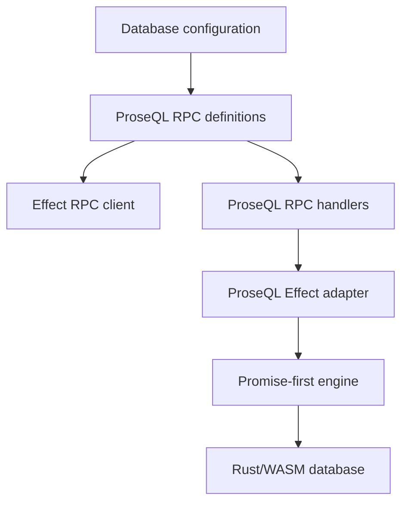
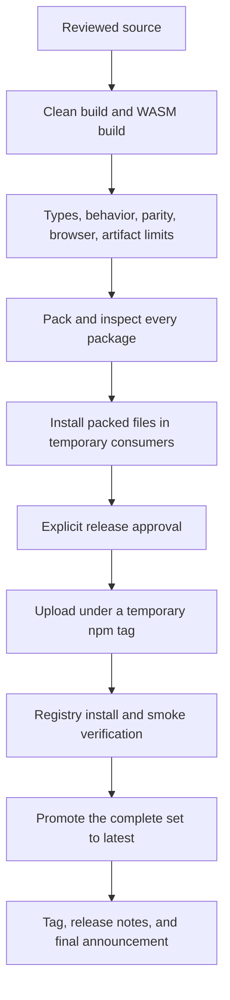
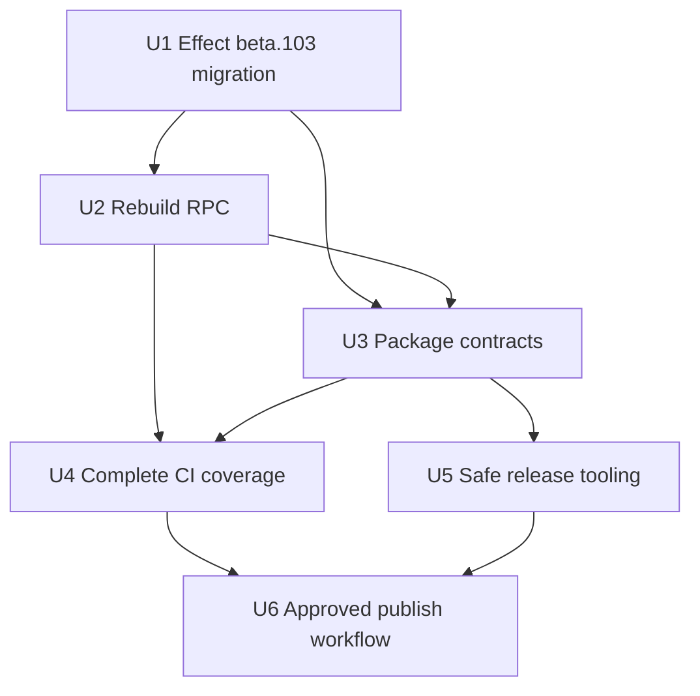
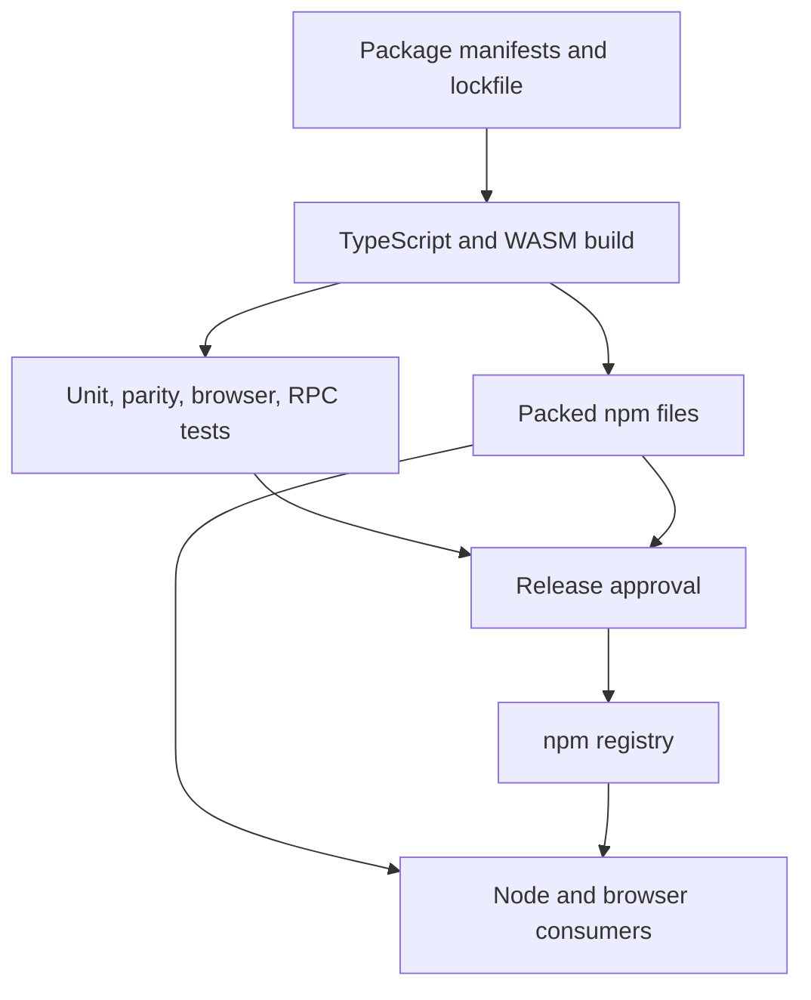

# feat: Publish the Rust/WASM package set

## Summary

Upgrade the workspace to `effect@4.0.0-beta.103`, rebuild `@proseql/rpc` for Effect 4 and the Rust/WASM engine, and make `@proseql/engine`, `@proseql/effect`, `@proseql/browser`, and `@proseql/rpc` safe to publish for the first time. The release path will prove the exact files consumers receive before any irreversible npm or GitHub action.

---

## Problem Frame

The four packages currently return 404 from npm even though the repository presents them as usable packages. The workspace also pins `effect@4.0.0-beta.60`, while the selected release baseline is beta.103. Publishing against the older beta would turn an avoidable dependency lag into the first public compatibility promise.

The existing release path is not ready for these packages: it omits engine and effect from version updates, omits all four new packages from publication, can continue after a failed publish, and does not test installation from the files that would actually be uploaded. RPC is further behind: it uses the old separate `@effect/rpc` package, talks to the TypeScript database in core, and is absent from normal build and test gates.

---

## Requirements

- R1. Pin every workspace package that names Effect to exactly `effect@4.0.0-beta.103`, regenerate the lockfile, and restore type and behavior compatibility across the workspace.
- R2. Preserve Rust/WASM as the query and mutation engine behind `@proseql/engine`, `@proseql/effect`, `@proseql/browser`, and the repaired RPC handlers.
- R3. Rebuild `@proseql/rpc` on Effect 4's built-in RPC support and `@proseql/effect`, removing the old `@effect/rpc` dependency and legacy TypeScript-engine execution path.
- R4. Keep RPC coverage for individual and bulk operations, typed failures, multiple collections, collected queries, and streamed queries without silently weakening filters or results.
- R5. Give all four first-release packages complete public package metadata, valid dependency declarations, built entry points, and only the intended distributable files.
- R6. Prove that packed packages install and run outside the workspace in Node and a real browser, including both WASM loading paths and an RPC client/server round trip.
- R7. Include RPC, Effect, browser, package, and WASM checks in normal local and CI release gates so omitted or stale artifacts cannot pass unnoticed.
- R8. Prepare and publish packages in dependency order, stop on the first failure, verify each registry result, and provide a safe recovery path for partial publication.
- R9. Republish core, node, REST, and CLI because their Effect promise changes, at the same coordinated version as the four first-release packages. Align `@proseql/ai` source to beta.103 without publishing its independent version in this release, and state that its older npm version is not compatible with the new package set.
- R10. Update package and release documentation so install commands, package roles, Effect requirements, RPC examples, and known browser limitations match the shipped system.
- R11. Treat pushing the reviewed release commit and publishing to npm as two separate explicit approvals. Do not push before local release checks pass, and do not tag, create a GitHub release, or publish before the remote no-secret preflight and protected publication approval pass.

---

## Scope Boundaries

- Keep the packages ESM-only; do not add CommonJS builds.
- Do not redesign core database behavior or move `@proseql/core` itself onto WASM in this work.
- Do not add HTTP, WebSocket, authentication, authorization, or framework-specific transports to `@proseql/rpc`; it defines database calls and handlers while consumers must choose a connection method and enforce access before requests reach those handlers.
- Do not preserve unpublished RPC request-class APIs that only exist for the obsolete Effect 3 RPC design.
- Do not publish `@proseql/ai` in this release; align its source declaration, but do not imply that the older npm release is compatible with the new coordinated package set.
- Do not include further engine performance work or resolve browser transaction-origin tracking here.
- Do not weaken WASM size, startup, memory, parity, or browser interaction limits to make publication pass.

### Deferred to Follow-Up Work

- Replace first-publish npm credentials with npm trusted publishing after the new package records exist and can be configured safely.
- Address browser async transaction-origin tracking under backlog item `01KZ0KEZGPGESNCEZX5DKQSVR7`; document the limitation in this release until then.
- Add transport-specific RPC convenience packages only after a concrete consumer requires one.
- Publish the beta.103-aligned `@proseql/ai` independent version in a separate release after its own consumer checks are defined.

---

## Context & Research

### Relevant Code and Patterns

- `packages/engine/package.json` and `packages/engine/scripts/build-wasm.mjs` define the pinned Rust/WASM build and artifact budgets.
- `packages/engine/src/loader.ts` rejects stale generated WASM bindings before initialization.
- `packages/effect/src/database.ts` is the existing Effect wrapper over the Promise-first engine and the execution path RPC must use.
- `packages/browser/src/index.ts` is the browser facade over the browser-safe engine, Effect adapter, and storage hosts.
- `packages/rpc/src/rpc-group.ts` contains the obsolete request-class design; `packages/rpc/src/rpc-handlers.ts` contains handler behavior that can be retained where it still matches the database contract.
- `scripts/verify-package-artifacts.ts` already validates built exports and WASM artifact limits, but does not yet validate RPC or real packed installs.
- `scripts/release.ts` is the current version, tag, GitHub release, and npm publication script; it must be separated into reversible preparation and controlled publication stages.
- `.github/workflows/ci.yml` and `justfile` are the existing gate surfaces. `.github/workflows/publish.yml` is intentionally a stub.

### Institutional Learnings

- `docs/solutions/build-errors/effect-v4-foundation-migration-2026-05-06.md` shows that Effect upgrades change behavior as well as names. Stream collection, failure handling, service definitions, and background task lifetime require behavior tests rather than type-only fixes.
- Existing build-and-publish decisions establish ESM-only packages, TypeScript project references, minimal exports, whitelisted package files, and coordinated workspace versions.
- The Rust conversion work treats TypeScript types as the public contract and Rust/WASM as the implementation. Package work must not create a second browser engine or bypass parity gates.

### External References

- Effect 4 consolidates RPC into the main package and exposes it through `effect/unstable/rpc`: https://www.effect.website/blog/releases/effect/40-beta
- `effect@4.0.0-beta.103` exports `effect/unstable/rpc`; the unstable path may change between beta releases: https://registry.npmjs.org/effect/4.0.0-beta.103
- Bun rewrites direct `workspace:*` dependencies during `bun publish`, but the packed manifest must still be inspected before first publication: https://bun.com/docs/pm/workspaces
- Public scoped packages require explicit public access: https://docs.npmjs.com/creating-and-publishing-scoped-public-packages
- npm versions are immutable; recovery normally means deprecation and a new version rather than replacing an uploaded file: https://docs.npmjs.com/policies/unpublish

---

## Key Technical Decisions

| Decision | Rationale |
|---|---|
| Pin beta.103 exactly in dependencies and peer dependencies | Effect RPC remains under an unstable path and can break between beta releases. An exact promise is more honest than claiming compatibility with untested future betas. |
| Treat the Effect upgrade as a workspace migration | Core, node, REST, CLI, AI, engine, effect, browser, and RPC share Effect types. A split workspace can compile locally while advertising incompatible promises to consumers. |
| Rebuild RPC around an Effect 4 RPC group and handler layer | This follows the current Effect model and avoids carrying unpublished classes tied to the removed package. Operation names and database behavior remain the useful contract. |
| Separate RPC definitions from server handlers | The root package export contains client-safe call definitions and schemas without requiring the engine. A `./server` export contains WASM-backed handlers and requires server users to install the compatible `@proseql/effect` package. |
| Run RPC server handlers through `@proseql/effect` | Remote calls must use the same Rust/WASM database as direct Effect consumers, not revive the old TypeScript engine through core. |
| Keep transport choice outside `@proseql/rpc` | The package's lasting value is describing ProseQL calls and connecting them to the database. Bundling a particular network framework would narrow its use and add unrelated dependencies. |
| Preserve full filter meaning for bulk RPC operations | The current hand-written equality check silently mishandles operator filters. The repaired package must either execute the canonical database filter contract or reject unsupported input explicitly; silent weakening is not acceptable. |
| Validate built tarballs, not workspace links | Workspace links hide missing files and undeclared dependencies. Temporary consumer projects using packed files reproduce what npm users will install. |
| Build once, then publish the inspected tarballs | Re-running package lifecycle builds during publication could upload files different from those verified. Preflight produces immutable tarballs; publication uploads those exact files and compares their checksums with npm. |
| Use one coordinated next version for the publish set | Existing public packages must receive their updated Effect promise, while new packages need dependency versions that exist in npm. The exact number is chosen only after checking registry availability. |
| Separate release preparation from publication | Builds, tests, version checks, package inspection, and release notes are reversible. Tags, GitHub releases, and npm uploads happen only after preflight succeeds and explicit approval is given. |
| Publish sequentially and fail fast | Continuing after failure can leave packages pointing to missing dependencies. Upload under a temporary npm tag, verify the whole set, and only then promote it to `latest`; a retry must first verify what is already live. |
| Keep first publication manually approved | The initial release needs npm scope ownership and credentials confirmed. Automatic trusted publication can replace those credentials after the package records exist. |

---

## Open Questions

### Resolved During Planning

- **Should RPC be removed?** No. Remote access remains useful, but the current unpublished implementation will be replaced before release.
- **Should RPC keep using the separate `@effect/rpc` package?** No. Effect 4 includes RPC under `effect/unstable/rpc`.
- **Should RPC preserve its old request classes?** No. They were never published and encode the obsolete library design. Preserve operation names, data meaning, failures, and streaming behavior instead.
- **Should Effect use a version range?** No. Use exactly beta.103 while RPC is unstable and update ProseQL packages together when moving to another beta.
- **Who builds WASM for release?** The reproducible release preflight does; release correctness must not depend on files left by a developer's earlier local build.
- **What happens after a partial npm publish?** Stop immediately. Verify any already-uploaded package checksum and manifest match the prepared release, then resume the remaining dependency-ordered list; if an uploaded package is wrong, deprecate it and prepare a new version rather than trying to overwrite it.
- **Should a tag automatically publish?** No for the first release. A manually approved release workflow runs against a reviewed commit and version.
- **When are tags and GitHub releases created?** Only after every npm package is live and the coordinated registry install checks pass; a failed npm attempt must not leave a successful-looking GitHub release.
- **Does the RPC client install the database engine?** No. The root RPC export carries definitions and schemas only. WASM-backed handlers live under a server export with an optional peer on `@proseql/effect`, which server users install explicitly.

### Deferred to Implementation

- The exact source changes needed outside RPC for beta.103 are discovered from compiler and behavior failures after the dependency update; do not assume the beta.60 migration list is complete.
- The exact next coordinated version is selected after registry checks confirm that it is unused across every package in the publish set.
- The first-publish authentication method depends on npm organization settings available to the release operator; the workflow must support the approved short-lived setup without storing credentials in source.

---

## Operator Preconditions

These are external release requirements, not code changes. They must be confirmed by the release operator before approving the publication job:

- The `@proseql` npm organization exists, the publishing identity can create public packages in it, and all four new package names still return the expected not-found result rather than an ownership error.
- A publish-capable npm credential that satisfies the organization's current two-factor policy is stored only in the protected `npm-production` GitHub environment. Before release, confirm the authenticated identity, scope membership, package-name availability, and two-factor settings; recognize that only the first candidate-tag upload can definitively prove new-package creation permission.
- The `npm-production` GitHub environment exists with required human reviewers and only the intended release branch or commit is allowed.
- The Nix release environment supplies the exact Rust target, wasm-bindgen, and wasm-opt versions recorded in `packages/engine/package.json`.
- A human has reviewed the release notes, including the exact Effect beta, the four new packages, the older AI package incompatibility, and the browser transaction limitation.
- The chosen coordinated version is unused for every package in the release set, and the prepared commit has passed all required local checks before the user separately approves pushing it for remote preflight.

## Go / No-Go Criteria

Publication is a **No-Go** if any of these is false:

- The clean release check passes TypeScript, Rust, parity, Effect, RPC, browser, package, and packed-consumer gates.
- Every packed manifest uses beta.103 exactly where Effect is declared, contains no `workspace:*` or `@effect/rpc`, names only existing coordinated dependencies, and marks the scoped package public.
- The production WASM files match the checked-in toolchain report and remain within the existing artifact, startup, memory, and interaction limits.
- The four new package names and every coordinated version are available, and the approved npm identity and scope permissions have been checked as far as npm permits before an actual first upload.
- The exact prepared tarballs, checksums, dependency order, release notes, and partial-failure decision tree have been reviewed.
- The protected GitHub environment and first-publish credential preconditions above are satisfied.

The known browser transaction limitation and the deferred AI publication may proceed only when they are clearly stated in release notes; neither may be presented as fixed.

---

## High-Level Technical Design

> *This illustrates the intended approach and is directional guidance for review, not implementation specification. The implementing agent should treat it as context, not code to reproduce.*

The release path is deliberately split around the last reversible point:

---

## Implementation Units

### U1. Upgrade the workspace to Effect beta.103

**Goal:** Move every workspace declaration to the exact selected Effect beta and restore existing behavior before layering RPC or release changes on top.

**Requirements:** R1, R2, R9

**Dependencies:** None

**Files:**
- Modify: `package.json`
- Modify: `bun.lock`
- Modify: `packages/core/package.json`
- Modify: `packages/engine/package.json`
- Modify: `packages/effect/package.json`
- Modify: `packages/browser/package.json`
- Modify: `packages/node/package.json`
- Modify: `packages/rest/package.json`
- Modify: `packages/cli/package.json`
- Modify: `packages/ai/package.json`
- Test: `packages/core/tests/database-effect.test.ts`
- Test: `packages/engine/tests/engine.test.ts`
- Test: `packages/effect/tests/effect.test.ts`
- Test: `packages/browser/tests/browser-entry.test.ts`
- Test: `packages/node/tests/convenience.test.ts`
- Test: `packages/rest/tests/handlers.test.ts`
- Test: `packages/cli/tests/`
- Test: `packages/ai/tests/ai-tools.test.ts`

**Approach:**
- Change all direct and peer declarations together, regenerate the lockfile, and use the installed beta.103 package as the API source of truth.
- Characterize failures by package. Fix behavior changes at their owning boundary rather than adding compatibility wrappers for beta.60.
- Keep the Promise-first engine independent of Effect where possible; Effect-specific changes belong in core's Effect surfaces, `@proseql/effect`, and other Effect-facing adapters.
- Leave RPC's manifest and source on their existing isolated dependency set until U2 replaces them together. U1's normal verification excludes RPC rather than creating a manifest/source mismatch between atomic units.

**Execution note:** Start with the dependency change and failing type/behavior gates. Preserve targeted regression coverage for every semantic API change discovered.

**Patterns to follow:**
- `docs/solutions/build-errors/effect-v4-foundation-migration-2026-05-06.md`
- `packages/effect/src/database.ts`
- Existing package-wide exact Effect version alignment

**Test scenarios:**
- Happy path: each existing package builds against beta.103 and its normal API tests retain the same observable results.
- Integration: the Effect adapter still creates and queries the Rust/WASM-backed database with typed success and failure values.
- Integration: browser creation, persistence, and streaming continue through the browser WASM entry point.
- Error path: tagged validation, storage, transaction, and engine failures remain catchable under the same public tags and fields.
- Edge case: collected streams, background writes, interruption, and scoped resources retain their tested beta.60 behavior after the upgrade.
- Compatibility: no non-RPC package manifest or lockfile retains beta.60 or a second Effect major version; U2 removes the final beta.60 declaration from RPC.

**Verification:**
- Every non-RPC workspace package resolves beta.103, its project and behavior checks pass, AI's source compatibility is proven, and Rust/WASM authority remains unchanged. U2 completes the RPC version alignment.

### U2. Rebuild `@proseql/rpc` for Effect 4 and the WASM engine

**Goal:** Replace the obsolete RPC implementation with a first-release API that describes ProseQL operations using Effect 4 and executes them through `@proseql/effect`.

**Requirements:** R1, R2, R3, R4

**Dependencies:** U1

**Files:**
- Modify: `packages/rpc/package.json`
- Modify: `packages/rpc/tsconfig.json`
- Modify: `packages/rpc/src/index.ts`
- Create: `packages/rpc/src/server.ts`
- Modify: `packages/rpc/src/rpc-group.ts`
- Modify: `packages/rpc/src/rpc-handlers.ts`
- Modify: `packages/rpc/src/rpc-schemas.ts`
- Modify: `packages/rpc/src/rpc-errors.ts`
- Modify: `packages/rpc/README.md`
- Test: `packages/rpc/tests/rpc-group.test.ts`
- Test: `packages/rpc/tests/rpc-handlers.test.ts`
- Test: `packages/rpc/tests/rpc-streaming.test.ts`
- Test: `packages/rpc/tests/multi-collection-namespacing.test.ts`
- Create: `packages/rpc/tests/rpc-wire-contract.test.ts`

**Approach:**
- Update RPC to the exact beta.103 contract and remove `@effect/rpc` in the same atomic unit that replaces its imports; define one composable Effect 4 RPC group from a database configuration and expose handler construction that can be supplied to Effect's server tools.
- Keep stable, collection-qualified operation names for find, query, stream, create, update, delete, aggregate, and bulk/upsert actions.
- Use plain payloads rather than constructible request classes. Export client-safe ProseQL definitions and schemas from the root entry point; consumers import transport tools from Effect itself.
- Export handler construction from `@proseql/rpc/server`. Keep `@proseql/effect` as an optional server peer so definition-only clients do not install the engine or WASM, while server users must install the exact coordinated effect adapter.
- Build server handlers over `@proseql/effect`, with core used for shared schemas, types, and error definitions rather than database execution.
- Make request, result, and error schemas reflect the actual public engine contract. Define a first-release contract table for operation names, allowed collection names, payloads, ordinary results, stream items, and typed failures, then protect it with encoded fixtures.
- Cover each direct query shape explicitly: ordinary entities, selected fields, populated relationships, search/sort/pagination, and cursor/page results where the direct API supports them. Each shape is either represented faithfully over RPC or rejected before execution; ambiguous result schemas are not allowed.
- Remove options that have no real Effect 4 behavior rather than documenting imaginary buffering controls.
- Preserve full query-filter meaning for bulk mutations through the canonical database path; unsupported input must fail clearly before mutation.

**Execution note:** Build the replacement test-first around an in-process Effect 4 client/server pair, then retire obsolete request-class tests as the new behavior is proven.

**Patterns to follow:**
- `packages/effect/src/database.ts` for Rust/WASM-backed Effect execution
- `packages/rpc/src/rpc-schemas.ts` for existing operation coverage where its data meaning remains correct
- Effect beta.103's installed `effect/unstable/rpc` declarations for current group, handler, test-client, and streaming behavior

**Test scenarios:**
- Happy path: one collection produces all supported operation names and a client can create, find, query, update, delete, aggregate, and upsert through the in-process server.
- Multi-collection: equal operation names in two collections remain distinct and route to the correct collection.
- Integration: RPC-created and RPC-updated rows are visible through a direct `@proseql/effect` query against the same Rust/WASM database.
- Query variants: plain, selected, populated, searched, sorted, paginated, cursor/page, and streamed results match direct `@proseql/effect` output for every supported shape; unsupported combinations reject before work begins.
- Filters: declarative comparison, membership, and logical filters used by query and bulk mutation return the same rows and counts as direct database calls.
- Wire contract: representative calls, results, stream items, and typed failures encode and decode to stable collection-qualified names and documented fields.
- Serialized integration: a test-only Effect transport performs real encoding and decoding for normal calls, failures, and streams rather than relying only on the no-serialization test client.
- Package boundary: installing only the root RPC package exposes definitions without installing engine/WASM; installing the server peer enables handlers through `@proseql/rpc/server`.
- Error path: not-found, validation, duplicate, relationship, operation, and transaction failures cross the RPC boundary with their public tag and useful fields intact.
- Error path: invalid or unsupported filter data fails before a bulk mutation and cannot produce a silent zero-result success.
- Streaming: a streamed query emits rows in database order, supports interruption, and reports a handler failure without hanging or converting it to a successful end.
- Edge case: empty collections, empty bulk inputs, dangerous collection names, and multiple simultaneous clients do not collide or lose type information.

**Verification:**
- RPC has no dependency or import from `@effect/rpc`, normal calls and streams work through Effect 4, and all server-side database work is performed by the Rust/WASM-backed Effect adapter.

### U3. Make the npm package contents independently verifiable

**Goal:** Ensure each first-release package has complete metadata and prove the exact tarballs work without workspace links or undeclared files.

**Requirements:** R5, R6, R9

**Dependencies:** U1, U2

**Files:**
- Modify: `packages/engine/package.json`
- Modify: `packages/effect/package.json`
- Modify: `packages/browser/package.json`
- Modify: `packages/rpc/package.json`
- Modify: `packages/core/package.json`
- Modify: `packages/node/package.json`
- Modify: `packages/rest/package.json`
- Modify: `packages/cli/package.json`
- Modify: `scripts/verify-package-artifacts.ts`
- Modify: `scripts/verify-browser.mjs`
- Create: `scripts/verify-packed-packages.ts`
- Test: `scripts/verify-packed-packages.test.ts`
- Test: `packages/core/tests/database-effect.test.ts`
- Test: `packages/engine/tests/node-smoke.mjs`
- Test: `packages/effect/tests/node-smoke.mjs`
- Test: `packages/browser/tests/browser-smoke.mjs`
- Test: `packages/node/tests/convenience.test.ts`
- Test: `packages/rest/tests/handlers.test.ts`
- Test: `packages/cli/tests/commands/query.test.ts`
- Test: `packages/rpc/tests/rpc-handlers.test.ts`

**Approach:**
- Normalize descriptions, public access, repository, license, runtime, export, build, and package-file declarations using core and engine as the established pattern.
- Add RPC to artifact verification and reject packed manifests containing workspace references, wrong internal versions, missing entry points, or undeclared runtime dependencies.
- Build engine WASM from a clean tree with the pinned toolchain, then confirm Node and browser JavaScript glue plus WASM binaries are present and within existing limits.
- Pack the full coordinated release set, install those files into temporary consumer projects, and test only through public imports. Do not use symlinks back to the repository.
- Assert exact beta.103 declarations, one resolved Effect copy, no old RPC package, and strict peer-resolution failure when a consumer forces beta.60 or a neighboring untested beta.
- Exercise core, node, REST, and CLI as well as Node engine/effect imports, a real browser import and database interaction, and an RPC round trip from installed packages.

**Execution note:** Add failing package-content and temporary-install checks before changing metadata so the checks prove the original gaps.

**Patterns to follow:**
- `scripts/verify-package-artifacts.ts`
- `packages/engine/tests/node-smoke.mjs`
- `packages/browser/tests/browser-smoke.mjs`
- Existing `files: ["dist", "LICENSE", "README.md"]` package boundary

**Test scenarios:**
- Happy path: every packed manifest contains concrete coordinated dependency versions, public access metadata, and only intended files.
- Engine: both public engine entry points load their included WASM from an installed tarball without repository-relative paths.
- Effect: an installed consumer catches a typed database error and collects a streamed query through public exports.
- Browser: a temporary browser app loads the installed browser package, creates data, queries it, and uses browser storage without Node-only imports.
- RPC client: a definition-only temporary consumer imports the root RPC export without installing engine or WASM.
- RPC server: a temporary server consumer installs `@proseql/effect`, imports `@proseql/rpc/server`, and completes one serialized normal call, one typed failure, and one streamed call.
- Existing packages: temporary consumers create a core database, use node persistence, invoke a REST handler, and execute the installed CLI binary successfully.
- Effect contract: the coordinated packages install with exactly beta.103 and one Effect copy; strict installs with beta.60 or an untested neighboring beta fail with the expected peer conflict.
- Error path: missing WASM, stale generated bindings, a remaining `workspace:*`, an old `@effect/rpc`, a wrong Effect range, an omitted dependency, or an undeclared deep import fails package verification before release.
- Edge case: a completely clean checkout with no prior `dist` or engine build output produces the same accepted package contents.

**Verification:**
- The packed files, manifests, WASM limits, installed Node entry points, real browser entry point, and RPC round trip all pass without workspace links.

### U4. Put all publishable surfaces under normal CI gates

**Goal:** Make it impossible for RPC, Effect, browser, or packed-package failures to remain invisible in routine checks.

**Requirements:** R1, R6, R7

**Dependencies:** U2, U3

**Files:**
- Modify: `tsconfig.json`
- Modify: `justfile`
- Modify: `.github/workflows/ci.yml`
- Test: `packages/rpc/tests/rpc-group.test.ts`
- Test: `packages/rpc/tests/rpc-handlers.test.ts`
- Test: `packages/rpc/tests/rpc-streaming.test.ts`
- Test: `packages/effect/tests/effect.test.ts`
- Test: `packages/browser/tests/browser-entry.test.ts`
- Test: `scripts/verify-packed-packages.test.ts`

**Approach:**
- Add RPC to TypeScript project references and package tests to the standard gate; expand lint coverage to all source packages touched by the release.
- Keep fast unit/type checks separate from expensive WASM, parity, real-browser, and packed-install checks, but require all groups before release readiness can pass.
- Add a single release-check entry point that composes clean build, Rust checks, parity, package verification, browser smoke, and packed-install verification without publishing.
- Preserve generated report artifacts when a CI gate fails so missing files, size changes, or browser failures are diagnosable.

**Patterns to follow:**
- Existing separate jobs in `.github/workflows/ci.yml`
- Existing `just parity-gate`, `just verify-packages`, and `just browser-smoke` boundaries

**Test scenarios:**
- Happy path: a clean CI checkout builds WASM and completes every release-readiness gate without cached `dist` files.
- Regression: an RPC type error fails normal typecheck; an RPC behavior error fails normal tests.
- Regression: an omitted WASM or packed browser file fails the package job rather than a later publication.
- Failure isolation: a failed unit, parity, browser, or package gate identifies its own job and keeps its report evidence.
- Edge case: ordinary pull requests run no npm publication step and need no npm credentials.

**Verification:**
- RPC is no longer absent from normal checks, release readiness is a named reproducible gate, and CI proves all consumer-facing paths without registry access.

### U5. Make release preparation and npm publication safe to retry

**Goal:** Replace the current all-in-one, continue-on-error release script with a fail-fast process that validates versions and package order before irreversible work.

**Requirements:** R5, R8, R9, R11

**Dependencies:** U3

**Files:**
- Modify: `scripts/release.ts`
- Create: `scripts/publish-packages.ts`
- Create: `scripts/release-manifest.ts`
- Test: `scripts/release.test.ts`
- Modify: `justfile`

**Approach:**
- Define the coordinated release set and dependency order once, then use it for version updates, package checks, publication, and registry verification.
- Include core, engine, effect, browser, RPC, node, REST, and CLI in the coordinated release. Keep AI's independent version while updating its Effect declaration outside the publish list.
- Use the deterministic sequential order `core → engine → node → rest → effect → cli → browser → rpc`, which satisfies every internal dependency while keeping resume points unambiguous.
- Complete all clean builds, release gates, version-availability checks, package packing, checksum capture, and release-note preparation before creating a tag, GitHub release, or npm upload.
- Publish the exact inspected tarballs without rerunning package lifecycle builds. This makes the bytes approved in preflight the bytes uploaded to npm.
- Upload every package under a temporary release tag rather than moving `latest` during the sequence. Make candidate publication sequential and fail fast; after each upload, wait for registry visibility and compare the live manifest and integrity checksum before publishing a dependent package.
- Promote `latest` only after the full candidate set passes registry installation. Promote dependent packages first and core last so a partial tag-promotion failure keeps the foundational package on its prior release until the end. Remove the temporary release tag only after every `latest` tag is verified.
- Support deliberate resume from the first missing package after a partial failure, while refusing to continue if any live package checksum, manifest, or dependency differs from the prepared release.
- Keep actual publication behind an explicit flag or approved workflow input so ordinary release checks are non-destructive.

**Execution note:** Model package ordering, preflight failures, and partial registry states with pure tests before changing the release side effects.

**Patterns to follow:**
- Conventional-commit changelog generation already present in `scripts/release.ts`
- Dependency order derived from package manifests, not a second unrelated list
- npm's immutable-version model: repair with a new version when an uploaded package is wrong

**Test scenarios:**
- Happy path: the release manifest orders `core → engine → node → rest → effect → cli → browser → rpc`, satisfying every declared internal dependency.
- Versioning: every coordinated package receives the same unused next version; AI retains its own package version.
- Preflight failure: a used version, missing package, failed gate, bad tarball, or unavailable dependency prevents tags and publication.
- Publish failure: the first registry error stops later candidate uploads and no package's `latest` tag moves.
- Resume: matching candidate-tagged package manifests and integrity checksums are verified and skipped, then publication resumes at the first missing package.
- Promotion: after all candidate checks pass, `latest` moves in reverse dependency order (`rpc → browser → cli → effect → rest → node → engine → core`); an interruption can resume without rebuilding or re-uploading tarballs, and the temporary tag remains until promotion verification completes.
- Credential recovery: an expired or rejected credential stops the run, allows the protected environment secret to be repaired, and requires a fresh approval before resume.
- Safety: a mismatched already-published package blocks resume and directs the operator to deprecate only the bad version and prepare a new coordinated version.
- Safety: running release checks without explicit publication approval performs no push, tag, GitHub release, or npm write.

**Verification:**
- Release preparation is fully reversible, package order has deterministic tests, and simulated failures cannot produce continue-on-error publication.

### U6. Add an approved first-publish workflow and release guidance

**Goal:** Provide a reviewable, manually approved route from a green release commit to npm, followed by registry and consumer verification.

**Requirements:** R8, R10, R11

**Dependencies:** U4, U5

**Files:**
- Modify: `.github/workflows/publish.yml`
- Create: `docs/releases/npm-packages.md`
- Modify: `README.md`
- Modify: `packages/engine/README.md`
- Modify: `packages/effect/README.md`
- Modify: `packages/browser/README.md`
- Modify: `packages/rpc/README.md`
- Modify: `CHANGELOG.md`

**Approach:**
- Release tooling stops after local verification and requests explicit approval rather than pushing automatically. After the approved commit is pushed, a no-secret preflight job builds, tests, packs, and records checksums. npm publication then requires a second, separate protected GitHub environment approval.
- Isolate npm credentials in a separate protected upload job with minimal workflow permissions and actions pinned to immutable revisions. That job downloads only the prepared tarballs, verifies their checksums, and runs no source build or package lifecycle script after credentials become available.
- Publish the prepared tarballs under a temporary release tag one at a time in the tested order. Retry registry reads for bounded propagation delays and confirm each live manifest and checksum before moving to a dependent package.
- Use first-publish credentials only through the protected `npm-production` environment; never place tokens in source or logs. Record the post-release move to npm trusted publishing.
- After all uploads, install the eight-package coordinated set together from npm and prove one Effect copy, correct dependency versions, CLI execution, REST behavior, Node WASM loading, Effect behavior, browser behavior, and RPC calls/streams.
- After the complete candidate set passes, promote `latest` in reverse dependency order and verify every tag. Create the git tag and GitHub release only for the exact package set that is confirmed live, or clearly record a partial failure before any retry.
- Explain package roles in plain language, the exact Effect beta requirement, RPC's current purpose, browser/WASM loading expectations, and the known browser transaction limitation. State plainly that RPC supplies no network security and that applications must authenticate and authorize callers before invoking mutation handlers.

**Patterns to follow:**
- `.github/workflows/ci.yml` for Nix/toolchain setup and separate evidence-producing gates
- Existing package READMEs for install and public API examples
- npm public scoped package and immutable-version guidance cited above

**Test scenarios:**
- Approval boundary: release tooling performs no push; the remote workflow starts only from the separately approved commit, and without publication approval no job can access npm credentials or upload packages.
- Workflow: the no-secret preflight can build and inspect packages, while the protected credential-bearing job cannot run source builds or unverified scripts.
- Workflow: a failed release check prevents all registry writes.
- Workflow: a package candidate upload, checksum mismatch, or registry-visibility timeout stops dependent packages, leaves `latest` unchanged, and reports the exact resume point.
- Workflow: `latest` promotion begins only after all candidate installs pass, can resume safely if tag updates are interrupted, and removes the temporary tag only after all final tags are verified.
- Integration: a single fresh consumer installs core, node, REST, CLI, engine, effect, browser, and RPC together with no wrong internal versions or duplicate Effect copy.
- Integration: fresh npm installs pass CLI, REST, Node WASM, Effect, real-browser, and RPC public-entry smoke checks equivalent to the packed-file checks.
- Registry: every live manifest contains the coordinated dependency versions and every `latest` tag points to the intended release.
- Documentation: every advertised install command names a package that exists on npm at the documented version and no RPC example uses the old package or request classes.

**Verification:**
- The workflow is inert without explicit approval, a release operator has a complete go/no-go and recovery guide, and the four formerly missing packages can be installed and exercised from npm after an approved run.

---

## System-Wide Impact

- **Interaction graph:** Effect types cross every package; engine/effect/browser form one runtime chain; RPC adds a remote-call layer above effect; release scripts and CI consume all package manifests and built artifacts.
- **Error propagation:** Engine boundary failures must remain typed through the Effect adapter and RPC. Build, pack, publication, and registry failures must stop the release rather than being logged and ignored.
- **State lifecycle risks:** npm versions cannot be replaced. Partial publication is handled by stopping, verifying live packages, and resuming only matching prepared artifacts or moving to a new version.
- **API surface parity:** Node and browser engine entry points, Effect and browser adapters, direct and streamed RPC calls, existing core/node/REST/CLI packages, and their shared Effect peer promise all require coordinated checks.
- **Integration coverage:** Workspace tests cannot prove package contents; packed temporary installs cannot prove registry configuration; post-publication fresh installs are required for the final release decision.
- **Unchanged invariants:** Rust/WASM remains the browser query and mutation authority; core remains the shared type/schema foundation; no TypeScript browser engine, fallback execution path, or relaxed artifact budget is introduced.

---

## Risks & Dependencies

| Risk | Mitigation |
|---|---|
| Beta.103 changes Effect behavior across the workspace | Upgrade first, classify failures by package, and require behavior tests in addition to typechecking. |
| Effect RPC changes again after beta.103 | Pin exactly, import only the selected built-in RPC path, and release ProseQL updates alongside future Effect beta changes. |
| RPC schemas drift from engine behavior | Exercise each operation against the same Rust/WASM database and compare direct Effect and RPC outcomes, including errors and bulk filters. |
| Engine tarball omits or ships stale WASM | Build from clean source with the pinned toolchain and inspect/install the tarball before approval. |
| Workspace links hide undeclared dependencies | Run temporary consumer tests using packed files and public imports only. |
| A publish fails halfway | Upload under a temporary tag, publish sequentially, fail fast, verify each live version, and use tested resume rules; do not move `latest` until the full set passes. |
| First-publish npm scope or credentials are unavailable | Treat scope ownership and approved credentials as preconditions before the destructive workflow can start. |
| Existing public packages advertise beta.60 while new packages require beta.103 | Republish the affected coordinated packages at the same new version. |
| Browser async transaction-origin bug remains | Keep the existing backlog item, document the limitation prominently, and do not imply the release fixes it. |
| RPC rewrite expands into transport framework work | Keep HTTP/WebSocket/framework adapters outside this package and test with Effect's own test tools. |
| Consumers expose mutation handlers without access control | Document that RPC provides no authentication or authorization and require applications to enforce access before requests reach handlers; do not publish an unsecured network-server example. |

---

## Documentation / Operational Notes

- The first-release checklist must name the npm scope owner, credential source, approved commit, coordinated version, package order, release-check result, and partial-failure contact/action.
- Do not announce the release until the full eight-package coordinated install and every package-specific registry smoke check pass.
- Record the exact Rust/WASM artifact measurements and Effect beta in the release notes.
- After first publication, configure npm trusted publishing for each new package, remove the temporary publish credential, and keep manual environment approval.
- If no npm upload occurred, discard any unpublished release preparation cleanly. If a wrong package was uploaded, use npm's allowed early recovery only before dependents exist; otherwise deprecate the bad version and prepare a new coordinated version.
- Package documentation should use plain descriptions: core defines shared rules, engine runs the database, browser adds browser storage and entry points, effect adds Effect-style usage, and RPC allows another program to call the database remotely.

---

## Sources & References

- Related conversion plan: `work/items/active/01KYR2GFF49SRGMH4Q9MV1F2TS-rust-engine-conversion/plan.md`
- Related optimization plan: `work/items/active/01KYWNNC4EQSMDE3GESRS837J3-wasm-engine-optimization/plan.md`
- Browser transaction follow-up: `work/items/parking-lot/01KZ0KEZGPGESNCEZX5DKQSVR7-add-browser-async-transaction-origin-tracking.md`
- Effect migration learning: `docs/solutions/build-errors/effect-v4-foundation-migration-2026-05-06.md`
- Current release script: `scripts/release.ts`
- Current package verifier: `scripts/verify-package-artifacts.ts`
- Effect 4 beta announcement: https://www.effect.website/blog/releases/effect/40-beta
- Effect beta.103 registry metadata: https://registry.npmjs.org/effect/4.0.0-beta.103
- Bun workspace publishing: https://bun.com/docs/pm/workspaces
- npm scoped public packages: https://docs.npmjs.com/creating-and-publishing-scoped-public-packages
- npm unpublish policy: https://docs.npmjs.com/policies/unpublish
